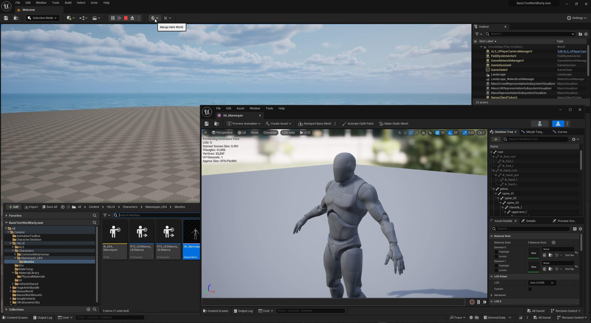
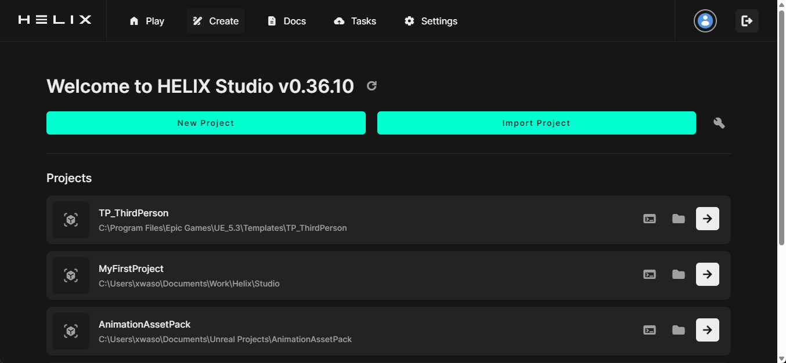

# HELIX's Tooling Ecosystem

/// tip | Iterative Feature
The Launcher and Studio workflow is relatively new, and more features are being added consitently. Expect more changes and improvements here soon!
///

- HELIX Studio (**Studio**) is a UE5 plug-in for more advanced developers to import custom assets and develop highly sophisticated experiences. Unleash the full power of UE5 and create assets and worlds with the highest fidelity of graphics and gameplay.

- In combination with the HELIX Launcher (**Launcher**), you will have all the tools you need to create fantastic roleplaying worlds and experiences.

## Studio

HELIX adds functions for the most common use cases, allowing you to make an RP game far quicker and easier (e.g. asset cooking, code linking, hot reload, etc.).

??? abstract "Full Studio Feature List"

    ## World
    <figure markdown="1">
        
    </figure>

    - **Start VS Code**: Initiates Visual Studio Code within the Package folder.
    - **Regenerate Placeholder**: Refreshes the placeholder file located in the package.
    - **Server Hot Reload**: When enabled, the plugin checks for changes in the package file and automatically performs a hot reload within the editor.
    - **Publish**
        - **All**: Cooks and publishes both the world asset and package.
        - **Package**: Only publishes the package.

    ## Asset
    <figure markdown="1">
        
    </figure>

    - **Open Creator Exchange**: Display the creator exchange where assets created by other users can be imported into the project.
    - **Import Asset**: Allows users to import asset packs that have been downloaded.
    - **New Package**: Initiates the creation of a new server package.
    - **New Asset Pack**: Initiates the creation of a new asset pack.
    - **New Item**: Initiates the creation of a new item.
    - **Publish Asset**: Cooks and uploads to the HUB a specified asset pack.

---

## Launcher

The Launcher also includes some key functionality, notably:

- Access to the [Add-on Vault](https://helixgame.com/vault){.external-link}(1)
- Easily launch new/old projects, start standalone severs, and more

1. The Add-on Vault is a central repository of shared assets that contains everything you need to build your worlds and RP servers. Discover thousands of add-ons and mods from maps, characters, vehicles, weapons, Lua scripts to entire game modes!

/// tip | Iterative Feature
The Launcher especially is quite new - so definitely expect more changes and improvements here soon! Other existing features should be self-explanatory.
///

## Next Steps

-   __Quickstart__

    The best way to learn is by doing. Make your first game quickly and easily in this step-by-step tutorial!

    [:material-folder-download-outline: Install](install.md)

    [:material-controller-classic-outline: Making Your First Game](firstGame.md)

-   __Disciple specific tooling__

	Whatever you specialize in, we've got the right tools for you. 

    [:octicons-command-palette-16: Scripters](scripters.md)

    [:octicons-server-16: RP Server Owners](rpServerOwners.md)

    [:material-palette-outline: Artists](artists.md)
    
-   __View tutorials and examples__

    See how it's done directly, either step-by-step or through examples.

    [:material-file-document-check-outline: General Tutorials](../tutorials/index.md)

    [:material-file-document-arrow-right-outline: Scripting Tutorials](../scripting/index.md)

-   __Browse the API__

    Check out our extensive API to see the full breadth of HELIX.

    [:octicons-file-code-24: View API](../api/index.md)

<!-- ToDo: make snippet? -->
<!-- ToDo: maybe appendix for Launcher and Studio tooltips? -->
