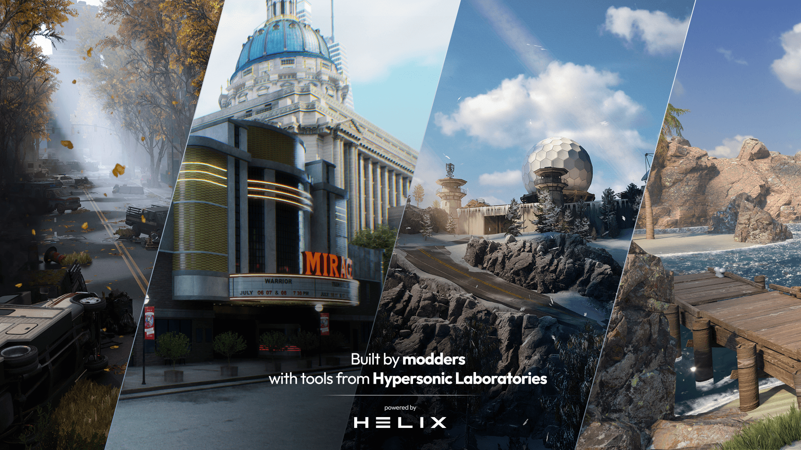

# Getting Started

Welcome to the documentation for [HELIX](https://helixgame.com/){.external}, the ultimate open world roleplaying platform.

## About HELIX

HELIX is an open-world multiplayer sandbox platform, specifically designed for roleplay. As a developer, you can create your own games, roleplaying servers, and virtual worlds using our extensive scripting API and creation tools.

- :fontawesome-solid-people-line: **Built By Creators, For Creators**{.whiter} - We see you. We see your ingenuity, your creativity, as you modify games in beautiful, frustrating ways, fighting the very systems you rely on. *HELIX is different.* Time to know what it feels like to be empowered alongside a community of creators.

- :material-chart-areaspline: **We Succeed When You Succeed**{.whiter} - With access to the [Add-on Vault](../tutorials/vault.md) (1) and extensive documentation, we strive to help you excel. Not to mention features like one-click-publishing and full IP ownership!

- :material-arrow-up-box: **Delightful Tooling**{.whiter} - HELIX is built on top of the well-used Unreal 5 game engine, allowing for unparalleled graphical fidelity and customization. We also provide an intuitive and powerful Lua API alongside a host of other useful tools.

1.  The Add-on Vault is a central repository of shared assets that contains
    everything you need to build your worlds and RP servers. Discover thousands of add-ons and mods from maps, characters, vehicles, weapons, Lua scripts to entire game modes!

<!-- , and mututally-beneficial monetization! (2) 
2.  Simply put, Hypersonic takes a cut of all the profits on HELIX. This means
    the success of the company is directly in-line with how successful you, the creators, are. In other words, our goals are mutually aligned! :partying_face: -->

## Getting Started

-   __Quickstart__

    The best way to learn is by doing. Make your first game quickly and easily in this step-by-step tutorial!

    [:material-folder-download-outline: Install](install.md)

    [:material-controller-classic-outline: Making Your First Game](firstGame.md)

-   __Disciple specific tooling__

	Whatever you specialize in, we've got the right tools for you. 

    [:octicons-command-palette-16: Scripters](scripters.md)

    [:octicons-server-16: RP Server Owners](rpServerOwners.md)

    [:material-palette-outline: Artists](artists.md)
    
-   __View tutorials and examples__

    See how it's done directly, either step-by-step or through examples.

    [:material-file-document-check-outline: General Tutorials](../tutorials/index.md)

    [:material-file-document-arrow-right-outline: Scripting Tutorials](../scripting/index.md)

-   __Browse the API__

    Check out our extensive API to see the full breadth of HELIX.

    [:octicons-file-code-24: View API](../api/index.md)

/// tip |  Navigation
Use ++right++ to quickly go to the next page too!
///

### Contributing
HELIX's documentation is continuously written and edited, and **we'd love your help/input to make it better!** To contribute, simply click the <a href="#" title="Edit this page" class="md-icon">edit icon :material-file-document-edit-outline:</a> in the **top right corner of any page**.