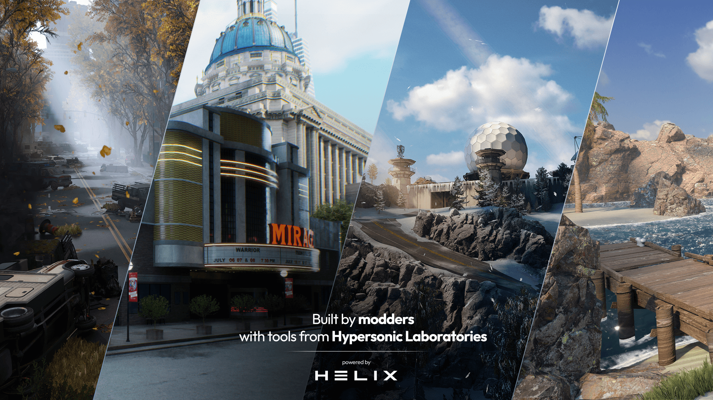

# Welcome to HELIX
Welcome to the documentation for [Helix](https://helixgame.com/), the platform that allows you to create the experience of your dreams.

## About HELIX

- **Built For Creators, By Creators** - We see you. We see your ingenuity, your creativity, as you modify games in beautiful, frustrating ways, fighting the very systems you need. *HELIX is different.* Time to know what it feels like to be empowered alongside a community of creators.

- **The Power of Unreal** - HELIX is intentionally built on top of the well-loved Unreal 5 game engine, allowing for unparalleled graphical fidelity and customization. Our import tools allow you to work on whatever complexity layer you like - this is creation without limits!

- **Helpful Resources** - From one click publishing to the [Vault](https://hub.helixgame.com/) (community created assets) to extensive documentation, we have all the resources you need to get started quickly and easily.

## Getting Started

-   __Quickstart__

    The best way to learn is by doing. Make your first game with us, in minutes!

    [:material-folder-download-outline: Install](install.md)

    [:material-controller-classic-outline: Making Your First Game](firstGame.md)

-   __Disciple specific tooling__

	Whatever you specialize in, we've got the right tools for you. 

    [:material-palette-outline: Modelers](modelers.md)

    [:octicons-command-palette-16: Scripters](scripters.md)

    [:octicons-server-16: Server Owners](serverOwners.md)

-   __View tutorials and examples__

    See how it's done directly, either step-by-step or through examples.

    [:material-file-document-check-outline: See Tutorials](../tutorials/tutorialHome.md)

-   __Browse the API__

    Check out our extensive API to see the full breadth of HELIX.

    [:octicons-file-code-24: View API](../api/apiHome.md)

### Organization of Documentation
- **Getting Started** explains the essential information you need to start using HELIX, from installation to publishing.
- The **Tutorials** section contains step-by-step instructions to make specific features or full games, as well as a collection of **Examples** to learn from and use.
- The **HELIX API** holds formal information about scripting in HELIX, including a Lua style guide and references for all functions.

### Contributing
HELIX's documentation is continuously written and edited, and we'd love your help/input to make it better! To contribute, simply click the <a href="#" title="Edit this page" class="md-icon">edit</a> icon in the top right corner of any page.