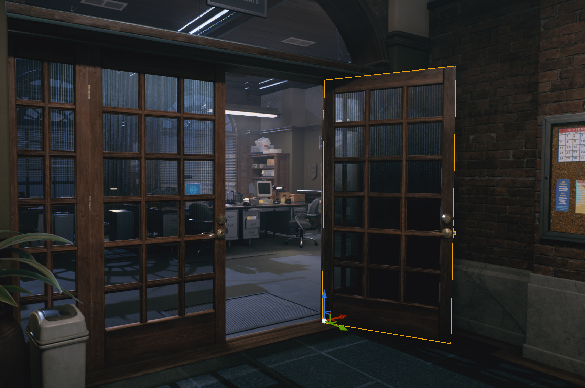
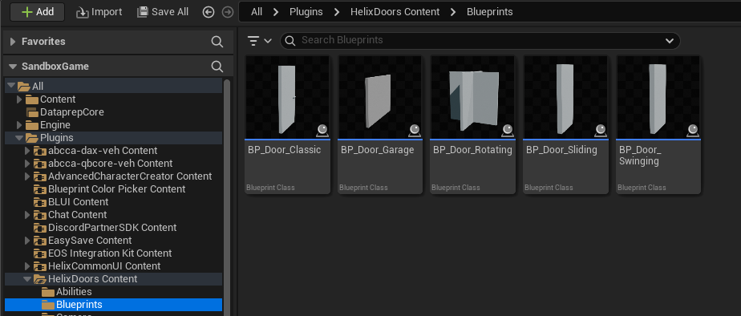
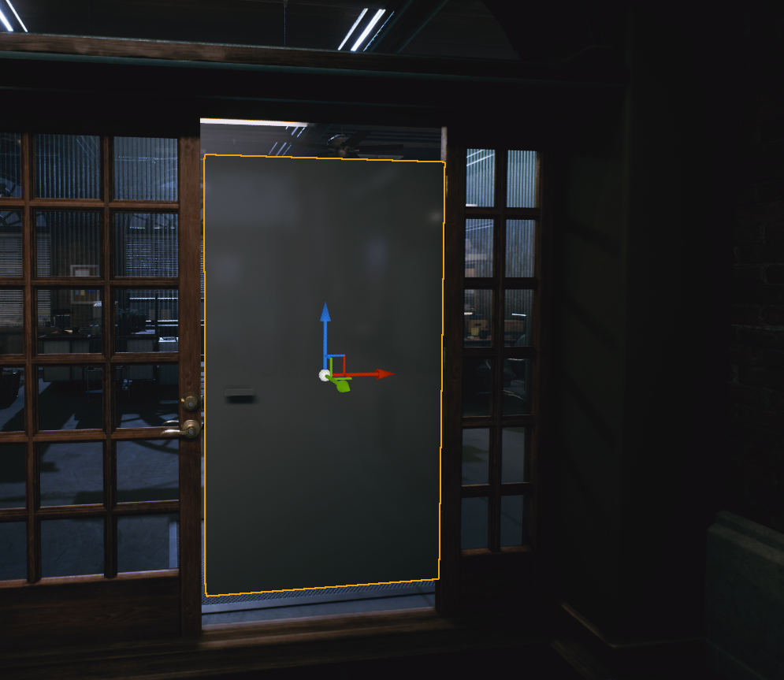
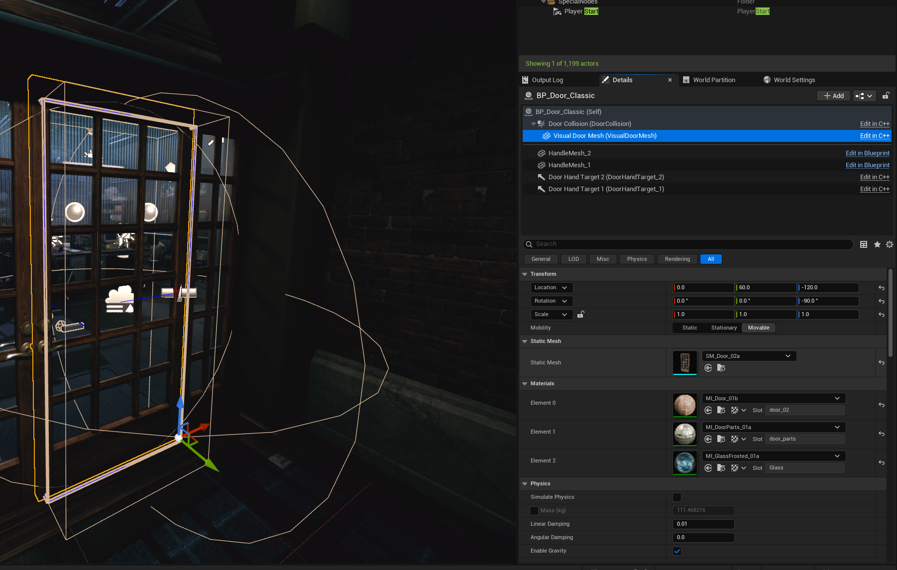
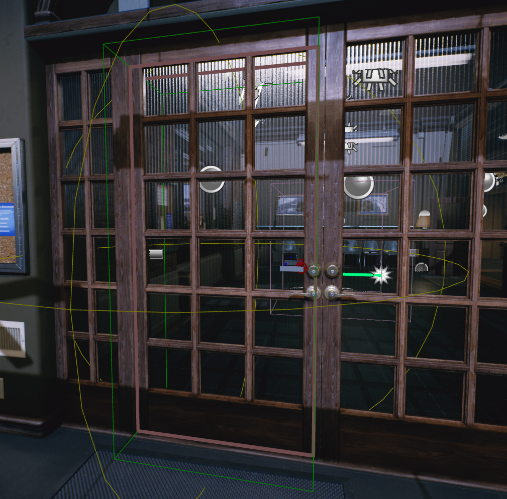
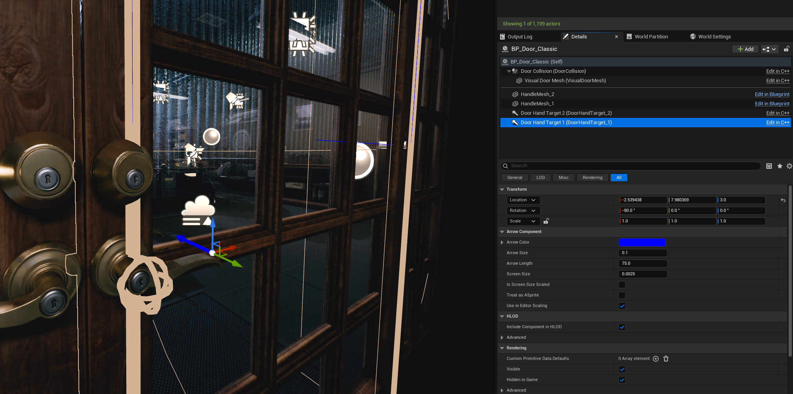

# Adding Interactable Doors To Custom Levels

If your level has door meshes that you want to make interactable by players, you can take additional steps to replace them with **HELIX Doors**.

1. You can find all the available template blueprints for different door types in `HelixDoors` plugin, within `Plugins/HelixDoors/Blueprints` folder in content browser.

    

2. After choosing the applicable door blueprint for your use case, just remove the door static mesh from your level and drag the blueprint to your scene. We will use `BP_Door_Classic` for first example, which acts as a classic house door.

    

3. Find the **Visual Door Mesh** component in your placed actor and change its mesh to the door static mesh previously used in the level. Tweak its transform to correctly center actor location as shown below. 

    

4. Tweak the orange colored door collision box from the actor's **Door Collision Size** property. As a rule of thumb, the collision should be slightly smaller than the visual door mesh. This is required to prevent physics doors getting stuck by hitting to ground mesh or walls covering the door.

    

    

5. Tweak the location of door handle marker from **Door Handle Right Offset** and **Door Handle Up Offset** properties of the actor. The small orange sphere shape should approximately placed onto your door handle's connection point to door.

    

6. Tweak the local transforms of **Door Offset Handle** components in door actor. Those components are used to correctly align character's hand with door handle while interacting with door. Keep the arrow component directed towards door with perpendicular angle, and move it slightly above the actual door handle mesh as shown on the screenshot.

    

7. You can tweak the handle location by playing in the level from editor and find the best transform value for the handle component.

    

      <iframe src="https://youtube.com/embed/pvT46ot4wfU?si=eeqvZvWVsqAoshFp"
              style="position: absolute; top: 0; left: 0; width: 100%; height: 100%;"
              frameborder="0"
              allowfullscreen>
      </iframe>
    

8. After your door is fully tweaked, you can play in editor and test it out!

    

      <iframe src="https://youtube.com/embed/RiNXVfrfgeU?si=V1rBtR0Q8yOswVBT"
              style="position: absolute; top: 0; left: 0; width: 100%; height: 100%;"
              frameborder="0"
              allowfullscreen>
      </iframe>
    

9. Now we will replace another door in the level, this time by using `BP_Door_Swinging`, which is acts like entrance doors on the markets etc.

    

    

      <iframe src="https://youtube.com/embed/Vy1U2Um0KgY?si=qWNrv-Rscqb6zrEK"
              style="position: absolute; top: 0; left: 0; width: 100%; height: 100%;"
              frameborder="0"
              allowfullscreen>
      </iframe>
    

10. If required, you can create a child blueprint from the HELIX template door blueprints, tweak defaults as you like, and reuse them in your custom map. Make sure the new blueprint is placed in your map package folder. See [Custom Blueprints](custom_blueprints.md) for more information.

11. See [Door Lua API](../api/apiImport/classes/door.md) for more information about available properties for doors.
