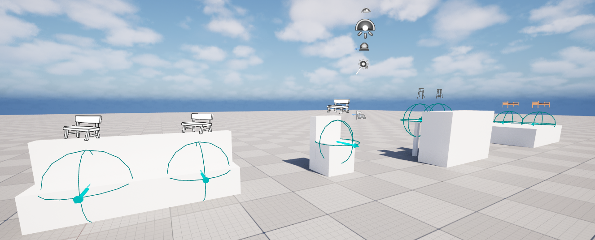
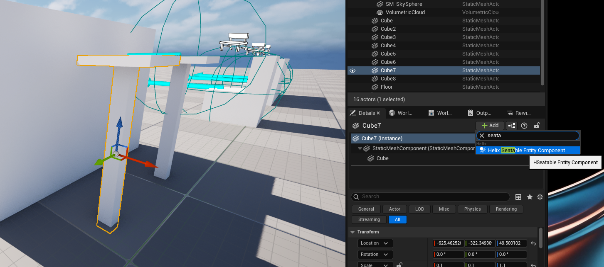
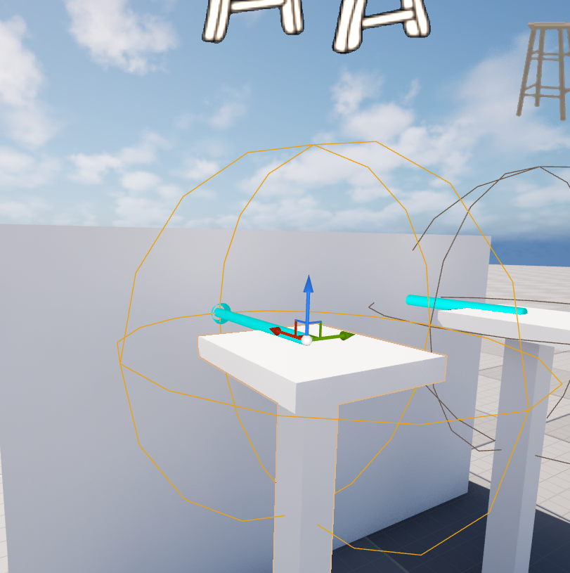
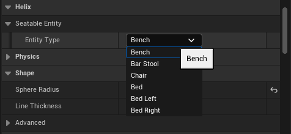

# Adding Seatable Entities To Custom Levels

If your level has seatable assets such as benches, beds, chairs etc, you can take additional steps to make them interactable by players.

1. After selecting the actor you would like to convert in your level, click **Add Component** button in properties panel and select `Helix Seatable Entity Component` from the list. This component provides all the required functionality for your actor.

    

2. After adding the component, tweak its location to center the spot where character should be seated on your actor. The direction of the arrow should be same as character's seated direction. The sphere radius defines interaction radius for your actor, which also can be tweaked from component properties.

    

3. Lastly, choose the most suitable entity type for your actor from the `SeatableEntity` property of the component. This changes the animations played during the interaction.

     
