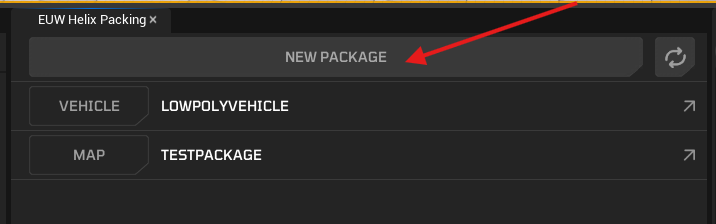
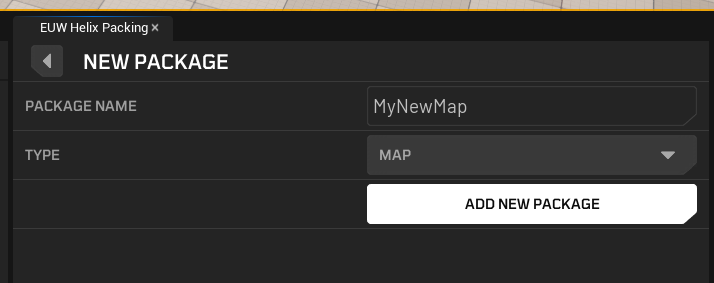
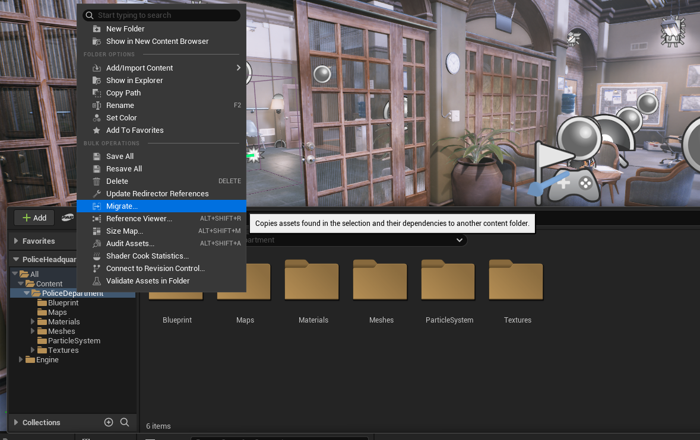
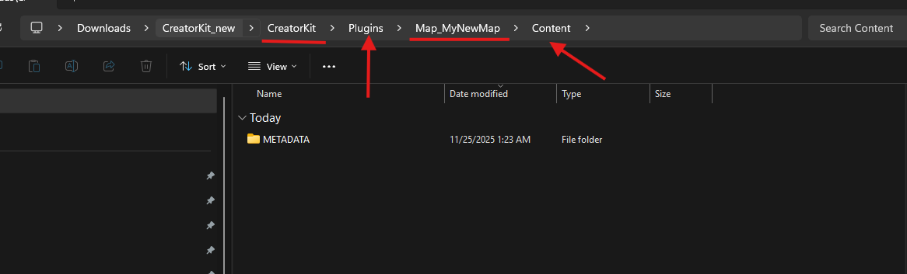
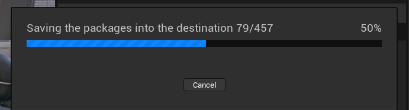
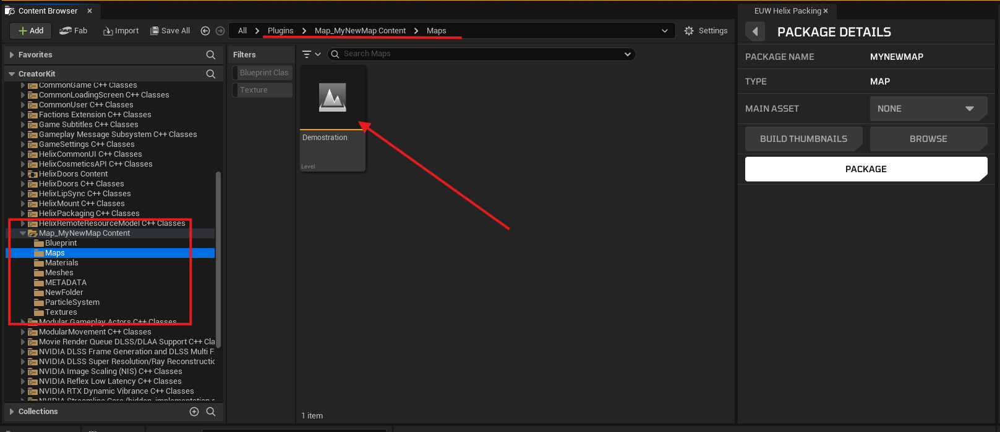
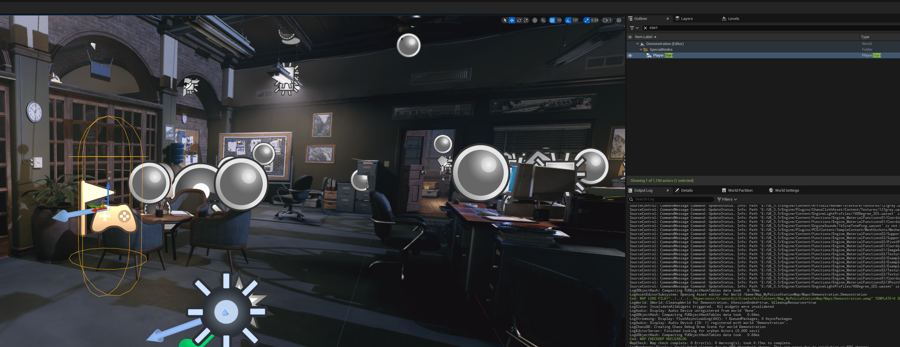
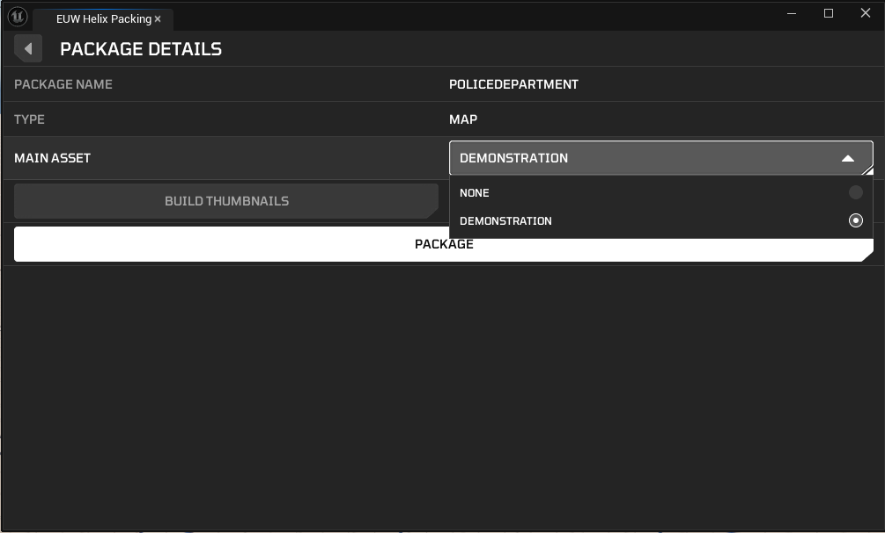
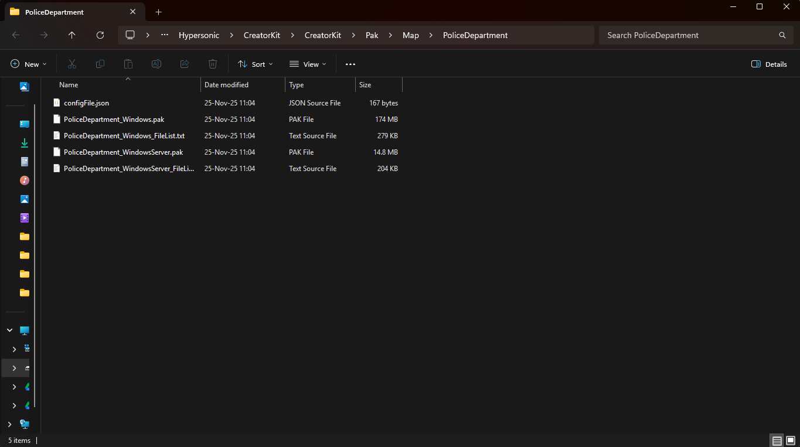
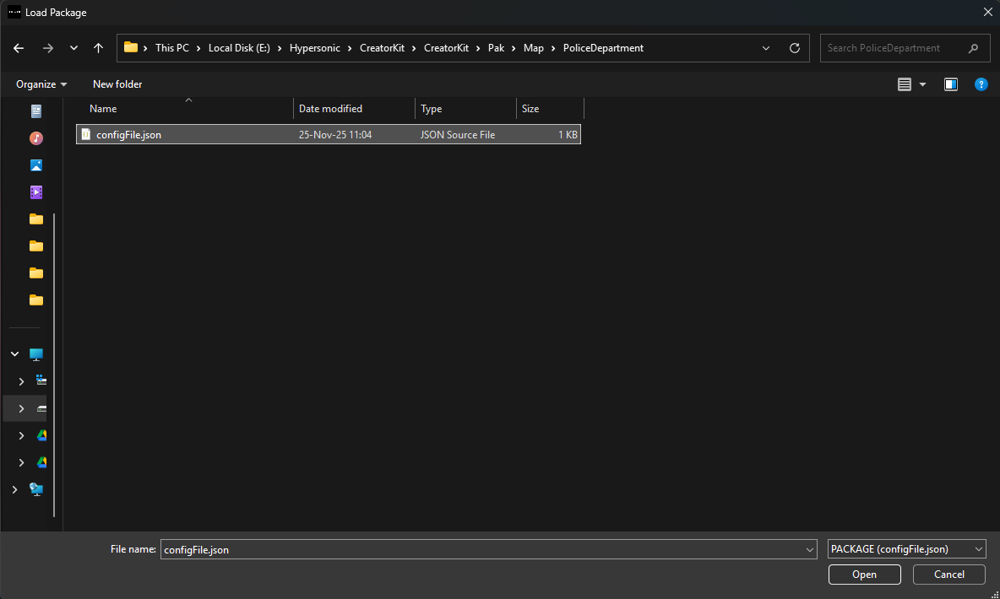

# Creating Custom Levels

This guide walks you through the process of packaging custom maps for the [Creator Hub](creatorhub.md) by using the [Creator Kit](creatorkit.md).

## 1. Creating a new Map Package on Creator Kit

1. In your CreatorKit project, open the the Package window and click the **New Package** button.

2. Write a name for your Map package and select **Map** on the Type field.

3. The location of your package folder will show up. You can always navigate back to this folder on the Package Manager **Browse** button.

## 2. Acquiring Your Custom Map

Either use **Creator Kit** to create your own custom map, or get a map asset from [Fab](https://fab.com).

Remember all the content of your map package should be on the folder highligthed on the previous step.

---

## 3. Importing a map

For this tutorial, we will be using a police station asset acquired from Fab.

1. Launch the project downloaded from Fab. It's needed to migrate assets from downloaded project into **Creator Kit** project.

    

2. Right click to root folder containing all assets in content browser and click **Migrate**, it is also ok to migrate the entire content folder, since the plugin workflow will take care of placing everything into your plugin content folder. Alternative, you can find the specific **Level** you want to migrate, right click the level and click migrate. Unreal will handle the dependencies.

    

3. Ensure each dependency is shown on the next window and click **OK**.

    

4. On the next window, find your **Creator Kit** installation's, go into plugins and find the package you just created. In this case we are going to import it into Map_MyNewMap. Then open the `Content` folder and select it.

    

5. Your assets will be copied into your **Creator Kit** plugin `Content` folder with same folder structure after process is done.

    

6. Close the custom map project and launch the **Creator Kit** project. Ensure your custom map is migrated into **Creator Kit** correctly.

    

7. Ensure you can play in your migrated custom map without any errors/warnings caused by migration process.

    

---

## 4. Making Your Custom Map Compatible With HELIX

1. Your level should at least have one **Player Start** actor placed in to define where your players will be spawned on initial login to your world. Make sure it's correctly aligned with ground floor. You can press **End** key to automatically align the actor with floor in editor.

    

2. HELIX currently utilizes **Lumen** for dynamic lighting, and static lighting is not supported. Make sure lighting actors in your map are set to **Dynamic** mobility for them to work properly in builds.

3. HELIX provides a set of base materials that creators can use when building custom maps. It’s strongly recommended to create your materials by deriving from these base materials. Doing so helps reduce package size and maintain optimal rendering performance in your level. For more details, see [Default Materials Guide](https://docs.helixgame.com/tutorials/default_materials/).

4. Some gameplay systems in HELIX utilizes Unreal Navigation System for NPC characters and also to automatically move player characters towards target location when required. Please check [Basic Navigation Documentation](https://dev.epicgames.com/documentation/en-us/unreal-engine/basic-navigation-in-unreal-engine?application_version=5.5) to see how to add a navigation bounds volume to your level and build a navigation mesh before cooking your package.

    /// warning | Warning
    If your level doesn't have a valid navmesh data, NPC characters will fail to move in your level, and player characters will fail to move towards vehicles after interaction.
    ///

    /// info | Note
    HELIX uses static nav mesh generation with nav modifier support. Please check [Navigation Components Documentation](https://dev.epicgames.com/documentation/en-us/unreal-engine/navigation-components-in-unreal-engine) to see how to affect navigation in your level with nav modifiers dynamically in runtime, if needed.
    ///

---

## 5. Finalizing and Cooking The Package

1. Make sure all the depending assets by your Map are placed inside same plugin package folder. If one of those assets are placed outside of the created package folder, cooked `.pak` file will have missing dependencies and this might cause crashes or runtime errors during playthrough with this package.

2. Return to the HELIX Packaging Tool window.

3. Go into your package and choose **Main Asset** to the level asset you would like to use for your package. This is should be the persistent level you used for your map.

    

3. Click package button and wait for cook process to complete.

4. Once cooking is complete, a file explorer window will automatically open, displaying your final `.pak` files. Your custom character mesh is now ready to be uploaded to the **Creator Hub**!

    

---

## 6. Testing Your Custom Map

### 1. In Creator Kit

As shown on the previous steps, you can directly test your map in **Creator Kit** by pressing play button from editor toolbar. This doesn't require you to cook any package.

### 2. In HELIX

1. Create a draft world with **Local File** option.

    

2. Select the `.pak` file you've cooked in **Creator Kit**.

    

3. If import was successful, your new world should be automatically created with your custom map placed in. If you don't see your map on the spawn location, or your character starts falling down just after game starts, ensure you have a valid **Player Start** actor placed in your level as explained in the previous steps.

    

      <iframe src="https://youtube.com/embed/S3ikj9rI9s8?si=YdcmI64ysvrKTH9H"
              style="position: absolute; top: 0; left: 0; width: 100%; height: 100%;"
              frameborder="0"
              allowfullscreen>
      </iframe>
    

---

## 7. On Your Own

Once you've followed these steps and uploaded your package to **Creator Hub**, your should be able to create new worlds with your custom map package!
