# Creating Custom Characters

This guide walks you through the process of packaging custom character mesh assets using **HELIX Studio**.

By the end you will have a custom character mesh that players can select and equip on their characters at runtime.

/// warning | Warning
Custom character meshes do not support [wearables](https://development.helix-documentation.pages.dev/tutorials/HelixCharacterCreator/cc_wearables), and they will be disabled in character customization game UI if a custom character mesh is chosen.
///

---

## Prerequisites

- **HELIX Studio** installed (refer to [this guide](../studio.md)).
- A **HELIX account**, logged in within **HELIX Studio** (required for the Packages tools and **Vault** upload).
- A custom character mesh, prepared for importing into project (either .fbx file or import from [Fab](https://fab.com)).

---

## 1. Create a Project

Launch **HELIX Studio** and create either a **new wearable sample project** or a **blank project** to start from.

---

## 2. Create a Wearable Vault Package

1. From the toolbar menu, select **Packages → Manage Packages → New Package**.

    

2. Fill in the details for your wearable package. Set the **type** to **Wearable**.

    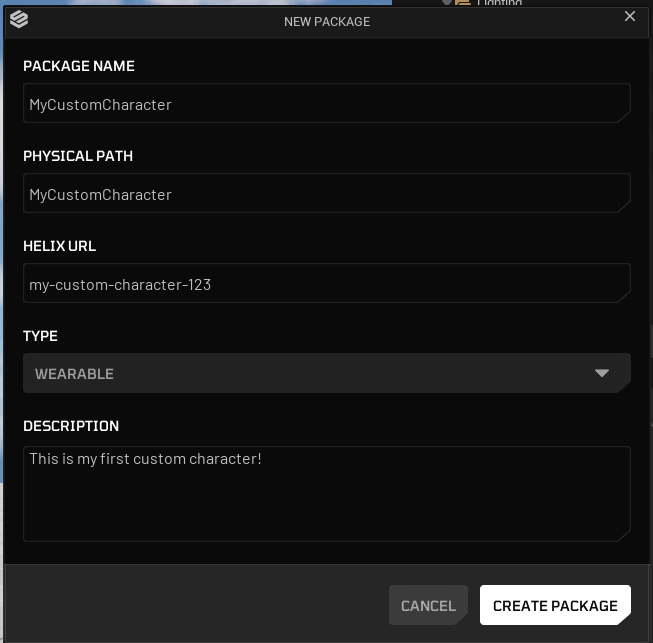

3. Click **Create Package**.

    Package creation generates a new plugin folder named after your package. This folder is the **root** where you gather all custom character related assets.

    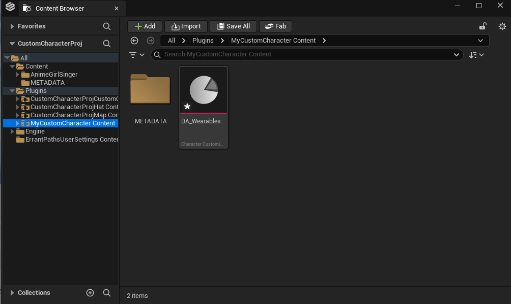

## 3. Acquire Your Custom Character Mesh Asset

Either use your favorite modeling tool to create and skin a custom character mesh, or get a character mesh from [Fab](https://fab.com).

If you're using a character pack acquired from [Fab](https://fab.com), just simply move textures, materials and character mesh into your package folder.

Otherwise, if you have an `.fbx` file to import into project, import it directly into the created folder. Do not forget to fix redirectors.

/// warning | Warning
Custom character meshes should closely match the proportions of the standard Unreal Engine 5 Manny/Quinn mannequins. This is not a strict requirement; however, substantial differences in limb length, body proportions, or overall scale may cause animation or gameplay systems to behave incorrectly, including interaction traces, first person view mode quality, collision/hit detection, IK solvers, and ability logic.
///

---

## 4. Set Up Your Custom Character Mesh

### 4.1. Unreal Engine 5 Rig Based Character Mesh

If your character mesh is using same skeleton with Unreal Engine 5 Manny/Quinn and has similar proportions with them, you can directly use your mesh without need of runtime retargeting.

1. **Right Click** to your character skeletal mesh and assign `SK_Unified` as target skeleton, which is currently placed inside `HelixAnimation` plugin. This ensures your mesh is encoded with the project's main skeleton asset.

    

    

2. If you get errors about bone merge process being failed or missing bones on target skeleton, that means your character mesh is not compatible with this method and you should follow the steps in [4.2](https://development.helix-documentation.pages.dev/tutorials/HelixCharacterCreator/cc_characters/#42-custom-rig-based-character-mesh) instead.

### 4.2. Custom Rig Based Character Mesh

If your character mesh is using a custom rig (including old Unreal Engine 4 mannequin skeleton), it will need additional steps to set-up an IK Rig retageter to get it compatible with **HELIX** characters.

/// tip | Daz Studio characters
If your mesh comes from **Daz Studio** (a Genesis figure imported with the **Daz to Unreal** bridge), follow [4.3](#43-daz-studio-genesis-characters) instead. Building the IK Rig automatically works for the limbs but leaves the spine rigid, and 4.3 avoids that.
///

/// warning | Warning
Ensure all of your skeleton bones have unit scale (1.0). If your character bones were scaled inside Maya/Blender during rigging (especially the root bone), this is not supported and your custom mesh will fail to retarget animations.
///

1. **Right Click** to your custom character mesh in content browser and select **Create** -> **IK Rig**, when naming it, follow **IK_Name** convention for clarity. IK Rig is asset is used to define bone chains and IK targets to use during retargeting process.

    

2. Open the IK Rig asset you've created. Then click **Auto Create Retarget Chains** and **Auto Create IK** buttons on top bar in order. Unreal Engine is usually good at auto detecting your bone chains and automatically define them within the asset.

    /// warning | Warning
    If you click **Auto Create IK** button multiple times by mistake, this might create duplicate IK targets, and they should be removed back from skeleton hierarchy panel and **Solver Stack** tab on the left side.
    ///

    

    

    

3. Ensure if the generated bone chains look correct on the right panel, and your character got **yellow cubes** on each hand and feet. Those cubes represents IK targets. If auto generation was successfull, pulling these cubes should move your charater limbs without any visual issues on execute IK body correction on top of it.

    

4. If there are issues with auto generated bone chains or IK targets, this usually happens if your character has an uncommon bone naming style or hierarchy, and you need to manually create each bone chain for your skeleton. Please check [IK Rig Documentation](https://dev.epicgames.com/documentation/en-us/unreal-engine/ik-rig-in-unreal-engine?application_version=5.7) for more information about manually setting up an IK Rig asset for skeletons.

5. After IK Rig asset is ready, we need to create an IK Retargeter asset to define how animations should be retargeted from **HELIX** character base mesh to your custom mesh. To do that, **Right Click** to an empty space in your package folder, and select **Animation** -> **Retargeting** -> **IK Retargeter**, when naming it, follow **RTG_Name** convention for clarity. Open the created asset.

    

6. Select `IK_Unified_CosmeticsRetarget` as **Source IKRig Asset**. When asked to assign IK to all ops, click **Assign** button on the prompt. Select either `SKM_Manny` or `SKM_Quinn` as **Source Preview Mesh** according to closest one to your custom mesh proportions for better results. This property will define the source skeleton we'll retarget the animations from during runtime.

    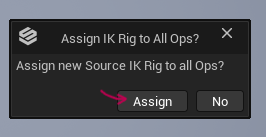

    

7. Select the IK Rig asset you've just created on previous steps as **Default Target IKRig Asset**. This property will define the target skeleton we'll retarget the animations to during runtime. When asked to assign IK to all ops, click **Assign** button on the prompt again.

    

    

8. Both characters now should be visible on the preview panel. You can tweak **Target Mesh Offset** on the right panel to place your mesh near retarget source mesh as shown below.

    

9. On the left **Op Stack** panel, go into **Pelvis Motion** settings. Ensure pelvis bone fields are correctly assigned to `pelvis` bone for both target & source rig.

    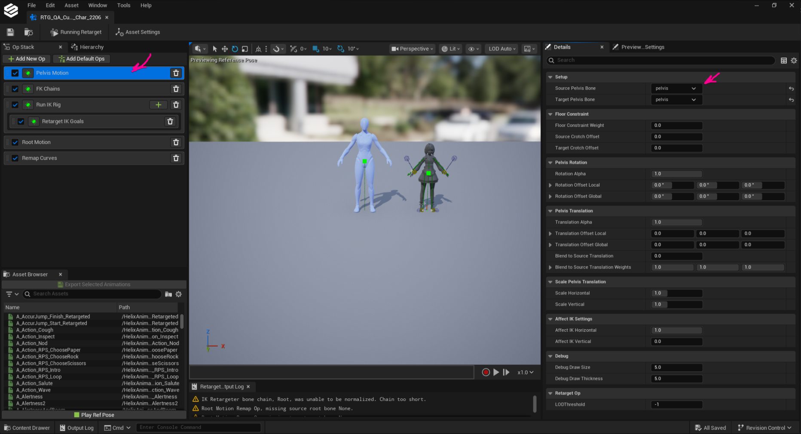

10. On the left **Op Stack** panel, go into **FK Chains** settings. **Retarget Chain Settings** section should automatically match your IK Rig asset bone chains with each other. Ensure each chain is mapped correctly. If there are missing chain assignments, assign the the missing chains manually, or use the **Auto-Map Chains** button to try automatically matching each chain.

    

11. On the left **Op Stack** panel, go into **Run IK Rig** settings. **Solve IK Goal Settings** section should automatically match your IK Rig asset IK goals with each other. Ensure goal is mapped correctly. If there are missing goal assignments, assign the the missing goal manually, or use the **Auto-Map Chains** button to try automatically matching each goal.

    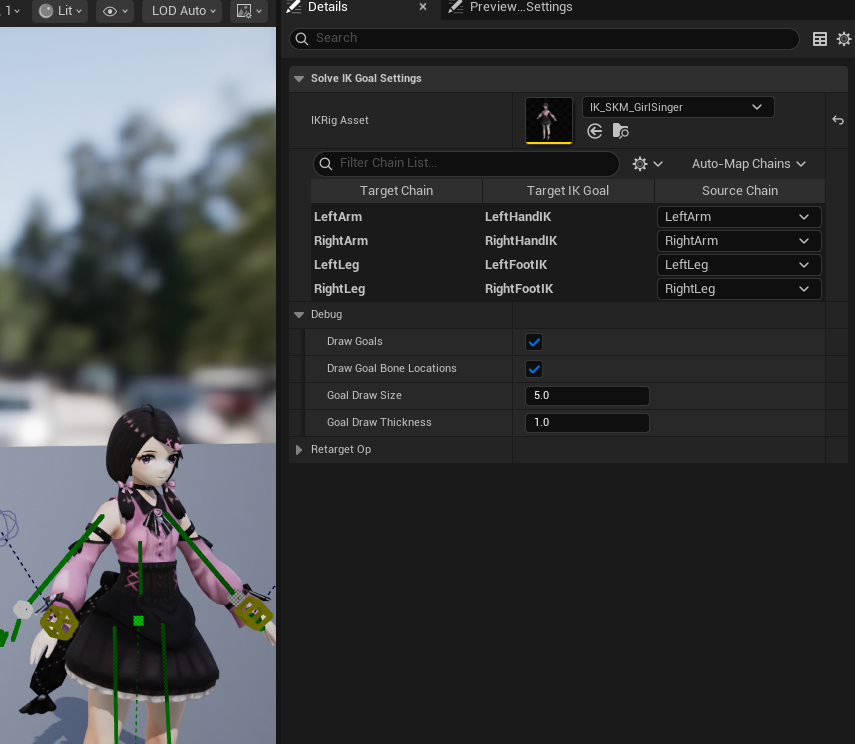

12. On the left **Op Stack** panel, go into **Root Motion** settings. Assing root bones of both rigs to **Source Root** and **Target Root** fields. Assign your custom character rig's pelvis bone to **Root Motion Source** field.

    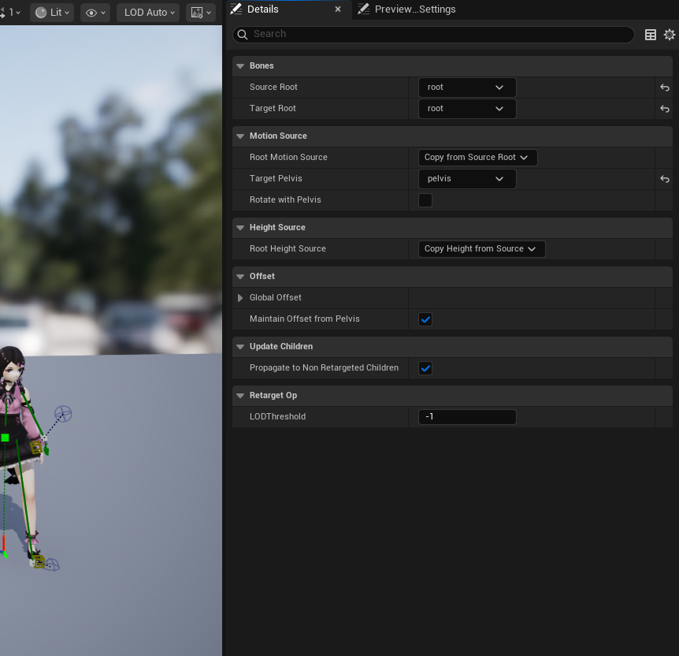

13. To ensure your IK Retargeter works correctly, go to **Asset Browser** tab on bottom left panel, and play one of the available animations. If your custom character plays the animations without any visual issues, this means your IK Retargeter setup is ready!

    

14. If there are issues with retargeting results, you might need to further tweak your bone chains in your IK Rig and IK Retargeter assets. Please check [IK Rig Retargeting Documentation](https://dev.epicgames.com/documentation/en-us/unreal-engine/ik-rig-animation-retargeting-in-unreal-engine?application_version=5.7) for more information.

15. Open your skeletal mesh asset and find **Asset User Data** property. Click **+** symbol to create a new asset user data instance.

    

    /// warning | Warning
    Do not confuse **Asset User Data** with **Asset User Data Editor Only**. They are separate properties and only the former should be modified.
    ///

16. Select `HELIX Cosmetics Body Mesh Asset User Data` from the dropdown menu. This asset is used to define how your mesh should be used with **HELIX** characters during runtime.

    

17. Assign the IK Retargeter asset you've created on the previous steps into **Retargeter** field. Write down approximate body height of your character, in Unreal units (cm). This value will help animation retargeting and also improve first person camera behavior on your custom mesh.

    

18. If you need your character body mesh to get retargeted differently during first person view mode, you can create another IK Retargeter asset and assign into **First Person Retargeter** field.

19. If your character body mesh has a neck & head section which can obscure camera during first person view mode, add the bone names covering those mesh sections into **First Person Bone Hide List** field. Usually, you should put names such as `head`, `neck_01`, `neck_02` etc. in this list.

20. Your mesh should be ready for runtime retargeting after following those steps.

### 4.3. Daz Studio (Genesis) characters

If your character comes from **Daz Studio** (a Genesis figure imported with the **Daz to Unreal** bridge), use this method instead of [4.2](#42-custom-rig-based-character-mesh).

Daz Genesis figures use a custom skeleton whose bones are aligned to the world rather than oriented along each bone. If you build the IK Rig and IK Retargeter automatically as in 4.2, the arms and legs retarget correctly because they are driven by IK goals, but the **spine, neck, and head stay rigid** during animation. The bone orientation breaks the forward-kinematics retargeting that those chains rely on.

/// info | Why this happens
The retarget reads each bone's local rotation. Daz bones share the same world-aligned orientation, so the spine chain has no usable rotation to transfer. The arms and legs hide the problem because IK goals override them; the spine, neck, and head have no IK, so they freeze.
///

The **Daz to Unreal** plugin already ships IK Rigs and IK Retargeters built for the Genesis skeletons. Reuse the pair that matches your figure instead of generating your own:

1. In the content browser, open the plugin folder `/DazToUnreal/Retarget/`. It contains ready-made assets for each Genesis generation:

    | Figure | IK Rig | IK Retargeter |
    |---|---|---|
    | Genesis 8 / 8.1 | `G8IKRig` | `G81FixRotZeroRootIKRetargeter` |
    | Genesis 9 | `G9IKRig` | `G9Retargeter` |

    A `G3Retargeter` is also provided for older Genesis 3 figures.

2. Copy the matching IK Rig and IK Retargeter into your package folder, next to your character mesh.

3. Open each copied asset and assign your Daz character mesh:
    - In the **IK Rig**, set your character mesh as its preview skeletal mesh.
    - In the **IK Retargeter**, assign your character mesh as the **Target** (through the copied IK Rig).

4. Continue from step 15 of [4.2](#42-custom-rig-based-character-mesh): open your skeletal mesh, add the `HELIX Cosmetics Body Mesh Asset User Data`, and assign the copied IK Retargeter to its **Retargeter** field.

/// tip | Tip
Test with an animation that bends the torso, such as sitting down or standing up. If the spine follows the animation instead of staying upright, the setup is correct.
///

---

## 5. Tweak Your Custom Character Mesh

Custom character meshes have additional requirements to ensure they have optimal performance and fully compatible with gameplay systems in **HELIX**. Those steps are required to successfully package your assets.

1. Ensure a physics asset is assigned to your skeletal mesh within its **Physics Asset** property. 

    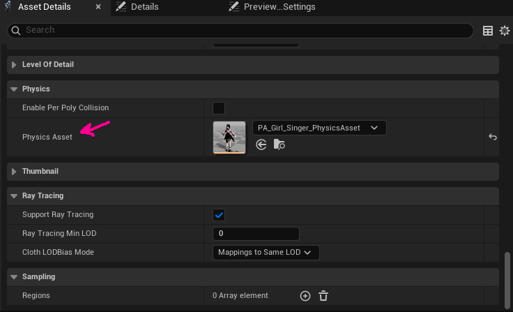

2. Then, open the corresponding physics asset and ensure the capsules cover the mesh approximately. This is required for your mesh bounds to be properly calculated for FOV based occlusion. If this is not done properly, your mesh can disappear randomly from certain camera angles during gameplay. Please check [Physics Asset Editor Documentation](https://dev.epicgames.com/documentation/en-us/unreal-engine/physics-asset-editor-in-unreal-engine?application_version=5.5) for more information.

    

    /// warning | Warning
    If you may get prompted with the "Physics Asset has no skeletal mesh assigned" error. If this happens, the PA file will use the default cube mesh as the preview mesh. To fix it, go to the Preview Settings panel on the right side -> Mesh -> Preview Mesh (Physics Assets) -> Add your mesh here.

    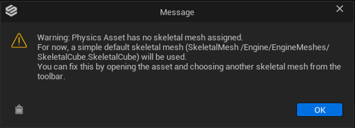

    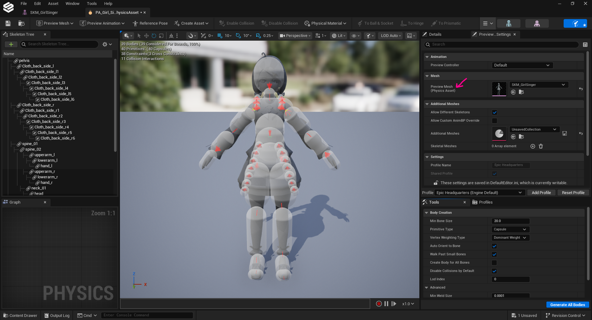

    ///

3. In your skeletal mesh asset, make sure you have LOD data generated for your mesh. This ensures your mesh does not negatively impact performance for distant characters using your custom character mesh. You can set LOD count to 3 and click regenerate to automatically generate LODs for your mesh. Please check [Skeletal Mesh LODs Documentation](https://dev.epicgames.com/documentation/en-us/unreal-engine/skeletal-mesh-lods-in-unreal-engine?application_version=5.5) for more information.

    

4. In your skeleton asset, ensure you have required sockets added. Please check [Skeletal Mesh Sockets Documentation](https://dev.epicgames.com/documentation/en-us/unreal-engine/skeletal-mesh-sockets-in-unreal-engine?application_version=5.5) for more information.

    /// note | List of Required Sockets
    - **weapon_l_socket**: Left hand socket used in **HELIX** to attach held items. Usually should be created under `hand_l` or `weapon_l` bone of your rig.
    - **weapon_r_socket**: Right hand socket used in **HELIX** to attach held items and weapons. Usually should be created under `hand_r` or `weapon_r` bone of your rig.

    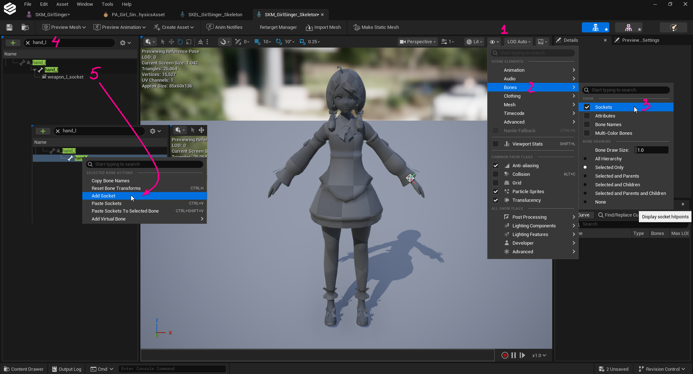

    ⚠️ *The list might be updated with more sockets in the future* ⚠️
    ///

---

## 6. Set Up Materials

Please refer to [this section](cc_wearables.md#set-up-materials) of the Custom Wearables tutorial to set up materials. You will need to follow this even if you imported your own materials as **HELIX Studio** currently only support material instances parented to specifically allowed master materials.

---

## 7. (Optional) Add Post-Anim Physics Simulation Support

Custom character meshes optionally can simulate post-anim physics with post-process animation blueprints. Please check [Rigid Body Documentation](https://dev.epicgames.com/documentation/en-us/unreal-engine/animation-blueprint-rigid-body-in-unreal-engine?application_version=5.5) and [Anim Dynamics Documentation](https://dev.epicgames.com/documentation/en-us/unreal-engine/animation-blueprint-animdynamics-in-unreal-engine?application_version=5.5) for more information about how to create one for your character if applicable.

/// warning | Warning
1. Post-process animation blueprint support is experimental and creators are responsible with ensuring their custom character physics implementation is optimized for performance.

2. If you decide to use this feature, please ensure to assign a skeleton to your Post-Process Animation Blueprint, otherwise packaging will fail.
///

1. After creating a post-process animation blueprint, assign it to **Post-Process Anim Blueprint** field of your skeletal mesh asset.

    

2. Make sure to also set a LOD threshold for your animation blueprint in the next **Post-Process AnimBP LOD Threshold** field, according to LOD count of your mesh. For example, if your mesh has 3 LODs, it usually makes sense to limit it only to LOD0 or LOD1 by setting the field to corresponding value. This will ensure your performance heavy physics implementation won't be executed for non-significant characters on the screen. 

---

## 8. Finalize and Cook The Package

1. Make sure all the depending assets for your custom character mesh are placed inside the same package folder. If one of those assets are placed outside of the created package folder, cooked `.pak` file will have missing dependencies and this might cause crashes or runtime errors during playthrough with this package.

2. Find the `DA_Wearables` data asset in your package folder and open it.
3. Select `Custom Characters` from left panel.
4. Press "+ Add" to create a new entry in the category.
5. Give your new custom character entry a unique ID by double clicking the tile's name.
6. After creating your entry, fill in the properties as described below:

    | Property | Description |
    |---|---|
    | **Body Mesh** | Assign the imported skeletal mesh here. |
    | **Supported Genders** | Select the gender most closest to your custom character. This will change the base animation retarget source mesh used with your custom mesh. |
    | **Display Name** | A meaningful name shown in the UI. |
    | **Preset Icon** | An icon texture, if you have one. |
    | **Additional Tags** | List of additional metadata tags for your wearable. These tags are used for categorization purposes in the **HELIX Character Creator** UI. |
    | **Is Hidden From Database** | Hides your entry from the **HELIX Character Creator **UI, if enabled. |

7. After finishing setting up your data asset, find your package from top toolbar and click on it.

    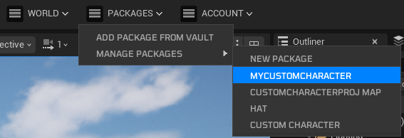

8. Ensure information on the properties window is correct, and fill any missing fields if needed. Click **Publish**.

    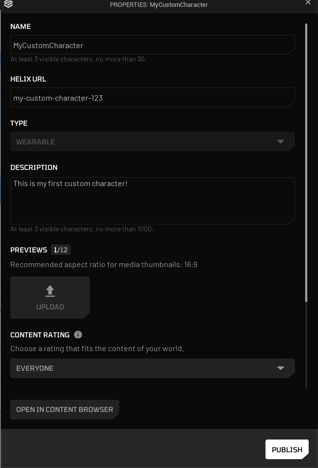

9. Select **Upload to Vault** option and choose what you want to do with the current package (update current, make latest, publish as new). For current tutorial, we'll choose publish as new. Click **Start** button to start packaging process.

    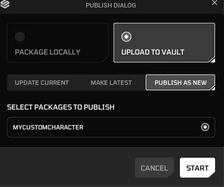

10. Once packaging is completed, your package will be ready to use from HELIX Vault on game build.

    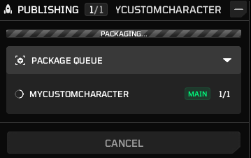

---

## 9. Test Your Custom Character Mesh

### 9.1. In HELIX Studio

This method doesn't require you to cook the package on the previous steps. As long as you placed all the required assets in your package folder in **HELIX Studio**, and created the data asset as explained above, it will automatically become available for "play-in-editor" playthroughs.

1. Press play in **HELIX Studio** editor, and press **P** button to show the **HELIX Character Creator** UI for your character.

2. In the shown UI, you should be able to navigate to your new custom mesh in **Custom** tab and click on it to test on the character.

    

### 9.2. In HELIX Game Client

1. Create a draft world and press N to bring build mode window. Then click **Vault** from bottom toolbar. Find your package from the list.

    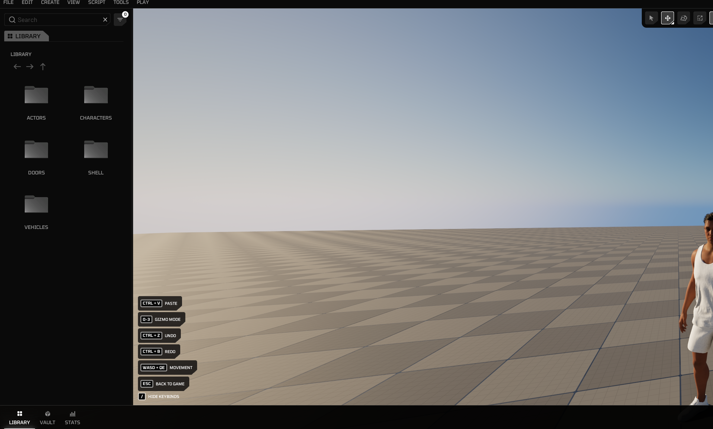

    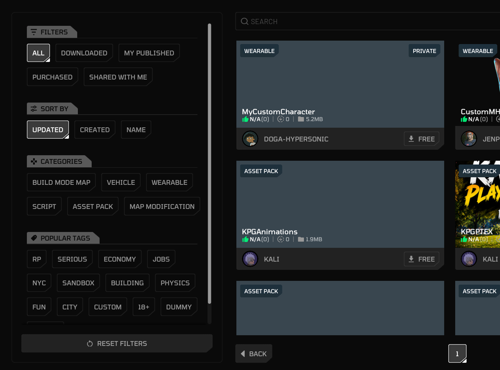

2. Click on your package and select **Add to World**

    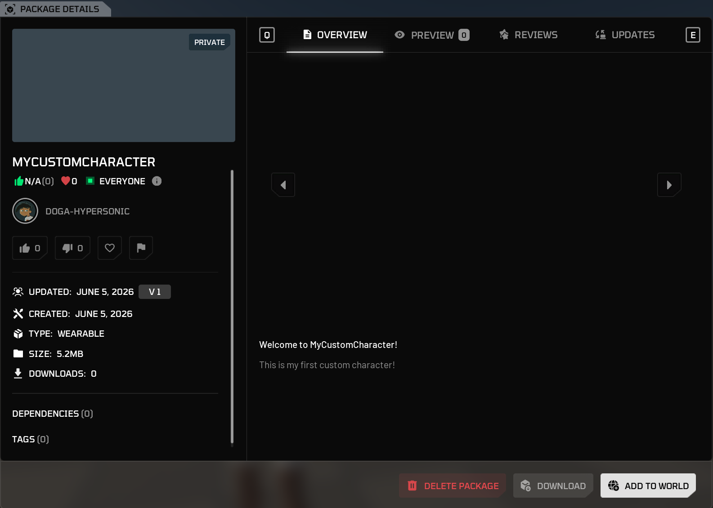

3. If download was successful, you should see the corresponding custom character mesh assets on left panel.

    

4. Go back to the game from build mode, and press **P** button.

5. Your imported custom character mesh should be available in the **Custom** tab.

    

    <iframe src="https://www.youtube.com/embed/eM2_7DWIIqM?si=qELiLj1TaBILbGUP"
            style="position: absolute; top: 0; left: 0; width: 100%; height: 100%;"
            frameborder="0"
            allowfullscreen>
    </iframe>
    

---

## 10. Share with Other Players

Once you've followed these steps, uploaded your public package to **Vault**, and imported it into your world, your new custom character mesh will be available for players joining your public world!
