# Creating Custom Characters

This guide walks you through the process of packaging custom character mesh assets using Helix Studio.

By the end you will have a custom character mesh that players can select and equip on their characters at runtime.

/// warning | Warning
Custom character meshes do not support [wearables](https://development.helix-documentation.pages.dev/tutorials/HelixCharacterCreator/cc_wearables), and they will be disabled in character customization game UI if a custom character mesh is chosen.
///

---

## Prerequisites

- Helix Studio installed.
- A **Helix account**, logged in within Helix Studio (required for the Packages tools and Vault upload).
- A custom character mesh, prepared for importing into project (either .fbx file or import from Fab)

---

## 1. Create a Project

Launch Helix Studio and create either a **new wearable sample project** or a **blank project** to start from.

---

## 2. Create a Wearable Vault Package

1. From the toolbar menu, select **Packages → Manage Packages → New Package**.

    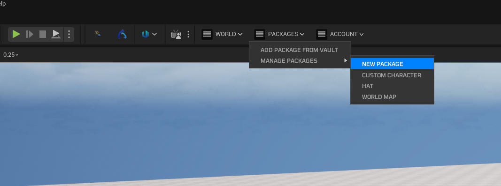

2. Fill in the details for your wearable vault package. Set the **type** to **Wearable**.

    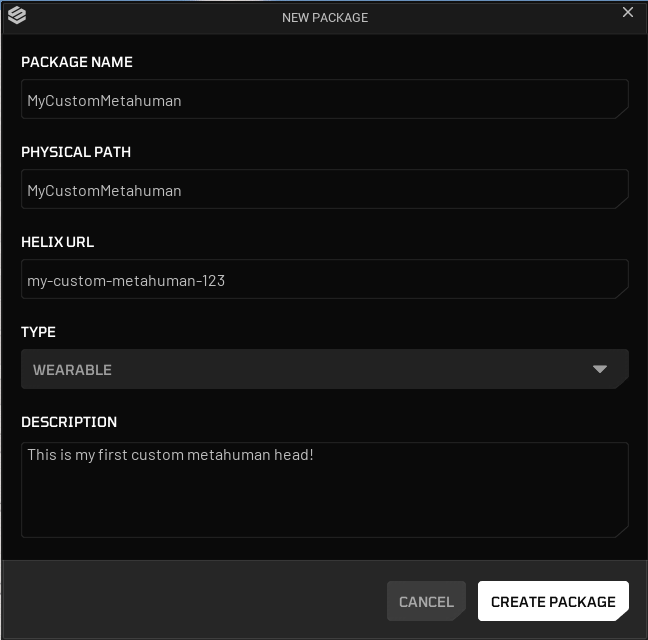

3. Click **Create Package**.

    Package creation generates a new plugin folder named after your package. This folder is the **root** where you gather all MetaHuman-related assets.

    

## 3. Acquiring Your Custom Character Mesh Asset

Either use your favorite modeling tool to create and skin a custom character mesh, or get a character mesh from [Fab](https://fab.com).

If you're using a character pack acquired from Fab, just simply move textures, materials and character mesh into your package folder. Otherwise, if you have an `.fbx` file to import into project, import it directly into the created folder. Do not forget to fix redirectors.

/// warning | Warning
Custom character meshes should closely match the proportions of the standard Unreal Engine 5 Manny/Quinn mannequins. This is not a strict requirement; however, substantial differences in limb length, body proportions, or overall scale may cause animation or gameplay systems to behave incorrectly, including interaction traces, first person view mode quality, collision/hit detection, IK solvers, and ability logic.
///

---

## 4. Setting Up Your Custom Character Mesh

### 4.1. Unreal Engine 5 Rig Based Character Mesh

If your character mesh is using same skeleton with Unreal Engine 5 Manny/Quinn and has similar proportions with them, you can directly use your mesh without need of runtime retargeting.

1. **Right Click** to your character skeletal mesh and assign `SK_Unified` as target skeleton. This ensures your mesh is encoded with the project's main skeleton asset.

    

    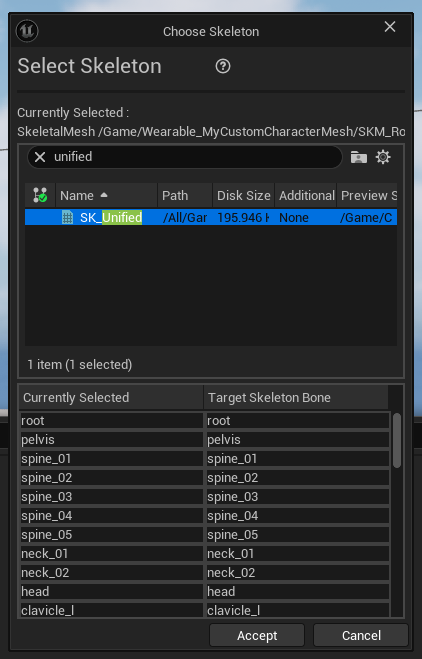

2. If you get errors about bone merge process being failed or missing bones on target skeleton, that means your character mesh is not compatible with this method and you should follow thesteps in [3.2](https://development.helix-documentation.pages.dev/tutorials/custom_characters/#32-custom-rig-based-character-mesh) instead.

### 4.2. Custom Rig Based Character Mesh

If your character mesh is using a custom rig (including old Unreal Engine 4 mannequin skeleton), it will need additional steps to set-up an IK Rig retageter to get it compatible with HELIX characters.

/// warning | Warning
Please note that runtime retargeting has an additional CPU cost per character rendered on screen. If you're planning your mesh to be used by mass number of characters in your world, please prefer rigging it with Unreal Engine 5 skeleton and follow the steps in [3.1](https://development.helix-documentation.pages.dev/tutorials/custom_characters/#31-unreal-engine-5-rig-based-character-mesh) to directly use it without need of retargeting.
///

/// warning | Warning
Ensure all of your skeleton bones have unit scale (1.0). If your character bones were scaled inside Maya/Blender during rigging (especially the root bone), this is not supported and your custom mesh will fail to retarget animations.
///

1. **Right Click** to your custom character mesh in content browser and select **Create** -> **IK Rig**. IK Rig is asset is used to define bone chains and IK targets to use during retargeting process.

    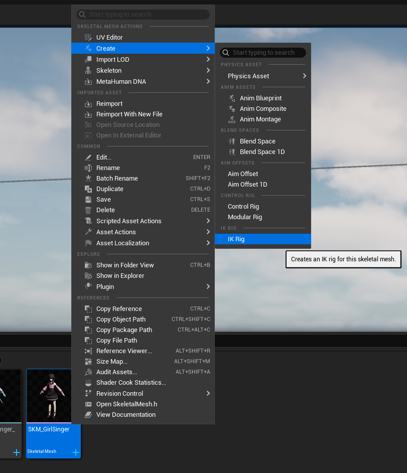

2. Open the IK Rig asset you've created. Then click **Auto Create Retarget Chains** and **Auto Create IK** buttons on top bar in order. Unreal Engine is usually good at auto detecting your bone chains and automatically define them within the asset.

    /// warning | Warning
    If you click **Auto Create IK** button multiple times by mistake, this might create duplicate IK targets, and they should be removed back from skeleton hierarchy panel and **Solver Stack** tab on the left side.
    ///

    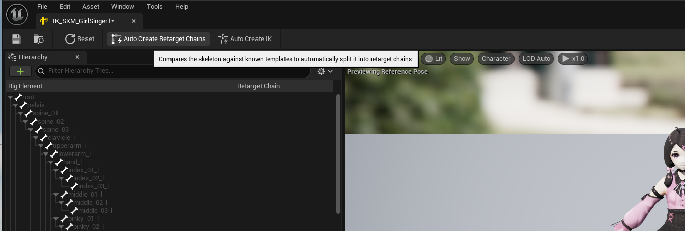

    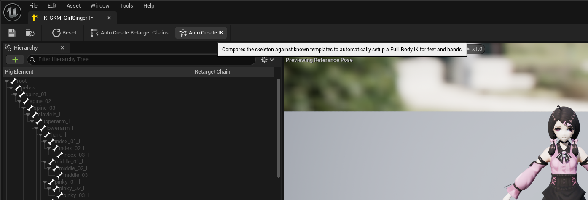

    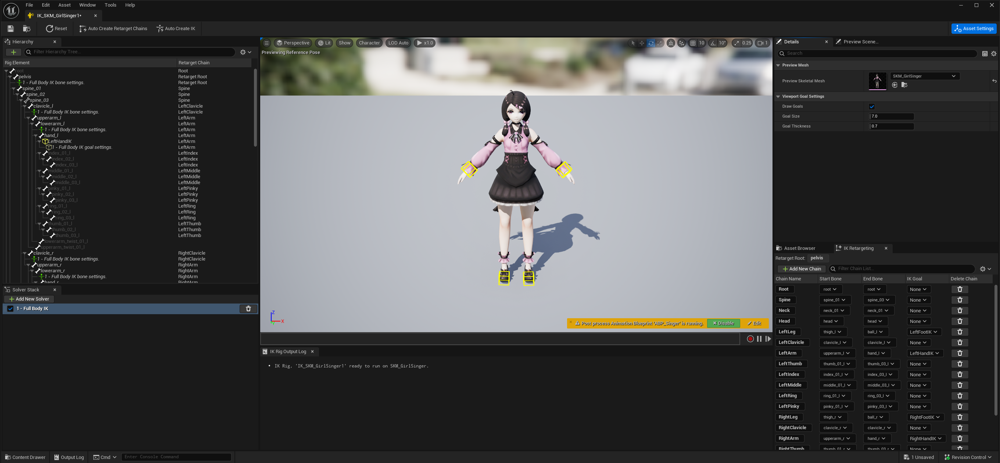

3. Ensure if the generated bone chains look correct on the right panel, and your character got **yellow cubes** on each hand and feet. Those cubes represents IK targets. If auto generation was successfull, pulling these cubes should move your charater limbs without any visual issues on execute IK body correction on top of it.

    

4. If there are issues with auto generated bone chains or IK targets, this usually happens if your character has an uncommon bone naming style or hierarchy, and you need to manually create each bone chain for your skeleton. Please check [IK Rig Documentation](https://dev.epicgames.com/documentation/en-us/unreal-engine/ik-rig-in-unreal-engine?application_version=5.7) for more information about manually setting up an IK Rig asset for skeletons.

5. After IK Rig asset is ready, we need to create an IK Retargeter asset to define how animations should be retargeted from HELIX character base mesh to your custom mesh. To do that, **Right Click** to an empty space in your package folder, and select **Animation** -> **Retargeting** -> **IK Retargeter**. Open the created asset.

    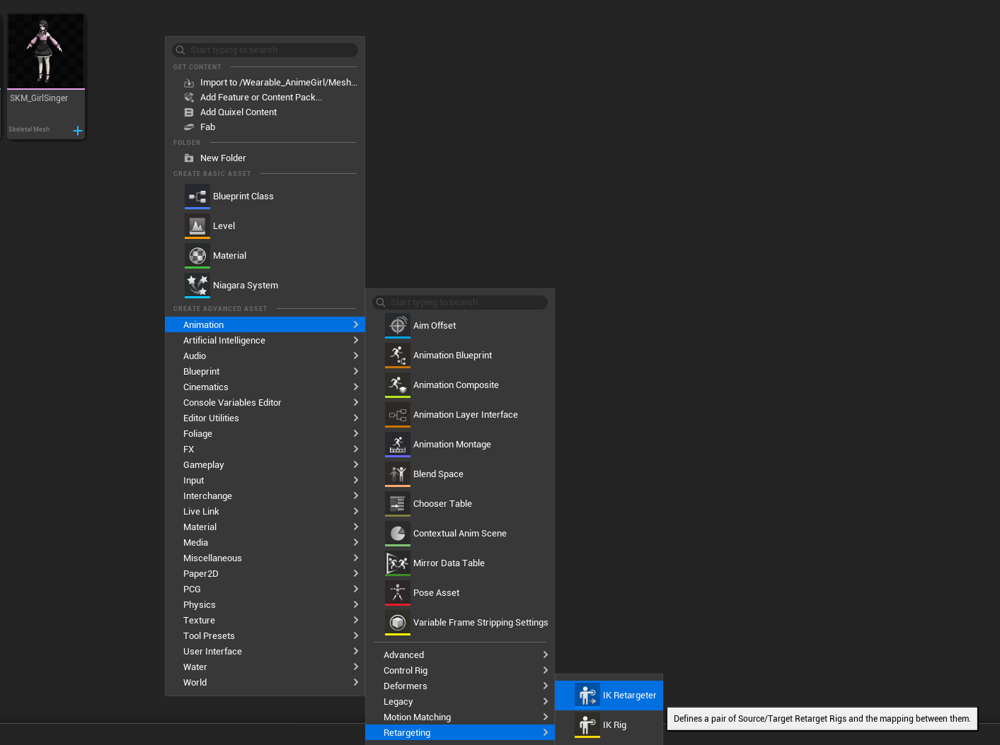

6. Select `IK_Unified_CosmeticsRetarget` as **Source IKRig Asset**. Select either `SKM_Manny` or `SKM_Quinn` as **Source Preview Mesh** according to closest one to your custom mesh proportions for better results. This property will define the source skeleton we'll retarget the animations from during runtime.

    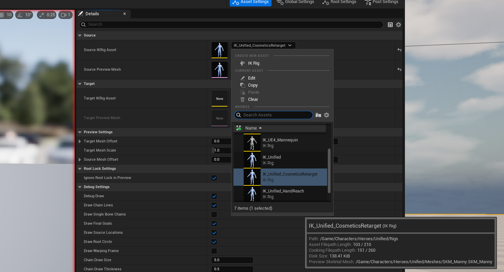

7. Select the IK Rig asset you've just created on previous steps as **Target IKRig Asset**. This property will define the target skeleton we'll retarget the animations to during runtime.

    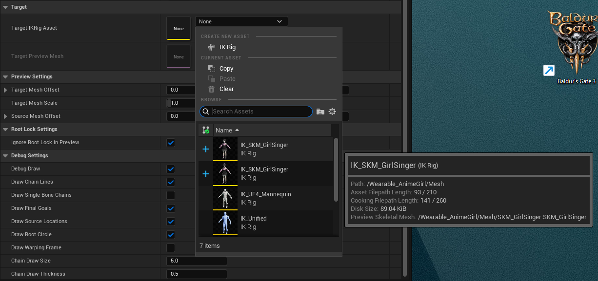

8. Both characters now should be visible on the preview panel. You can tweak **Target Mesh Offset** on the right panel to place your mesh near retarget source mesh as shown below.

    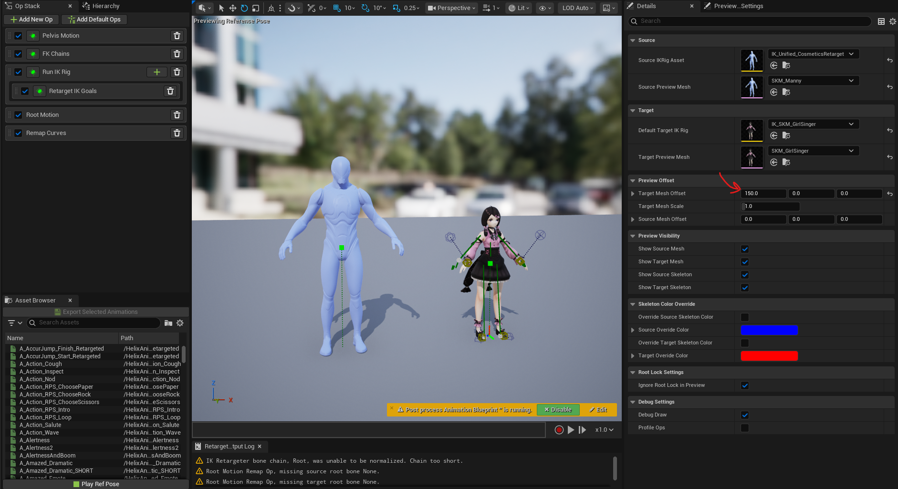

9. On the bottom right panel, **Chain Mapping** tab should automatically match your IK Rig asset bone chains with each other. Ensure each chain is mapped correctly. If there are missing chain assignments, assign the the missing chains manually.

    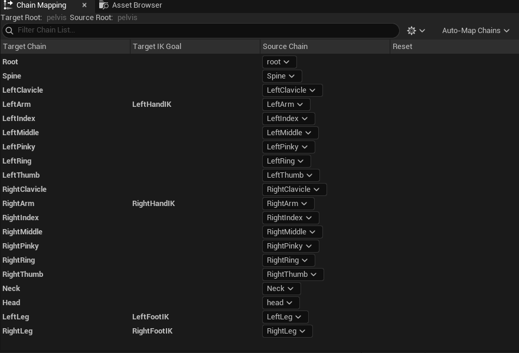

10. To ensure your IK Retargeter works correctly, go to **Asset Browser** tab on bottom right panel, and play one of the available animations. If your custom character plays the animations without any visual issues, this means your IK Retargeter setup is ready!

    

11. If there are issues with retargeting results, you might need to further tweak your bone chains in your IK Rig and IK Retargeter assets. Please check [IK Rig Retargeting Documentation](https://dev.epicgames.com/documentation/en-us/unreal-engine/ik-rig-animation-retargeting-in-unreal-engine?application_version=5.5) for more information.

12. Go into your skeletal mesh asset and find **Asset User Data** property. Click **+** symbol to create a new asset user data instance.

    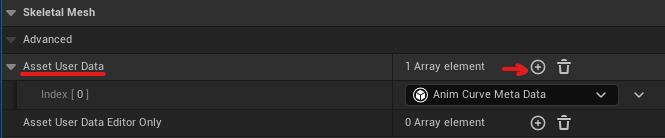

    /// warning | Warning
    Do not confuse **Asset User Data** with **Asset User Data Editor Only**. They are separate properties and only the former should be modified.
    ///

13. Select `HELIX Cosmetics Body Mesh Asset User Data` from the dropdown menu. This asset is used to define how your mesh should be used with HELIX characters during runtime.

    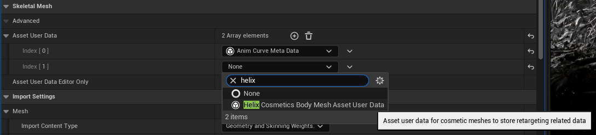

14. Assign the IK Retargeter asset you've created on the previous steps into **Retargeter** field.

    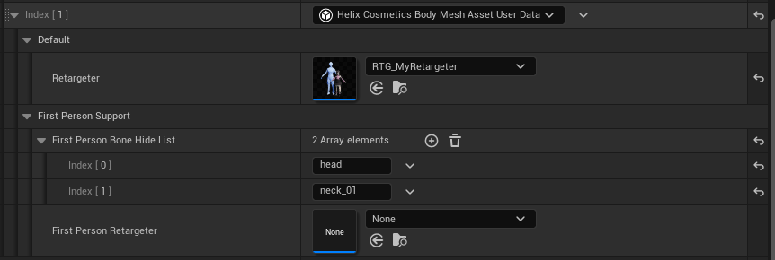

15. If you need your character body mesh to get retargeted differently during first person view mode, you can create another IK Retargeter asset and assign into **First Person Retargeter** field.

16. If your character body mesh has a neck & head section which can obscure camera during first person view mode, add the bone names covering those mesh sections into **First Person Bone Hide List** field. Usually, you should put names such as `head`, `neck_01`, `neck_02` etc. in this list.

17. Your mesh should be ready for runtime retargeting after following those steps.

---

## 5. Tweaking Your Custom Character Mesh

Custom character meshes have additional requirements to ensure they have optimal performance and fully compatible with gameplay systems in HELIX. Those steps are required to successfully package your assets.

1. Ensure a physics asset is assigned to your skeletal mesh within its **Physics Asset** property. Then, open the corresponding physics asset and ensure the capsules cover the mesh approximately. This is required for your mesh bounds to be properly calculated for FOV based occlusion. If this is not done properly, your mesh can disappear randomly from certain camera angles during gameplay. Please check [Physics Asset Editor Documentation](https://dev.epicgames.com/documentation/en-us/unreal-engine/physics-asset-editor-in-unreal-engine?application_version=5.5) for more information.

    

2. In your skeletal mesh asset, make sure you have LOD data generated for your mesh. This ensures your mesh does not negatively impact performance for distant characters using your custom character mesh. You can set LOD count to 3 and click regenerate to automatically generate LODs for your mesh, as shown below. Please check [Skeletal Mesh LODs Documentation](https://dev.epicgames.com/documentation/en-us/unreal-engine/skeletal-mesh-lods-in-unreal-engine?application_version=5.5) for more information.

    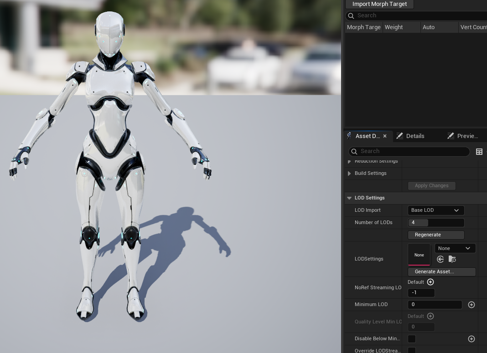

3. In your skeleton asset, ensure you have required sockets added. Please check [Skeletal Mesh Sockets Documentation](https://dev.epicgames.com/documentation/en-us/unreal-engine/skeletal-mesh-sockets-in-unreal-engine?application_version=5.5) for more information.

    /// note | List of Required Sockets
    - **weapon_l_socket**: Left hand socket used in HELIX to attach held items. Usually should be created under `hand_l` or `weapon_l` bone of your rig.
    - **weapon_r_socket**: Right hand socket used in HELIX to attach held items and weapons. Usually should be created under `hand_r` or `weapon_r` bone of your rig.
    * *The list will be updated with more sockets in the future*
    ///

---

## 6. (Optional) Post-Anim Physics Simulation Support

Custom character meshes optionally can simulate post-anim physics with post-process animation blueprints. Please check [Rigid Body Documentation](https://dev.epicgames.com/documentation/en-us/unreal-engine/animation-blueprint-rigid-body-in-unreal-engine?application_version=5.5) and [Anim Dynamics Documentation](https://dev.epicgames.com/documentation/en-us/unreal-engine/animation-blueprint-animdynamics-in-unreal-engine?application_version=5.5) for more information about how to create one for your character if applicable.

/// warning | Warning
Post-process animation blueprint support is experimental and creators are responsible with ensuring their custom character physics implementation is optimized for performance.
///

1. After creating a post-process animation blueprint, assign it to **Post-Process Anim Blueprint** field of your skeletal mesh asset.

    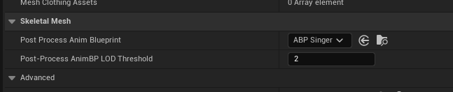

2. Make sure to also set a LOD threshold for your animation blueprint in the next **Post-Process AnimBP LOD Threshold** field, according to LOD count of your mesh. For example, if your mesh has 3 LODs, it usually makes sense to limit it only to LOD0 by setting the value to 0. This will ensure your performance heavy physics implementation won't be executed for non-significant characters on the screen. 

---

## 7. Finalizing and Cooking The Package

1. Make sure all the depending assets by your custom character mesh are placed inside same package folder. If one of those assets are placed outside of the created package folder, cooked `.pak` file will have missing dependencies and this might cause crashes or runtime errors during playthrough with this package.

2. Find the `DA_Wearables` data asset in your package folder and open it.
3. Select the appropriate wearable type, `Custom Characters`
4. Press "+ Add" to create a new element in the category.
5. Give your new custom character mesh a unique ID by double clicking the tile's name.
6. After creating your data asset entry, fill in the properties as described below:

    | Property | Description |
    |---|---|
    | **Body Mesh** | Assign the imported skeletal mesh here. |
    | **Supported Genders** | Select the gender most closest to your custom character. This will change the base animation retarget source mesh used with your custom mesh. |
    | **Display Name** | A meaningful name shown in the UI. |
    | **Preset Icon** | An icon texture, if you have one. |
    | **Material Override Template** | Not functional for custom characters. |
    | **Hides Slots** | Not functional for custom characters. |
    | **Additional Tags** | List of additional metadata tags for your wearable. These tags are used for categorization purposes in the HELIX Character Creator UI. |
    | **Is Hidden From Database** | Hides your entry from the HELIX Character Creator UI, if enabled. |

7. Return to the HELIX Packaging Tool window.

8. With your package selected, click the **Package** button. This process will cook your assets into the final `.pak` file format required by the HELIX Creator Hub. This may take some time.

    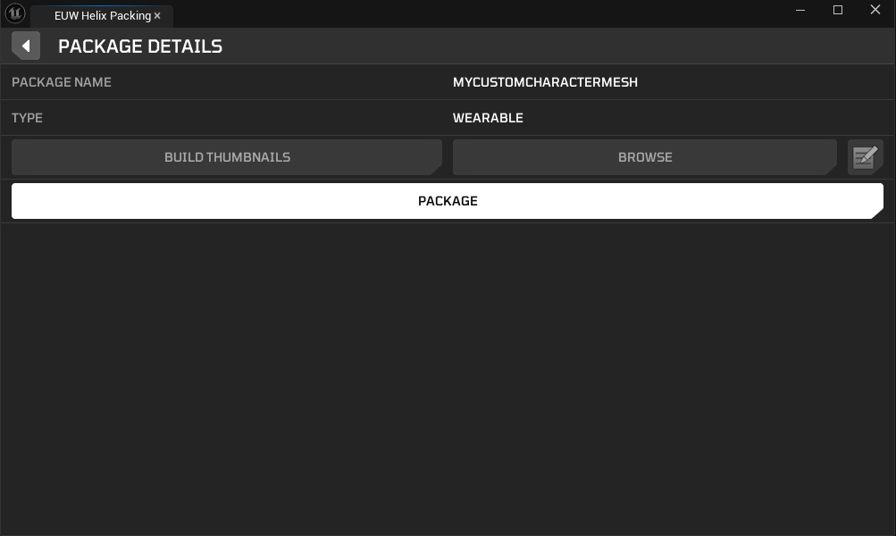

9. Once cooking is complete, a file explorer window will automatically open, displaying your final `.pak` files. Your custom character mesh is now ready to be uploaded to the **Creator Hub**!

    

---

## 8. Testing Your Custom Character Mesh

### 8.1. In Creator Kit

This method doesn't require you to cook the package on the previous steps. As long as you placed all the required assets in your package folder in Creator Kit, and created the data asset as explained above, it will automatically become available for editor playthroughs.

1. Press play in **Creator Kit** editor, and press **P** button to show the **HELIX Character Creator UI** for your character.

2. In the shown UI, you should be able to navigate to your new custom mesh in **Custom** tab and click on it to test on the character.

    

### 8.2. In HELIX

1. Create a draft world and import the `.pak` file you've cooked in **Creator Kit**.

    

    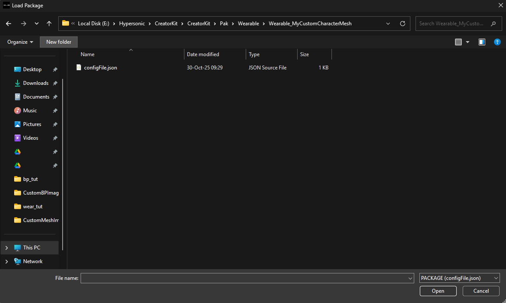

2. If import was successful, you should see the corresponding custom character mesh assets on left panel.

    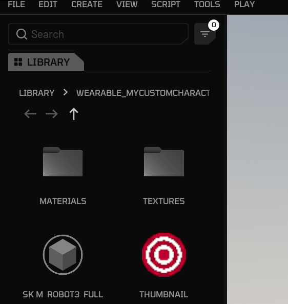

3. Importing also makes your custom character mesh automatically available in **Character Customization UI**. You can go back to the game from build mode, and press **P** button.

4. Your imported custom character mesh should be available in the **Custom** tab.

    

    <iframe src="https://www.youtube.com/embed/eM2_7DWIIqM?si=qELiLj1TaBILbGUP"
            style="position: absolute; top: 0; left: 0; width: 100%; height: 100%;"
            frameborder="0"
            allowfullscreen>
    </iframe>
    

---

## 9. On Your Own

Once you've followed these steps, uploaded your package to vault, and imported it into your world, your new custom character mesh will be available for players joining your public world!
