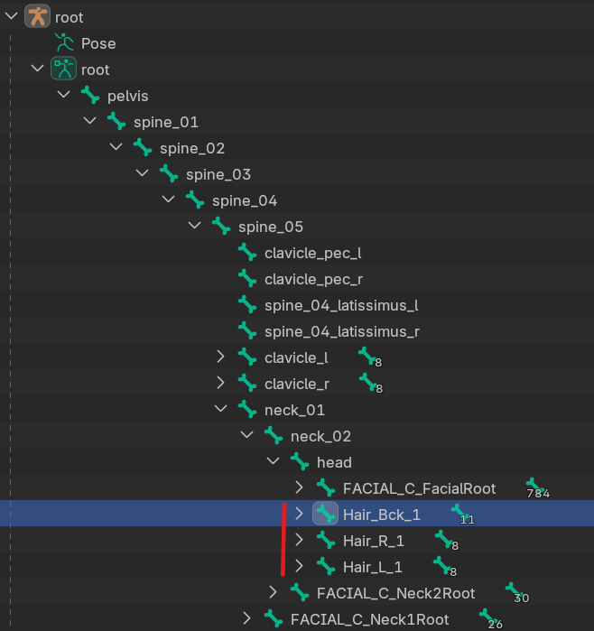

# Creating Dynamic Hair

This tutorial is an extension to the [wearables](../HelixCharacterCreator/cc_wearables.md) documentation. Please refer to the [wearables](../HelixCharacterCreator/cc_wearables.md) documentation to fill any gaps in the general workflow. This tutorial will only describe the work needed for simulated hair that diverges from the original wearables documentation.

---

Before following this tutorial familiarise yourself with the wearables documentation. For simulated hair, the workflow differs to section `7. HELIX Studio Importing`. This documentation is a supplement to section 7. Here, more asset creation detail pertaining to hair bone setup is given along with describing the import process and setting up the `Physics Asset`. 

---

## 1. Bone setup

Create new bones for long pieces of hair e.g. ponytail

For this example we’ve created the new hair bones stemming from the Head bone

In this example there’s 3 long bits of hair we want control over so we’ve created 3 bone groups. An example of the main back hair piece can be seen in the image below.

After parenting you hair and the bones take some time to paint smooth, accurate weights around the bone. Highlighting the areas of influence. Make sure the weights don't intrude onto other parts of the hair mesh that shouldn’t move or you will get stretching.

---

## 2. Exporting your hair

Export your model exactly how it’s shown in the wearables documentation. Making sure you’re hierarchy, LodGroups and bone binding is all setup.

---

## 3. HELIX Studio Importing

Import you fbx into the correct folder as outlined in the wearables documentation - Except this time don’t assign a skeleton. Leave it blank because we will need to import our new skeleton as we made bone changes/ added bones.

---

## 4. Physics Asset setup

Right click the imported hair Skeletal Mesh, navigate to `Create>Physics Asset>Create and Assign`

In the popup window, set `Auto orient bones` OFF.

Then hit Create Asset.

In the Physics Asset editor, you can press the eye icon and navigate to `Bones>None/All Hierarchy` to toggle visibility of the skeleton bones in the viewport. I find it helpful to have them set to None.

Next select the Head capsule and in the details panel navigate to `Physics Type` and set it to kinematic to stop the whole head mesh dropping to the ground

Press simulate to see visualise the simulation (don't forget to stop simulating by pressing it again) 

In the Skeleton Tree, delete all physics shapes other than head so we can start fresh.

Next in the same window, press the cog icon and navigate to “Show All Bones”. 

Select bones: `root`, `spine_03`, `spine_04`, `spine_05`. Then right click and navigate to `Create Bodies/ Constraints > Create bodies with Capsules`.

This will add capsule bodies at those bone locations.

To make things easier, hide the bones in the Skeleton Tree again by pressing the cog icon and navigate to “Hide Bones”

With all the new capsules selected, in the details panel under Body Setup>Primitives>Capsules set the Length and Radius to 10. 

Next set the Physics Type to Kinematic.

Now in the skeleton tree, show all bones again.

Scroll down to your created hair bones

Select them all and press `Add Bodies` using the `Tools` tab in the bottom right corner of the Physics Asset editor. Make sure the Primitive type is still set to Capsule. (Just like all other windows, if you don’t see this tab, in the main editor toolbar at the top of the editor window, navigate to `Window>Tools`)

Do the same for all chains of hair bones you have.

Next hide bones again to keep the skeleton tree hierarchy clear. 

Then select all of the new Hair capsule bodies and change the Physics Type to Simulated.  

You can then hit simulate again to see how the physics is interacting with your hair. This will help to inform you of appropriate changes you should make moving forwards (don't forget to stop simulating) 

Now delete any excess capsules to get the best effect possible.

#### Convert constraints:

Select all hair constraint capsules

Drag select the constraints nodes in the physics graph

Select “To Skeletal” to convert the Constraints to skeletal (This should change the red visualisations from spheres to cones)

Then select all the hair constraints and change the radius and length to more appropriate values for your hair.

#### Make further tweaks to the physics setup of your hair

Adjusting the positioning of your hair constraints to control how it simulates/ where the hair is pulled down 

Edit parameters in the details menu such as angular limits e.g. twist limit (some settings like this require you to select the constraint nodes in the physics graph to edit such details)

#### Enable collision interaction with body:

Select a hair constraint and then shift select the body part capsule that you want the hair to collide with .
Then press Enable Collision button in the toolbar

Once done, refer back to the [wearables](../HelixCharacterCreator/cc_wearables.md) tutorial starting from the material section of part 7 or part **`8. Character Creator Integration/ Data Asset Creation`**.
