# Creating Custom MetaHumans

This guide walks you through creating a custom MetaHuman head in **HELIX Studio**, packaging it as a wearable **Vault** package, and uploading it to our in-game **Character Creator**.

By the end you will have a custom MetaHuman head that players can select and equip on their characters at runtime.

---

## Prerequisites

- **HELIX Studio** installed.
- An Epic account (required for the Cloud rigging step).
- Familarity with MetaHuman Creator for sculpting a custom head shape.

---

## 1. Create a Project

Launch **HELIX Studio** and create either a **new wearable sample project** or a **blank project** to start from.

---

## 2. Create a Wearable Vault Package

1. From the toolbar menu, select **Packages → Manage Packages → New Package**.

    

     

2. Fill in the details for your wearable **Vault** package. Set the **type** to **Wearable**.

    
    
     

3. Click **Create Package**.

    Package creation generates a new plugin folder named after your package. This folder is the **root** where you gather all MetaHuman-related assets.

    

---

## 3. Create the MetaHuman Character Asset

1. Open your new package plugin folder.
2. Right-click an empty area in the content browser and choose **MetaHuman → MetaHuman Character**.

    

     

3. Name your MetaHuman character asset and open it.

    

    /// note | Note
    The MetaHuman Character UI is tailored to **HELIX** requirements. Some features available in standard Unreal Engine may not be available in the **HELIX MetaHuman Character Creator**.
    ///

---

## 4. Enable Skin Textures

To display skin textures on the character, select **Topology → Skin** from the viewport toolbar menu.

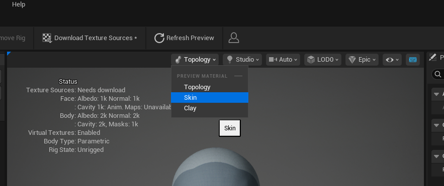

---

## 5. Choose a Body Type

Open the **Body** section from the side toolbar and click the body type you want.

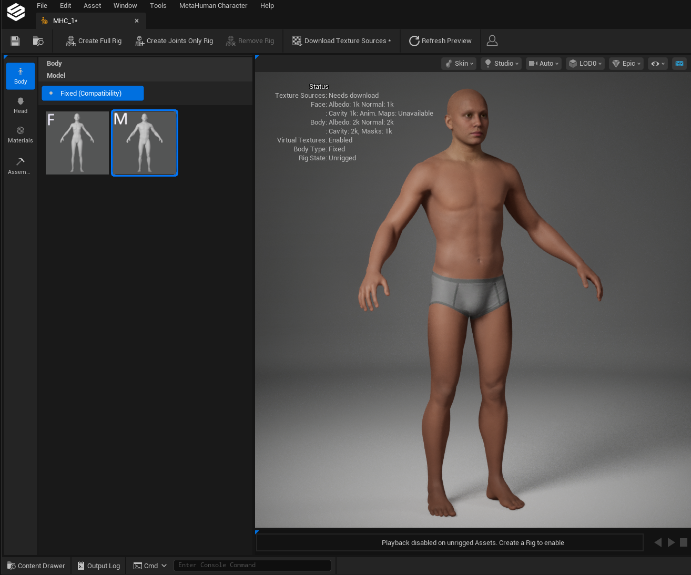

/// warning | Warning
The body type determines gender compatibility for items, so choose it carefully. If you select a **female** body type try to use it for male characters, the height difference between the two MetaHuman bodies will make the generated head incompatible with male facial accessories and hair.
///

/// note | Note
Body sculpting is **currently not supported**, and the generated body mesh won't be used by the **Character Creator**. You can adjust body proportions in the **HELIX Character Creator**'s body section instead.
///

---

## 6. Sculpt the Head

Open the **Head** section from the side toolbar to begin sculpting.

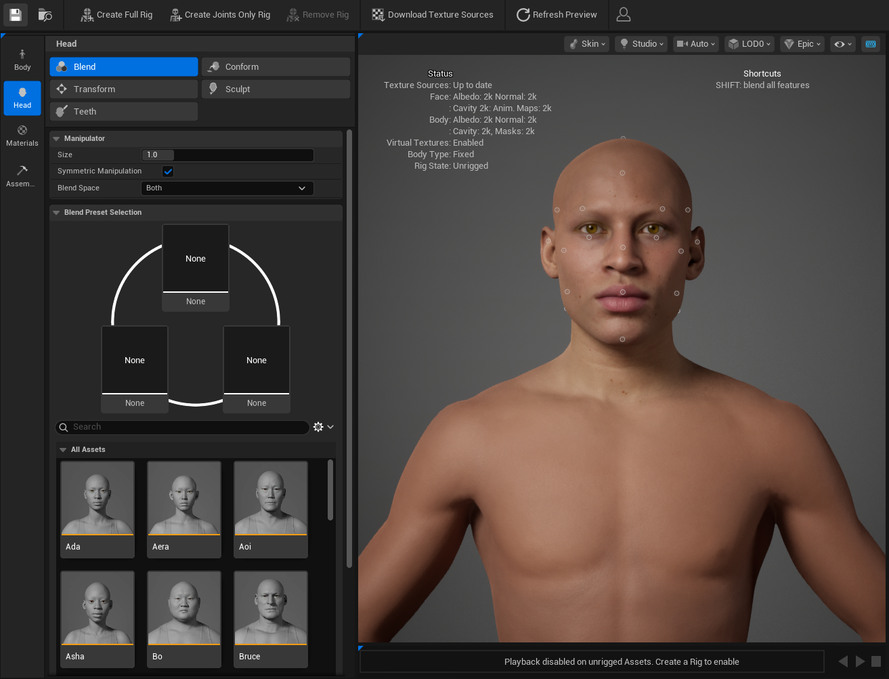

For detailed head sculpting controls, see the [MetaHuman Head Controls documentation](https://dev.epicgames.com/documentation/metahuman/head-controls).

### Adjusting Head Scale

To tweak the overall scale of your character, use the **Head Scale** slider inside the **Transform** tool. From the same panel you can also:

- Reset the head to its identity state.
- Align the neck to the body after modifying the head.

/// note | Note
It's recommended to align the neck to body after finalizing the head sculpting, to ensure neck proportions match the head size.
///

---

## 7. Adjust Materials

Open the **Materials** section to tweak your character's textures. Here you can change:

- Skin texture and tone
- Eye color and iris type
- Teeth
- Makeup

For detailed material controls, see the [MetaHuman Materials documentation](https://dev.epicgames.com/documentation/metahuman/materials-controls).

/// note | Note
Even though skin color is also configurable in the **HELIX Character Creator** UI, the skin color chosen in MetaHuman Creator still affects your character when the head is selected. The skin color originating from MetaHuman Creator becomes the **base** skin color once the head is selected, and the skin color that you may choose to select in the **HELIX Character Creator** UI will be applied **additively** on top of it.
///

/// warning | Warning
You can add makeup to your character from MetaHuman Creator, but it will conflict with makeup added through the **HELIX Character Creator** UI, and the MetaHuman Creator makeup will be **always visible**. Unless you have a specific reason, we would recommend you not to add makeup to custom heads.
///

---

## 8. Prepare for Export (Cloud Rigging)

After finalizing your character, click the following buttons in the top toolbar:

1. **Create Joints Only Rig**
2. **Download Texture Sources**

/// note | Note
Both actions require an Epic account. If you're not signed in, clicking **Create Joints Only Rig** will trigger the login prompt, there is no separate sign-in button in MetaHuman Creator.
///

---

## 9. Assemble the Character

Once rigging completes, go to the **Assembly** submenu in the side toolbar.

1. Set the assembly type to **HELIX Optimized**.

    

     

2. Set **Root Directory** to your new package plugin folder.

    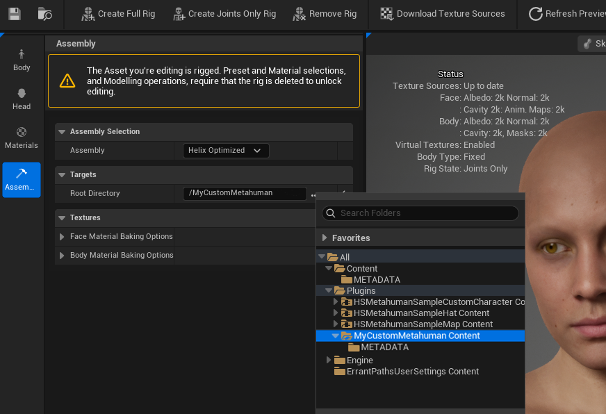

     

3. Save the MetaHuman Character file.

4. Once every field is correct, click **Assemble** and wait for the export to complete.

    

    /// warning | Memory Requirements
    Assembling a MetaHuman Character requires at least **10 GB of free RAM**. If you have less available, Unreal Engine may crash during assembly and you could lose unsaved work.

    Before assembling, close memory-heavy applications such as web browsers (Chrome, Edge), Slack, Discord, Spotify, and any other Unreal projects. You can check available memory in **Task Manager → Performance → Memory** (Windows).
    ///

     

    The export creates two folders: **Body** and **Face**. Verify the following items were created as you will need to use them in the next step:

    - **`T_Body_BC_VT`** and **`T_Body_N_VT`**, the base skin color and normal textures in **`Body/Baked/`** folder:

    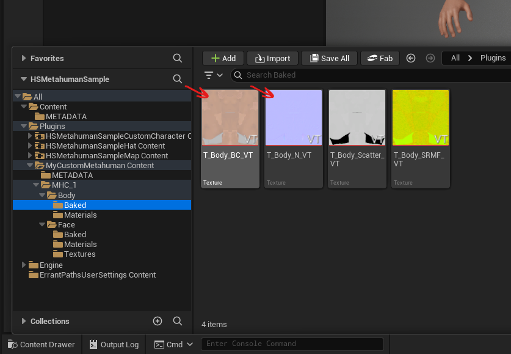

     

    - The custom head mesh from the **`Face`** folder:

    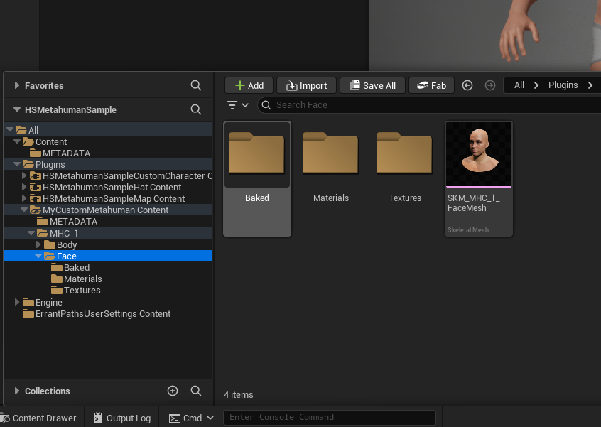

    /// warning | Warning
    The generated head mesh will have **3 LODs** by default. Modifying the mesh's LOD data may cause it to stop working correctly in the **HELIX Character Creator**. It's not recommended to do any modifications to LOD setup of exported heads.
    ///

---

## 10. Register the Head in the Data Asset

1. Open the **`DA_Wearables`** data asset inside your package folder.

    

     

2. Select the **Face Types** category in the left panel, then click **+ Add**.

    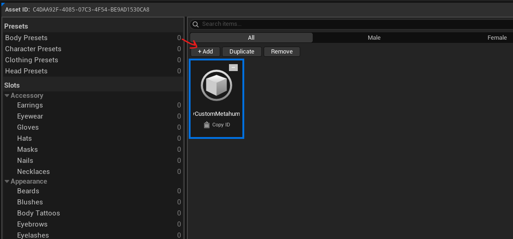

     

3. Click the tile's name section and give it a meaningful string ID (e.g. `M_Face_MyCustomMetahuman`). 

4. In the properties panel, configure everything to look similarly to the screenshot below. Please refer to the table below the screenshot for further information if you need help navigating around this menu.

    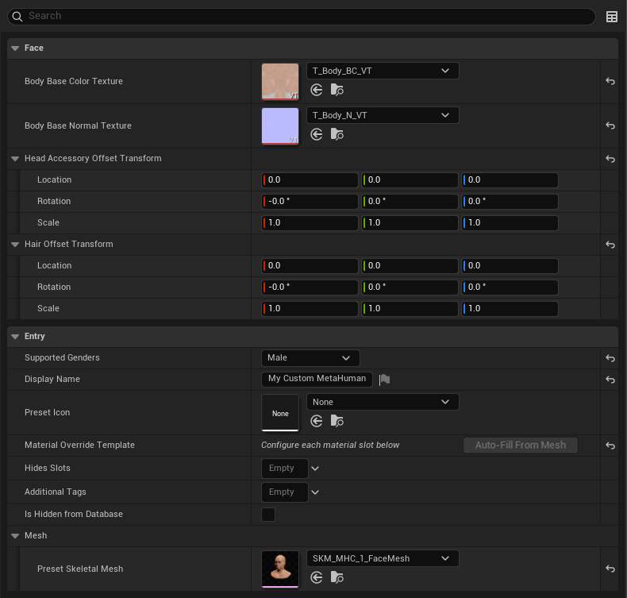

     

    | Field | Value |
    |---|---|
    | **Body Base Color Texture** | Assign the `T_Body_BC_VT` texture from your assembled metahuman character. |
    | **Body Base Normal Texture** | Assign the `T_Body_N_VT` texture from your assembled metahuman character. |
    | **Head Accessory Offset Transform** | Custom transform offset to apply to attached head accessories to your head mesh. |
    | **Hair Offset Transform** | Custom transform offset to apply to attached hair to your head mesh. |
    | **Supported Gender** | Match the body type you chose in MetaHuman Creator. |
    | **Display Name** | A meaningful name shown in the UI. |
    | **Preset Icon** | An icon texture, if you have one. |
    | **Material Override Template** | List of available material slot runtime parameter modifications for your head mesh. It is greyed out until a mesh is set. See next section about how to set this up. |
    | **Hides Slots** | List of cosmetic slots to hide when this head is selected. Usually, you don't need to assign a tag into this field. |
    | **Additional Tags** | List of additional metadata tags for your head. Those optional tags are used for categorization purposes on HELIX Character Creator UI. |
    | **Is Hidden From Database** | Hides your entry from the HELIX Character Creator UI, if enabled. |
    | **Preset Skeletal Mesh** | Assign your new head mesh here. |

---

## 11. Enable Runtime Skin Coloring

To support runtime skin coloring:

1. Ensure a mesh is selected from the **Face** folder, this will enable **Auto-Fill From Mesh** button.
2. Click **Auto-Fill From Mesh** and expand the **Material Override Template** section. This adds a **Skin** coloring template to **Slot 7**, where the head's main skin material resides. If it does not populate automatically, add the template type to Slot 7 manually and give it a meaningful display name.

    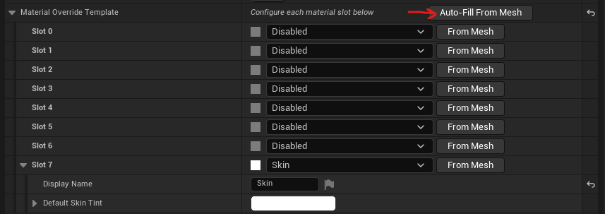

3. Save the data asset.

---

## 12. Test in Play-in-Editor

1. Enter Play-in-Editor in any level.

    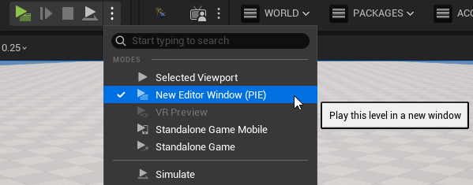

     

2. Press **P** or use `CustomizeCharacter` console command while in game to open the **HELIX Character Creator**.
3. Go to the **Head** section, your custom head mesh should appear in the list.
4. Click it to apply your custom head to the character.

    

---

## 13. Fix Attachment Clipping

After equipping different hairstyles or facial accessories, you may notice clipping against your custom head. This typically happens when the head is heavily sculpted and differs noticeably in proportion from the identity MetaHuman head.

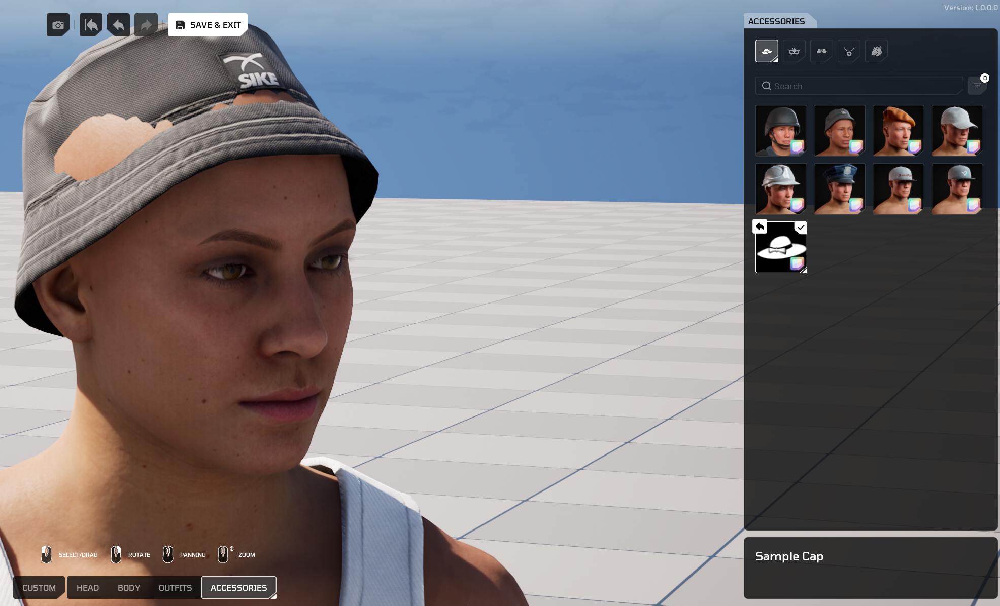

 

To fix this, tweak the following fields on your head mesh entry in the data asset:

- **Head Accessory Offset Transform**
- **Hair Offset Transform**

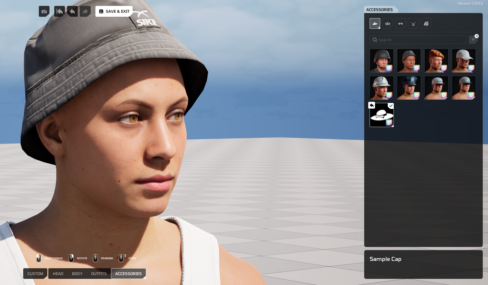

/// note | Note
The further you sculpt the forehead from the identity head, the harder existing hair and facial accessories are to fit. You will need to provide custom scale values as described in this step to better fit attachments to your custom head mesh. This process can be quite time-consuming as you'd need to be switching between the data asset file and relaunching PIE to check the result in **HELIX Character Creator**.
///

---

## 14. Publish the Package to the Vault

Once everything works as expected, publish your package so it is available for download.

1. From the toolbar menu, select **Packages → Manage Packages** and click your package name in the context menu. This opens the **Vault** publish window.

    

     

2. Adjust the publish fields to your liking, if you don't want your package to be available to other players, make sure to toggle the **PRIVATE** option. If needed, you can then give access to individual users via **Creator Hub**.

    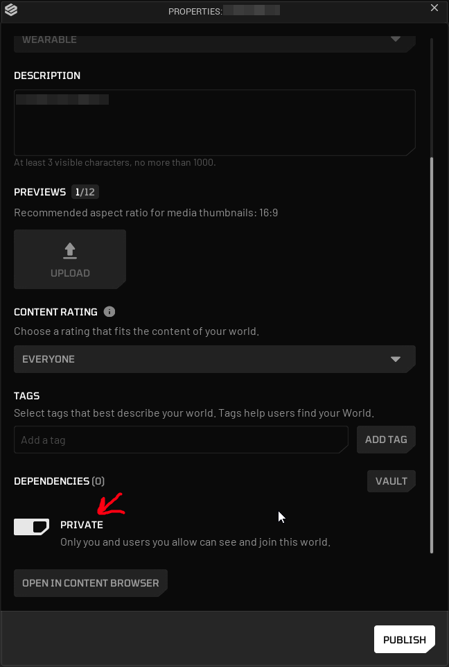

     

3. Click **Publish** to make your custom MetaHuman available for download in the **HELIX Vault**.

    /// note | Note
    When attempting to package and publish your package, **HELIX Studio** will prompt you to save your files. You must save your files before you can start the packaging process, otherwise your asset may not look or behave as expected.
    ///

4. After publishing is completed, your package can be tested in game builds by accessing it from the **Vault** tab, locating your package and clicking on **PREVIEW** button.

---

## Bonus: Head Conform Methods

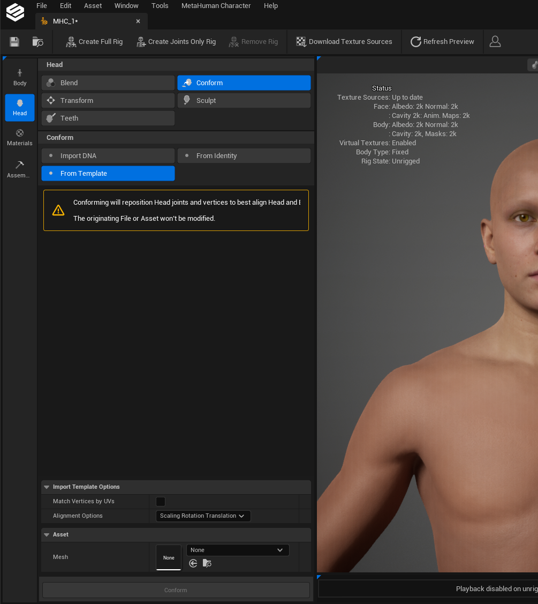

Instead of sculpting a head manually, you can also use the **Conform Tool** from **Head** section. You can choose one of the methods to conform your metahuman character head:

- Conform your MetaHuman character head to an existing skeletal mesh.
- Conform your MetaHuman character to a **DNA file** authored externally.
- Conform your MetaHuman character to a MetaHuman identity created from a photo scan or a static mesh. See the [Mesh to MetaHuman documentation](https://dev.epicgames.com/documentation/metahuman/mesh-to-metahuman) for more details about creating a MetaHuman identity.
