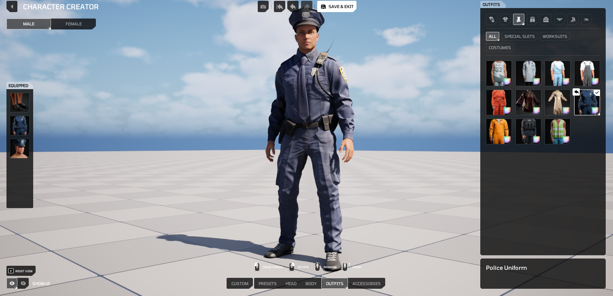

# HELIX Character Creator Overview

The **HELIX Character Creator** is the runtime character customization system for **HELIX**. It lets players assemble a character from modular body parts, clothing, accessories, and appearance layers, then equip user-generated content (UGC) authored in **HELIX Studio** and distributed through the **HELIX Vault**.

This page is a high-level overview of the system: what it is, what it supports, its current limitations, and what we want testers to focus on. For step-by-step authoring instructions, see the detailed guides linked throughout.

---

## What Is the HELIX Character Creator

The **HELIX Character Creator** composes a single character mesh at runtime from many independent cosmetic pieces. Each piece occupies a **slot** (identified by a gameplay tag) and is resolved from a runtime database built from creator-authored data assets.

/// note | Note
The character customization UI is opened in game with the `P` key by default, or with the `CustomizeCharacter` console command.
///

Key architectural points:

- **Mutable-based composition.** Meshes, textures, and material parameters are merged at runtime using Unreal's **Mutable** plugin, producing one optimized skeletal mesh per character instead of many attached components.
- **Fully replicated and server-authoritative.** The cosmetic loadout and body/face morph data replicate from server to all clients. Simulated proxies, late-joining clients, and owning clients converge on the same appearance.
- **UGC via Vault packages.** Creators cook their content into `.pak` packages in **HELIX Studio** and upload them to the **HELIX Vault**. Worlds download those packages on demand and apply them to characters at runtime, conceptually similar to **Fortnite**/**UEFN** packages.
- **Scriptable from Blueprint and Lua.** The entire query/equip/override/visibility API is exposed through two interfaces, `IHCharacterCosmetics` (the pawn) and `IHCosmeticsSystem` (the component), with no wrapper layer. See [Scripting on HELIX Character Creator](cc_scripting.md).

---

## What the System Supports

### Content types

| Content type | Description | Authoring guide |
|---|---|---|
| **Modular body** | Base head, upper body, lower body, hands, and feet meshes. | Built-in |
| **Clothing** | Tops, bottoms, full sets/outfits, backpacks, socks, shoes, and underwear layers. | [Creating Custom Wearables](cc_wearables.md) |
| **Accessories** | Hats, masks, eyewear, necklaces, earrings, gloves, nails. | [Creating Custom Wearables](cc_wearables.md) |
| **Appearance layers** | Main hair, facial hair (beard/mustache), eyebrows, eyelashes, iris, body/face tattoos, and makeup (lipstick, eyeliner, eyeshadow, blush). | [Creating Custom Wearables](cc_wearables.md) |
| **Dynamic hair** | Simulated hair driven by a physics asset and post-process anim blueprint. | [Creating Dynamic Hair](cc_dynamichair.md) |
| **Custom MetaHuman heads** | Custom heads authored in the **MetaHuman Character Creator**, paired with body skin textures. | [Creating Custom MetaHumans](cc_metahumans.md) |
| **Custom character meshes** | Full-body custom meshes that override the modular body, with runtime animation retargeting for non-standard rigs. | [Creating Custom Characters](cc_characters.md) |
| **Presets** | Full-character presets with save support inside HELIX Character Creator UI. | Built-in |

### Runtime capabilities

- **Slot equip/unequip**: equip single or multiple items, replace items in an occupied slot, and unequip by item ID or by slot tag.
- **Bulk operations**: clear all slots, clear every slot beneath a parent tag, or reset cosmetics to gender defaults.
- **Identity**: switch gender (`Male`/`Female`) at runtime.
- **Runtime body and face morphing**: replicated body and face morph handles allow proportion sculpting beyond the base meshes.
- **Material parameter overrides**: apply color and scalar overrides per slot at runtime, including RGB color-mask (Extra Colors) regions defined in the wearable material.
- **Runtime slot visibility**: a push/pop hide-request stack lets gameplay temporarily hide slots independently of the equipped loadout.
- **Persistence**: character state serializes to JSON and saves to the player's workspace; saved presets restore on load for player characters.
- **First-person view mode**: supported per character.
- **Scripting ready API**: Scripting API is fully available for Blueprint and Lua.

---

## Known Limitations

- **MetaHuman body sculpting:** Body sculpting is not supported in the MetaHuman pipeline, and the generated MetaHuman body mesh is not used. Body proportions are adjusted in the Character Creator's body section instead.
- **MetaHuman makeup:** Makeup applied in MetaHuman Creator is always visible and might conflict with makeup applied through the Character Creator UI.
- **Custom head attachment fit:** Heavily sculpted custom heads cause hair and facial-accessory clipping that must be corrected manually via per-head offset transforms, an iterative and time-consuming process.
- **Gender/clothing compatibility:** A female-body MetaHuman is incompatible with male clothing and hair, and vice versa for male-body. A custom clothing piece needs to be modeled for both genders as result of this.
- **Custom full-body character mesh support:** When a custom full-body character mesh is equipped, it overrides the modular body and **wearables are disabled** in the customization UI for that character. It's currently not possible to apply wearables on top of custom character meshes.

---

## Planned for Later

- **Custom Tattoos**: Allow cooking custom tattoo textures and apply them to characters from HELIX Character Creator UI.
- **Face Proportions Aware Makeup**: Project custom makeup items correctly to custom metahuman heads.
- **Custom Character Body**: Allow cooking custom body parts and use them on runtime with HELIX Character Creator UI.

---

## What We Want Testers to Evaluate

Try things out and tell us anything that looks wrong, breaks, or feels slow. When you report an issue, note what you did right before it happened and which item or package was involved. The main things to watch for:

- **Does everyone see the same character?** Your outfit, body shape, and look should appear correctly for other players, including people who join after you.
- **Does it break anything?** Watch for crashes, error messages, or characters showing the wrong or default look after changing outfits or respawning.
- **Do uploaded items work?** When you publish an item to the Vault and add it to a world, does it show up correctly with no missing textures or broken materials?
- **Do custom bodies and heads look right?** Check that animations, camera, and movement still work on custom characters, and that hair and accessories fit custom heads without clipping through them.
- **Do colors and tints work?** Recoloring an item should look the same for you and everyone else.
- **Does slot hiding work?** Things that should hide a slot (like a helmet hiding hair) should hide and un-hide cleanly, with nothing left stuck.
- **Is it smooth?** Note any lag, stutter, or delay when changing your look, and anything that looks off on far-away characters.
- **Does it save?** Your character should look the same after leaving and rejoining the same world.
- **Do items conflict?** Watch for items that overlap, clip, or behave oddly when combined.

---

## Related Documentation

- [Creating Custom Wearables](cc_wearables.md)
- [Creating Custom Characters](cc_characters.md)
- [Creating Custom MetaHumans](cc_metahumans.md)
- [Creating Dynamic Hair](cc_dynamichair.md)
- [Scripting on HELIX Character Creator](cc_scripting.md)
