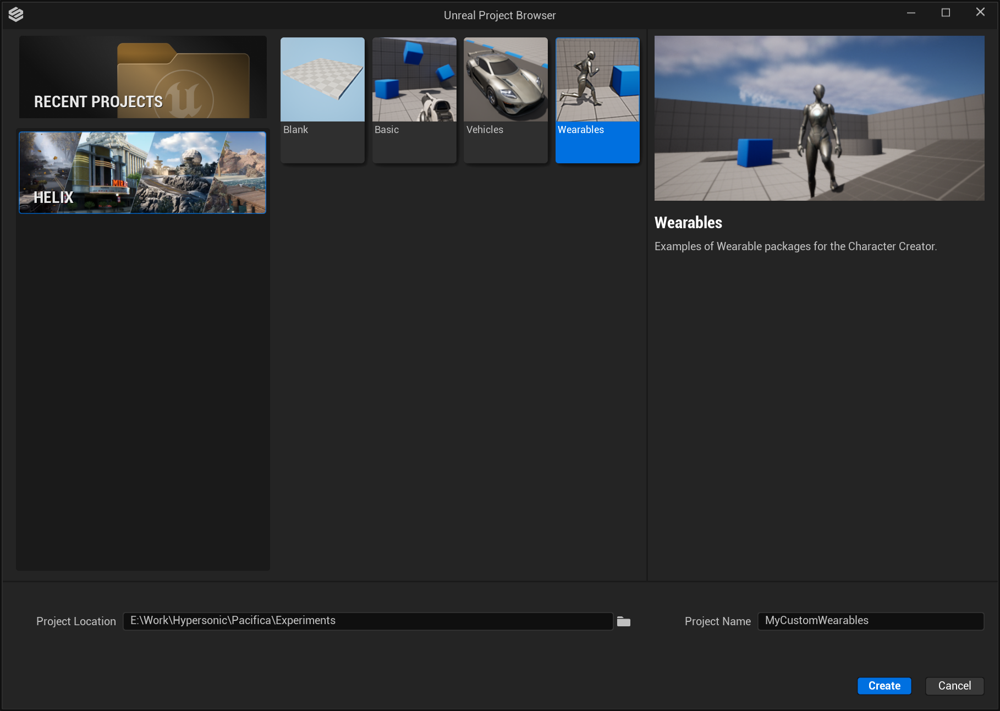
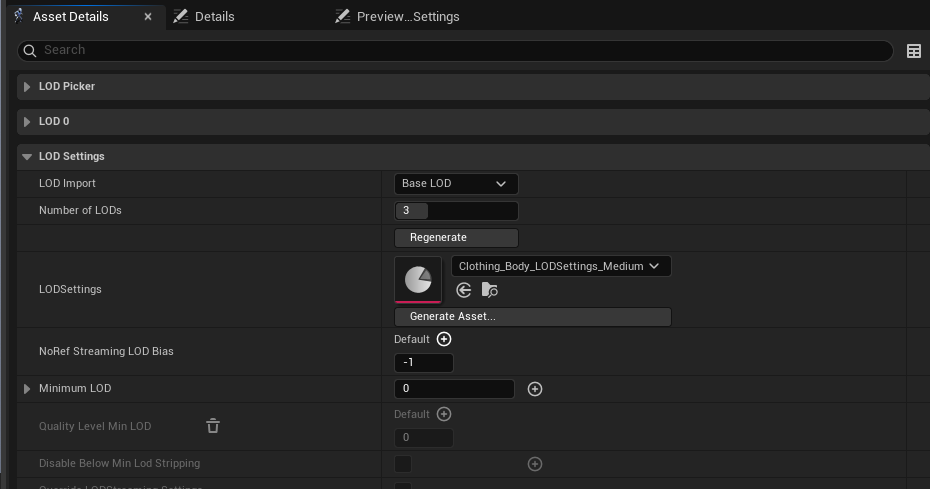
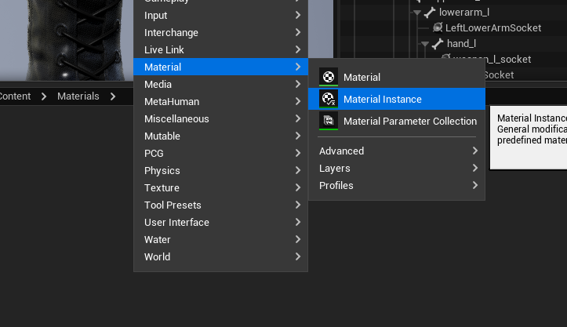
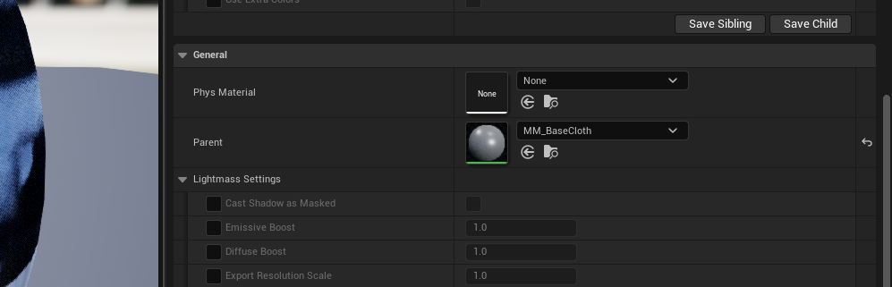
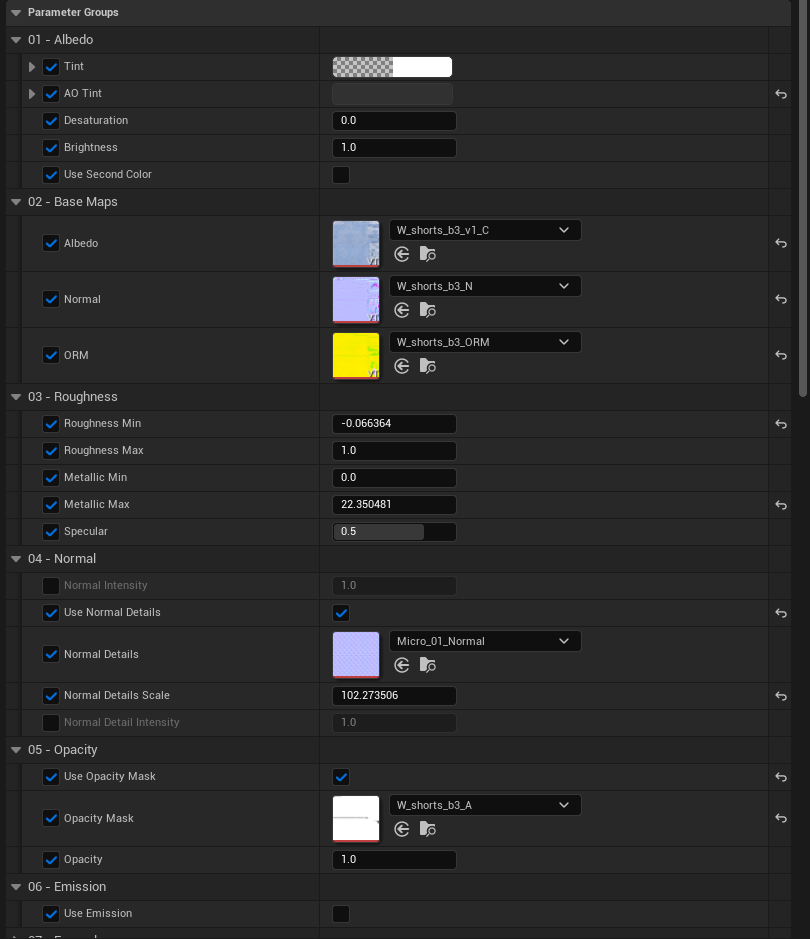
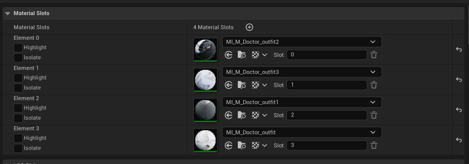
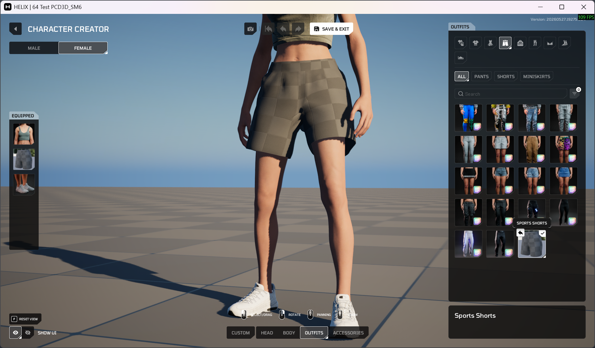

# Creating Custom Wearables

This guide walks you through the process of creating and packaging custom wearables using Helix Studio, such as clothing (e.g. shoes, shirts, bottoms, underwear, outfits), hair (facial and head), and accessories (e.g. hats, gloves, masks, necklaces, glasses). Some specific adjustments may be required depending on the asset type, such as dynamic hair sim.

By the end you will have a custom wearable that players can select and equip on their characters at runtime.

---

## Prerequisites

Before you begin, make sure you have:

- **Helix Studio** installed and launched.
- A **Helix account**, logged in within Helix Studio (required for the Packages tools and Vault upload).
- A 3D modelling package (this guide uses **Blender**, as it is free and the most accessible; the core principles apply to most applications).
- Your wearable textures prepared, if applicable.

---

## 1. Project Setup

1. Launch Helix Studio
2. Select the Helix tab to see the template projects
3. Select the appropriate template (we'll be using the Wearables template)
4. Define the project save location and project name
5. Hit Create

    

---

## 2. Package Creation

To create a pack, use the Packages dropdown in the toolbar above the viewport. If you don't see this, you may need to log in to your Helix account and potentially restart Helix Studio.

1. Navigate to `Packages > Manage Packages > New Package`

    

2. Enter a unique Package Name (e.g. Sports Shirts).
3. Select the appropriate package type for your package, e.g. **Wearable**.
4. Assign a suitable description.
5. Create a unique package URL. (Use `-` for spacing, e.g. `wearable-johns-sneakers`; uppercase characters are not allowed.)
6. Click **Create Package**. This action creates a dedicated plugin folder for your assets (e.g. **Plugins/SportsShirts**) — this is where you put all of the custom content that makes up your pack.

    

---

## 3. Template Assets

To create or adjust wearables to be compatible with HELIX, we've provided some meshes to serve as a guide. You can find them in the HELIX Character Creator engine plugin, in the templates folder: `/HelixCharacterCreator/Templates`

/// note | Note
You can paste these directories directly into the content browser path (where it will likely currently say `/HelixCharacterCreator/Templates`) by clicking the empty space in the bar.
///

Each template asset group can be found in the folders below:

- Full body meshes: `/HelixCharacterCreator/Templates/Body`
- Split body part meshes: `/HelixCharacterCreator/Templates/Body/Cut`
- Head meshes: `/HelixCharacterCreator/Templates/Head`

/// note | Note
HELIX Character Creator currently uses `SKM_F_UNDW_Tall` for female, and `SKM_M_NRW_Tall` variations as the male base mesh.
///

Although both male and female characters use the same skeleton, you will ideally create a piece of clothing for just one gender, or create 2 versions of your clothing, adjusting it individually to each body (i.e. Male & Female).

To export the template assets for use in a modelling package of your choice (e.g. Blender), you will need to export them out of Helix Studio.

1. For each mesh you want to export, `right click` it, go to `Asset Actions`, then `Export`.
2. Name and save the asset in a suitable folder on your PC.
3. In the export window, make sure you have Level of Detail (LOD) ticked under the Mesh tab. *(This is important because if you're making custom LOD models, you should model them around the corresponding LOD mesh to prevent clipping.)*
4. Do this for all required template assets.

    

---

## 4. Clothing Creation

Exactly how you create your wearables and which modelling applications you use is up to you, but there are a few principles that are important to get right. The next few sections provide a breakdown of how to approach the creation of wearables. The examples are given using Blender as it's free and the most accessible 3D package. The core principles apply to most/all applications.

1. Import a body or body part template into your modelling package.
2. Model your clothing item around the template body, OR if you're using an existing wearable, adjust your model to fit the body. (Make sure you have good topology, especially around joints such as the knees.)
3. Apply transforms to your model when done (so Location and Rotation equal 0,0,0 and Scale equals 1,1,1). To do this in Blender, with your model selected press `Ctrl + A` and select `All Transforms`.

#### Armature Binding & Transferring Weights

To get your item of clothing to move with the body, you will need to parent the wearable mesh to the skeleton. Below are the steps to do this in Blender; other programs will differ slightly.

1. Select your wearable mesh and Shift-select the armature (shown in the viewport as pyramids with spheres on the ends, or as "root" in the hierarchy).
2. Press `Ctrl + P` to parent, then select "With Automatic Weights".

/// warning | Warning
If you get a warning regarding unresolved bones, bone weighting issues, etc., you will need to investigate the cause further. Some things to check:

- Apply transforms as described above.
- Make sure your mesh has no duplicate/overlapping vertices. To fix this, with your model selected, enter Edit Mode (`Tab`), enter vertex select mode, press `A` to select all vertices, then hit `M` and select "By Distance".

Regardless of whether weights transfer correctly, you will likely need to weight paint by hand. Feel free to move the armature points back and forth from time to time to see how your mesh deforms and whether it looks correct.
///

---

## 5. Clothing Export Setup

Once your item of clothing is created, bound to the armature, and the weights are painted, you'll need to set up the hierarchy correctly, ready to export to Helix Studio.

To do this:

1. In the outliner, open up the "root" / armature parent.
2. Select all children of the imported template model, including root (in this case, everything under "SKM_F_UNDW_Tall").
3. With all children selected, press `Alt + P` and select "Clear and Keep Transformation".
4. Now delete the body meshes and the parent empty.
    1. You should be left with root, the reference model LodGroup, and your wearable mesh/es.
5. Rename the LodGroup to an appropriate name, e.g. `SKM_F_Undw_Shorts_LodGroup`.
6. Then select your wearable mesh (select all LOD meshes if you have created multiple LODs).
7. With them selected, `Ctrl`-select the LodGroup.
8. Then press `Ctrl + P` and select "Object".

<!--
#### LOD setup (if Applicable)

1. Select Lod Group parent
2. In the object tab, under custom properties create a new Property by pressing "New"
3. Press the cog icon
4. Set type to String, property name to fbx_type and the Default Value to LodGroup
5. Hit ok
6. Then change the value from 1 to LodGroup
-->

---

## 6. Export Your Wearable

1. Make sure your outliner only includes "root" (the armature) and the LodGroup containing your mesh/es.
2. Navigate to `File > Export > FBX`.
3. Define a save location.
4. Name your wearable appropriately. (Follow the naming conventions: for skeletal meshes, use the prefix `SKM_`.)
5. Make sure you enable Custom Properties.
6. Set Forward Axis to Y Forward and Up to Z Up.
7. In Armature settings, set the Primary Bone Axis to Y and the Secondary Bone Axis to X.
8. Make sure Add Leaf Bones is deselected.
9. To avoid any doubt, copy the settings from the image below.

    

---

## 7. Helix Studio Importing

Next, import your model into Helix Studio. You must import your assets into the correct package folder (e.g. the package you created earlier). To find your package again:

1. Navigate to `Packages > Manage Packages > YourPackageName`.

    

2. With your package window open, press "OPEN IN CONTENT BROWSER". This takes you to the location of your package.

    

#### Skeletal Mesh Import

With the content browser now inside the correct folder, you can add your mesh.

1. To add your mesh, either drag your FBX file from Windows Explorer into the content browser, or press the Import button and navigate to the file.
2. In the Import Content window, set a few settings:
    1. If you made multiple LOD meshes, make sure "Import LODs" is ticked.
    2. Disable "Create Physics Asset".
    3. Ideally you should also uncheck "Import Materials" (optional).
    4. **IMPORTANT:** Set Skeleton to `metahuman_base_skel` or `Face_Archetype_Skeleton`. (If you see multiple, hover over each and select the one located in `MetaHumanCharacter/Female/Medium/NormalWeight/body`, or if you're creating a head wearable, use `/MetaHumanCharacter/Face/Face_Archetype_Skeleton`.)
3. Then press "Import".

/// note | Incorrect Skinning Fix
If you open your wearable (double click it) and play a preview animation, you may see weight issues as demonstrated in the image below.

If this happens, it's important to adjust your weight painting. You can do this in your modelling package or directly in Helix Studio. However, here's a quick method that may fix it:

1. With your skeletal mesh open, open the Skin tab on the left.
2. Press "Edit Weights" (here you can paint or transfer weights).
3. Then expand the Weight Transfer tab.
4. Define a source SKM (assign the source skeletal mesh you used as a reference for your wearable, e.g. `SKM_F_Undw_Bottom`).
5. Set Mesh Mode to Source.
6. Set Location and Rotation to 0,0,0.
7. Hit Transfer Weights, then press "Apply to Asset".

///

#### LOD Setup

Your wearables need valid LOD data to work properly with HELIX Character Creator. To ensure that, open your imported skeletal mesh asset and find the `LODSettings` property. It must be assigned one of the LOD Settings Data Assets listed below, according to the type of wearable:

| LOD Settings Data | Path | Description |
|---|---|---|
| **Clothing_Body_LODSettings_Medium** | `/MetaHumanCharacter/Clothing/Clothing_Body_LODSettings_Medium` | Use for wearables attached to the body part of the character (anything below the head) |
| **Clothing_Face_LODSettings_Medium** | `/MetaHumanCharacter/Clothing/Clothing_Face_LODSettings_Medium` | Use for wearables attached to the head part of the character (anything above the neck, except hair) |
| **Hair_LODSettings_Medium** | `/MetaHumanCharacter/Hair/Hair_LODSettings_Medium` | Use for hair meshes |
| **Face_LODSettings_Medium** | `/MetaHumanCharacter/Face/Face_LODSettings_Medium` | Internal data asset. Automatically assigned to generated MetaHuman heads with the MetaHuman character generator. |
| **Body_LODSettings_Medium** | `/MetaHumanCharacter/Body/IdentityTemplate/Body_LODSettings_Medium` | Internal data asset. Utilized in base cut body meshes. |

After assigning the data asset, set the `Number of LODs` field to 3, and hit the `Regenerate` button to generate LOD data with the new settings.

/// warning | Vault Packaging LOD Settings Rule
If the skeletal mesh uses anything other than the listed data assets for LOD settings, or a LOD count other than 3, the vault packaging process will fail.
///

#### Material Setup

Your wearables need to use one of the defined master materials listed below to be compatible with HELIX Character Creator:

| Master Material | Path | Description |
|---|---|---|
| **MM_Basic_Wearables_Opaque** | `/HelixCharacterCreator/Materials/MM_Basic_Wearables_Opaque` | Base material for a basic texture with tint setup. |
| **MM_Basic_Wearables_Masked** | `/HelixCharacterCreator/Materials/MM_Basic_Wearables_Masked` | Base material for a basic texture with tint setup with mask functinality (e.g. masked hair) |
| **MM_BaseCloth** | `/HelixCharacterCreator/Materials/MM_BaseCloth` | Base material with Color/Normal/ORM texture-based setup. More advanced than MM_Basic_Wearables |
| **MM_BaseCloth_Glass** | `/HelixCharacterCreator/Materials/MM_BaseCloth_Glass` | Base material for transparent sections of wearables (e.g. sunglasses) |
| **MM_Stitches** | `/HelixCharacterCreator/Materials/MM_Stitches` | Base material for masked stitch sections of wearables |
| **M_Invis** | `/HelixCharacterCreator/Materials/M_Invis` | Invisible material. Can be used to hide specific sections of wearables if required. |
| **MM_Hair_1** | `/HelixCharacterCreator/Materials/MM_Hair_2` | Base material for hair meshes. |
| **MM_Hair_2** | `/HelixCharacterCreator/Materials/MM_Hair_2` | Base material for hair meshes. |

/// note | Additional Master Materials
You can also use any base engine material from the `/Engine/EngineMaterials/` folder, which is currently whitelisted in the packaging rules.
///

/// warning | Vault Packaging Material Rule
If the skeletal mesh uses any material instance inheriting from a master material other than those listed, the vault packaging process will fail.
///

To create a material instance from one of the master materials, right click an empty area in the content browser and select Material Instance from the menu:

Open the material instance and pick one of the allowed master materials as the parent:

Add your base textures into the corresponding fields. Tweak any vector/scalar parameters to your liking.

Lastly, assign the new material instance to one of the slots on your skeletal mesh. Repeat the steps for each slot if you need different materials per slot.

/// warning | Material Slot Requirements
Wearable skeletal meshes used in HELIX Character Creator must follow a naming convention in which each material slot is assigned a numeric value, starting at **0** and **increasing sequentially**, as shown in the image. This value is defined in the field next to **Slot** for each material element under **Material Slots** in the **Asset Details** panel.

Please note that wearables are currently limited to **8 material slots**, and remaining slots won't render on the character when equipped. While this is the maximum supported amount, we strongly recommend using only 1–2 unique materials per wearable to achieve optimal rendering performance.
///

<!--

To create a standard material for your assets presuming you already have textures and have your wearable UV mapped is pretty simple.

/// warning | Warning
Following this route for materials on your wearables will disable coloring support
///

1. Import your textures by dragging into the content browser or using the import button
2. Right click in your wearables package plugin folder
3. Search and select material
4. Name your material with the `M_` prefix for materials and `MI_` prefix for material instances 
5. Next open your material by double clicking
6. Now drag your textures from Helix Studios content browser, into the material graph
7. Next hook up the RGB values from your textures to the corresponding output pins by left click dragging the pins

    

    /// note | Note
    You may notice in this example we have used the R,G,B channels for the bottom texture. That is a packed Occlusion, Roughness & Metallic map (aka ORM). You don't need to worry about that right now but if you have 2/3 grayscale textures e.g. Occlusion, roughness & metallic it's good practice and optimal to pack these into the color channels of a packed texture.
    ///

8. Now you can open up your wearable skeletal mesh and in the asset details panel, assign your material to the correct material slot

    /// note | Note
    If you have a tileable texture you can hook the texture output pin into a multiply node, set the multiply value to the amount of times you want the texture to tile and then hook the output of the multiply into the corresponding texture type pin. You can create a multiply node by right clicking and searching or by holding down M and left clicking in the graph. Ideally the tile amount would be simply factored in to the uv mapping unless you're doing a more complex layered material setup.
    ///
-->

## 8. HELIX Character Creator Integration

1. Find the `DA_Wearables` data asset in your package folder and open it.
2. Select the appropriate wearable type (e.g. Bottoms).
3. Press "+ Add" to create a new element in the category you chose.
4. Give your new wearable a unique ID by double clicking the tile's name (e.g. **M_SportsShorts01** — M denoting Male).
5. After creating your data asset entry, fill in the properties as described below:

    | Property | Description |
    |---|---|
    | **Supported Genders** | Base character gender that this wearable is available to. A single wearable entry should only have one gender selected. |
    | **Display Name** | A meaningful name shown in the UI. |
    | **Preset Icon** | An icon texture, if you have one. |
    | **Material Override Template** | If your mesh has a correct setup as described in the Material Setup step, clicking "Auto-Fill From Mesh" will automatically add runtime coloring support for your wearable. After slots are created, you can rename the `Display Name` fields to describe each material slot of your mesh. |
    | **Hides Slots** | List of cosmetic slots to hide when this wearable is equipped. You can either hide body parts if your clothing fully covers them, or hide other clothing slots if your wearable is likely to conflict with them. |
    | **Additional Tags** | List of additional metadata tags for your wearable. These tags are used for categorization purposes in the HELIX Character Creator UI. |
    | **Is Hidden From Database** | Hides your entry from the HELIX Character Creator UI, if enabled. |
    | **Mesh** | Assign the imported skeletal mesh here. |

    

---

## 9. Testing Your Wearable In Helix Studio

You can test your new wearable on a character using the HELIX Character Creator directly in Helix Studio.

As long as your asset is added to your package plugin folder and you have correctly set up your data asset (defined name, gender, icon, and mesh), you will see your wearable in the corresponding menu inside Character Creator. Make sure you save all of your imported and created assets.

To test in Helix Studio, follow the steps below:

1. Press Play in the **Helix Studio** editor. The Play button is just above your viewport. (You can also press `Alt + P`.)

    

2. Once the game simulation and your character have loaded, press the `P` key to open HELIX Character Creator.
3. In the HELIX Character Creator UI, be sure to select the gender your asset was created for. You can switch gender using the buttons in the top left of the viewport.
4. Now you should be able to navigate to your new wearable using the HELIX Character Creator interface to find it.
5. Once you've selected your wearable, press Save and Exit. This allows you to run around in the test level and see your wearable in action.

---

## 10. Packing & Publishing

To use your wearable(s) directly inside HELIX, you need to package/publish it.

1. Navigate to `Packages > Manage Packages > YourPackageName`.
2. Finalise all fields appropriately.

    

3. Hit Publish.
4. In the publish window you have multiple options:
    1. **Package Locally** gives you a pak file, which you can add to your HELIX game files directly.
    2. **Upload to Vault** uploads your package to the Vault. Here you can choose whether it's publicly visible, only visible to you, or only visible to certain users.
5. In the publish window you also have the choice of updating a current package, making it the latest, or publishing as a new package.
6. Double-check that the correct package is selected to publish, and hit Start.

Your package will now begin to cook, pack, and upload to the Vault.

---

## 11. Check & Manage Your Uploaded Packages

To view your published packages, you can use the Creator Hub.

To access the Creator Hub, navigate to `Account > Creator Hub`.

This opens your web browser. Once you're signed into your Helix account, you should be able to see all of your uploaded packages, manage their details, etc.

---

## 12. Testing Your Wearables In HELIX

1. Load HELIX.
2. Navigate to the Vault tab.
3. Locate your uploaded package. (Tip: you can filter by "MY PUBLISHED".)

    

4. Open it by clicking it and pressing "Preview".

    This loads a blank test world with your package ready to go. Simply follow the same steps as testing in Helix Studio, e.g. launching HELIX Character Creator, and your wearable will be there.

    

---

## 13. Ready To Rock

Once you've followed these steps, uploaded your package to the Creator Hub, and imported it into your world, your new wearable items will be available for players joining your public world!