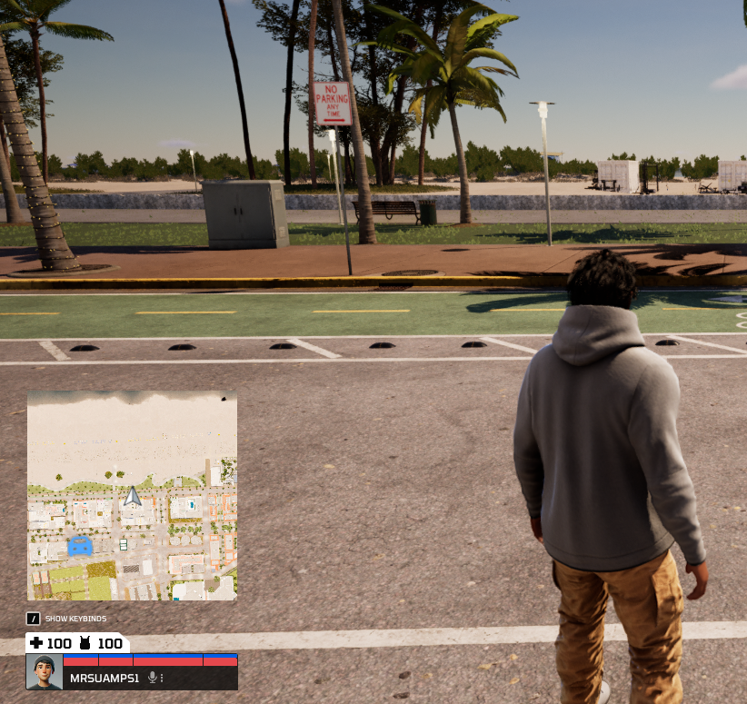
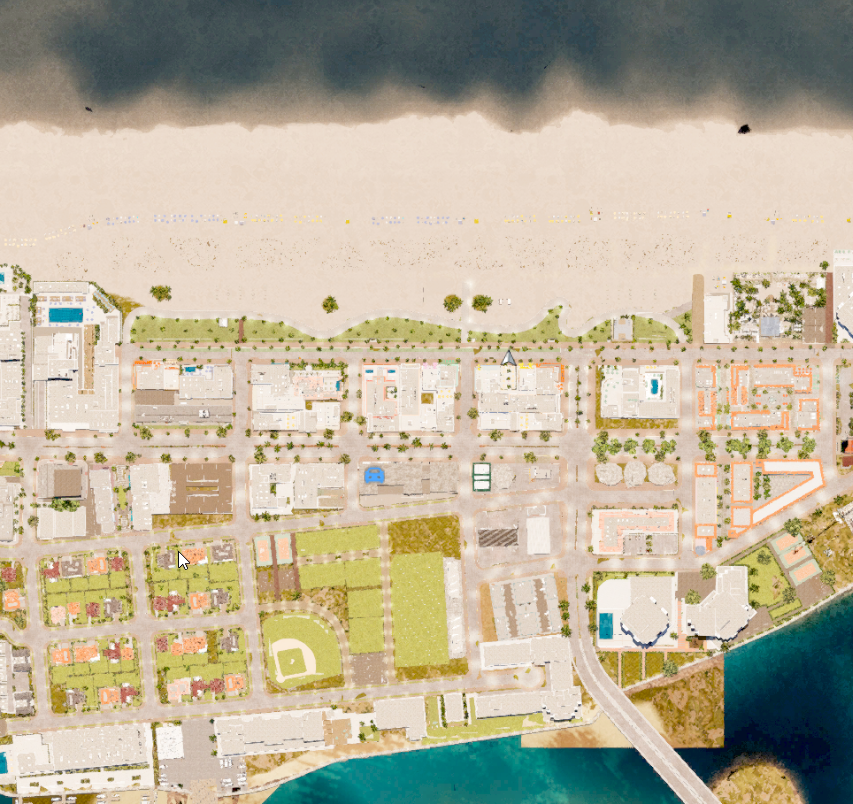
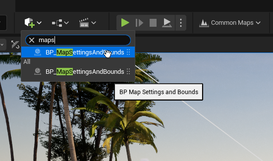
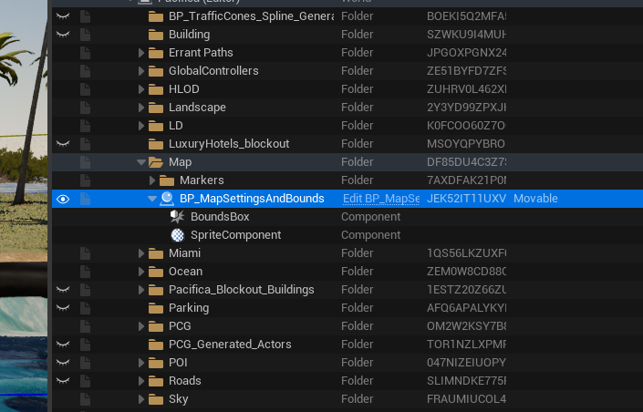
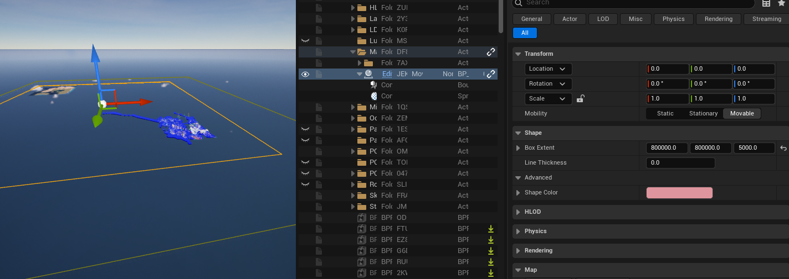
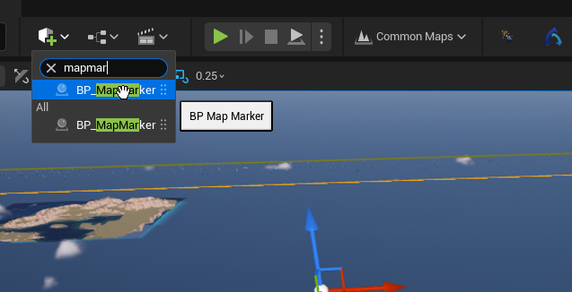
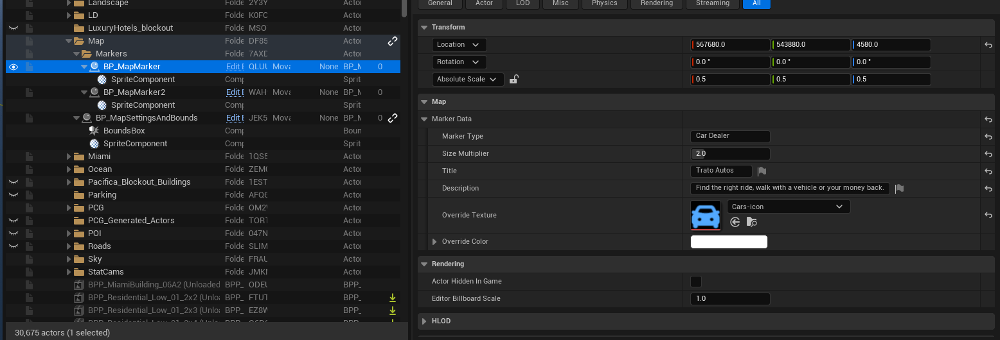
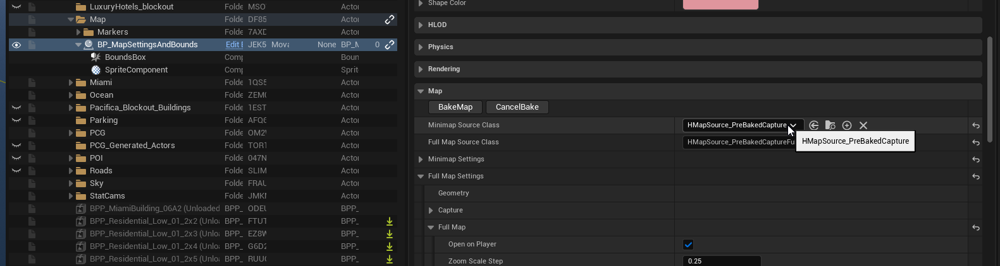
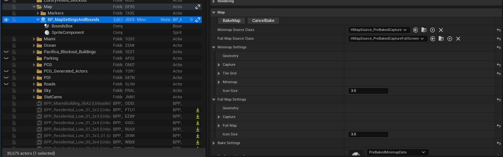
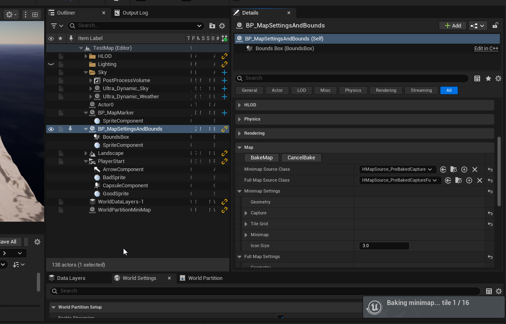

# Configuring the map on HELIX Studio

## What the map is

HelixMap is HELIX's built-in map system. Every map has two surfaces, both driven from one place:

- A **corner minimap** that sits on the HUD during play.
- A **full-screen map** the player opens with `M` (scroll to zoom, drag to pan).

Each surface draws its image one of two ways:

- **Scene Capture (live)** — a hidden camera renders the world top-down whenever a new image is needed. No setup, but it has a runtime GPU cost and the quality is limited.
- **Pre-Baked** — the world is captured once, ahead of time, into static textures on disk. Sharper and almost free at runtime, but you run a bake step whenever the level changes.

/// tip | Live or baked?
For most maps the live Scene Capture is fine — it's the default and needs no setup. Reach for **Pre-Baked** when the map is very large (the live capture gets more expensive the more world it covers, so big levels run much better baked) or when you want the sharpest, most consistent visuals. Baked is the choice for a shipping build — see [Baking the map](#baking-the-map).
///

You choose the surfaces and the strategy per level with a single **Map Settings** actor. This page walks through setting it up; for the meaning of every individual field, see the companion [Map Settings Object](settings.md) reference.

## Add the Map Settings actor

1. Open the **Place Actors** panel and search for `Map Settings`.
2. Drag one into your level.

Only **one** Map Settings actor is allowed per level — a second one logs an error and nothing is applied.

## Set the map bounds

The actor has a `Box` component that defines the area the map covers — this is your capture size.

- **Move** the actor so the box is centred over the playable region.
- **Scale** the box (or set its `Box Extent`) so it covers the whole playable area.
- The actor's **Z** position anchors the capture camera — place it slightly above the highest playable surface.

The box drives the map's centre, extent and camera height directly, so you size the map by sizing the box. These bounds are volume-controlled: editing the matching fields in the Details panel does nothing — the box always wins.

## Drop markers

To mark a point of interest (a store, an objective, a spawn point):

1. In **Place Actors**, search for `Map Marker` and drag one into the level.
2. Position it where it should appear on the map.
3. In the Details panel, expand **Marker Data** and set:
    - **Title** / **Description** — shown on the marker's hover tooltip on the full-screen map. A marker with no Title shows no tooltip.
    - **Marker Type** — a logical category (e.g. `Store`, `Quest`). The full-screen map legend shows one filterable row per distinct type, so set this to group related markers.
    - **Override Texture** — replace the default pin with your own icon.
    - **Override Color** — tint the icon.
    - **Size Multiplier** — scale the icon up or down (1.0 = default).

The marker shows up on both the minimap and the full-screen map. The local player's own marker is added automatically — you don't place one. To add markers from gameplay code, see [Configuring the map at runtime](runtime.md).

## Reading the full-screen map

Players open the full-screen map with **`M`** (scroll to zoom, drag to pan). Beyond viewing, they can:

- **Filter with the legend** — a panel in the bottom-left lists one row per distinct **Marker Type** on the map (icon + name). Clicking a row filters the map to that type — everything else hides, while the player marker and the navigation waypoint always stay visible. Selecting also pans to the **nearest marker of that type to the player**; clicking the row again clears the filter and pans back to the player.
- **Read tooltips** — hovering a marker shows its **Title** and **Description**. Markers without a Title show no tooltip.
- **Set a waypoint** — clicking a marker (or double-clicking any empty spot) drops a navigation waypoint; the minimap then shows a clamped arrow pointing to it, and it auto-clears when the player arrives. See [Navigation Waypoint](../../api/apiImport/classes/hmap.md#navigation-waypoint) in the `HMap` reference for the scripting side.

## Scene Capture vs Baked

Each surface picks a *source* — the backend that produces its image. There are four, two per surface:

| Source | Surface | How it works | Use when |
|---|---|---|---|
| **Scene Capture** | Minimap | Renders the world top-down each frame. | Prototyping — no setup, instant. |
| **Pre-Baked Capture** | Minimap | Streams baked tiles from disk. | Shipping — sharp, low GPU. Needs a bake. |
| **Scene Capture Full Screen** | Full-map | One live capture sized to the screen. | Prototyping the full map. |
| **Pre-Baked Capture Full Screen** | Full-map | Reads the same baked tiles as the minimap. | Shipping — pairs with the baked minimap. |

You set these on the Map Settings actor via **`MinimapSourceClass`** and **`FullMapSourceClass`**. Leave a picker empty to use the project default (live). The live setup works out of the box — you only need a bake when you want final-quality visuals.

## The options you'll touch most

Most defaults are fine. The handful you'll reach for first:

- **Minimap zoom** — how much world the minimap shows.
- **Projection** — flat top-down (orthographic) or a tilted 3D look (perspective).
- **Icon size** — pixel size of markers.
- **Open on player** — whether the full-screen map opens centred on the player or zoomed out.

Every field, with types and defaults, is in the [Map Settings Object](settings.md) companion.

## Baking the map

A bake turns the live capture into static textures on disk, plus a data asset that links them. **Bake when you're shipping a level** — baked maps look sharper and cost almost no GPU at runtime — or when the map is large enough that the live capture is too expensive. While you're still moving art around, stay on the live source; it's faster to iterate.

To bake:

1. Set `MinimapSourceClass` (and/or `FullMapSourceClass`) to a **Pre-Baked** variant. Extra bake fields appear on the actor.
2. Configure the bake — exposure, zoom depth, sky and water overrides. See [Bake settings](settings.md#bake-settings) in the companion.
3. Save the level, then press **Bake Map** in the Details panel.
4. The bake captures each tile in turn; it can take a few minutes on a large map. Don't close the editor while it runs.
5. When it finishes, `PreBakedMapData` is filled in automatically. Press Play — the map now reads from the baked tiles.

Pan the full-screen map across the whole level to check the result, looking for seams between tiles, exposure jumps, water sparkle, or dark patches.

### Troubleshooting the bake

**Tiles look washed out / too bright** — decrease `ExposureBias` (e.g. `1.0` → `0.5`) and re-bake.

**Tiles look dark / underlit** — increase `ExposureBias` (e.g. `1.0` → `1.5`), and confirm `bUDSSunCastShadows` is `true` (with it off, Lumen loses the sun contribution and tiles darken). Re-bake.

**Visible seams between tiles** — disable `Capture.ShowFlags.bReflections` (reflections are view-dependent and the bake camera moves per tile), confirm `bOverrideFluxWaterMaterial` is on if the level has Flux water, and confirm `UDSCloudCoverage` is `0.0`. Re-bake.

**Sparkle on water** — confirm `bOverrideFluxWaterMaterial` is on, `FluxSurfaceActorClass` matches your water actor, and `MinimapWaterMaterial` is a simplified material (no specular, detail wave, or foam). Re-bake.

**Deepest zoom-out looks too coarse** — cap it: set `BakedZoom.MaxZoomOutLevel` to e.g. `2` so the player stops at a finer level. Good for small maps where the deepest baked level is just a tile or two.

**Bake takes too long** — reduce `TileResolution`, increase `TileWorldSize` (fewer tiles), or reduce `MaxZoomLevel`.

Re-baking overwrites the existing tiles and data asset. If your version control marks files read-only (Perforce, Plastic), check the data asset and tile textures out first.
