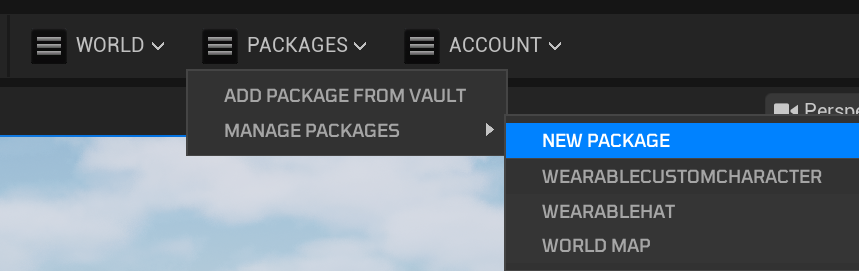
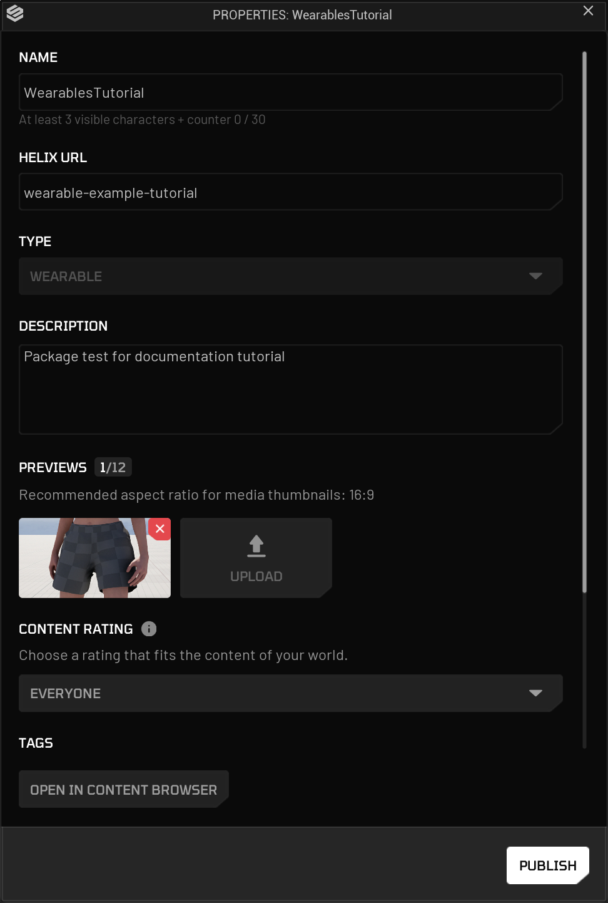
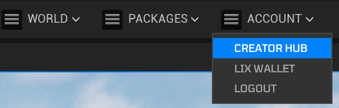

# Custom Wearables

This guide walks you through the process of creating and packaging custom wearables using Helix Studio. This tutorial is applicable to: Clothing (e.g. shoes, shirts, bottoms, underwear, outfits) Hair (facial and head), accessories (e.g. Hats, gloves, masks, necklaces, glasses). Some specific adjustments may need to be made depending on the asset type, such as dynamic hair sim.

---

## **1. Project Setup**

To integrate your wearables into Helix, you must first download and Launch Helix Studio.

1. Launch Helix Studio
2. Select the Helix tab to see our template projects
3. Select the appropriate template (We’ll be using the Wearables template)
4. Define the project save location and project name
5. Hit create
    
    
    

---

## **2. Package Creation**

To upload a bunch of assets to the vault you need to create a package. This is essentially an asset pack. Packs can be created/ split by theme, use, type etc. (e.g. Anime Clothing, Western Weapons, Sports car pack etc.) 

To create a pack use the Packages dropdown in the toolbar above the viewport. If you don't see this you may need to Log In to your Helix account and potentially restart Helix Studio

1. Navigate to `Packages>Manage Packages>New Package`

1. Enter a unique Package Name (e.g. Sports Shirts).
2. Select the appropriate package type for your package e.g. **Wearable** 
3. Assign a suitable description  
4. Create a unique package URL. (Currently we use “-” for spacing e.g. wearable-johns-sneakers and don't allow uppercase characters)
5. Click **Create Package**. This action creates a dedicated plugin folder for your assets (e.g., **Plugins/SportsShirts**). - This will be where you put all of your custom content that will make up your pack.

---

## **3. Template Assets**

To create or adjust wearables to be compatible with Helix, we’ve provided some meshes to serve as a guide. You can find them in the advanced character creator engine plugin, templates folder: `/All/EngineData/Plugins/AdvancedCharacterCreator/Templates`

Note: You can paste these directories directly into the content browser path (where it will likely, currently say `All>Plugins>”PackageName”`) by clicking the empty space in the bar.  

For full body meshes you can find them here: `/AdvancedCharacterCreator/Templates/Body`

> Currently we use: `SKM_F_UNDW_Tall` & `SKM_M_NRW_Tall`
> 

And split body part meshes are located here: `/AdvancedCharacterCreator/Templates/Body/Cut`

And heads are found here:

`/AdvancedCharacterCreator/Templates/Head` 

Although both male and female characters use the same Skelton, you will ideally create a piece of clothing for just one gender or create 2 versions of your clothing, adjusting it individually to each body (i.e. Male & Female).

To export the template assets to use in a modelling package of your choice e.g. blender you will need to export them out of Helix Studio. 

1. For each mesh you want to export, `right click` it, go to `Asset Actions` and `Export`
2. Name and save the asset in a suitable folder on you PC
3. In the export window, make sure you have Level Of Detail ticked under the Mesh tab. `(This will be important because if you’re making custom Level of Detail models, you should model them around the corresponding level of detail mesh to prevent clipping)`
4. Do this for all required template assets 

---

## **4. Clothing Creation**

Exactly how you create your wearables and what modelling applications you use is up to you but there’s a few principles that are important to get right. As a result, the next few section will provide a breakdown on how to approach the creation of wearables. The examples will be given using blender as it’s free and the most accessible 3d package. The core principles of what’s covered apply to most/ all applications.

1. Import a body or body part template into your modelling package
2. Model your clothing item around the template body OR if you’re using an existing wearable, adjust your model to fit the body. (Make sure you have good topology, especially around joint such as the knees)
3. Apply transforms to your model when done (to make Location and Rotation equal 0,0,0 and scale equal 1,1,1.) To do this in blender, with your model selected press `Ctrl + A` and select `All Transforms`.

#### Armature Binding & Transferring Weights

To get your item of clothing to move with the body you will need to parent the wearable mesh to the skeleton. Below is steps on how to do this in blender, other programs will differ slightly.

1. Select your wearable mesh and Shift select the armature (this will be shown in the viewport as pyramids with spheres on the end of them or as “root” in the hierarchy. 
2. The press Ctrl + P to parent
    1. then select “with Automatic Weights”

Warning: If you get a warning regarding unresolved bones/ bone weighting issue etc. you will need to investigate the cause further. Some things to check are:

- Apply transforms as described above
- Make sure your mesh has no unconnected vertices - To fix this, with your model selected, enter edit mode by pressing tab, enter vertex select mode, press A to select all vertices and kit M and select “by Distance”

Regardless of weights transferring correctly you will likely need to weight paint by hand. Feel free to move the armature points back and forth from time to time to see how your mesh deforms and if it looks correct.

---

## **5. Clothing Export Setup**

Once your item of clothing is created, you have bound it to the armature and painted the weights, you’ll need to setup the hierarchy correctly ready to export to Helix Studio.

To do this:

1. In the outliner open up the “Root”/ armature parent
2. Select all the children of the imported template mode including root (in my case everything under “SKM_F_UNDW_Tall”)
3. With all children selected, press Alt + P and select Clear and Keep Transformations
4. Now delete the body meshes and the parent empty
    1. You should be left with root, reference model LodGroup and your wearable mesh/s
5. Rename Lod Group to an appropriate name e.g. SKM_F_Undw_Shorts_LodGroup
6. Then select you wearable mesh (select all lod meshes if you have created multiple LODs)
7. With them selected Ctrl+ Select the LodGroup 
8. Then Press Ctrl + P and select Object

#### LOD setup (if Applicable)

1. Select Lod Group parent
2. In the object tab, under custom properties create a new Property by pressing “New”
3. Press the cog icon
4. Set type to String, property name to fbx_type and the Default Value to LodGroup
5. Hit ok
6. Then change the value from 1 to LodGroup

---

## **6. Export your wearable**

1. Make sure your outline only includes “root” (the armature) and the LodGroup containing your mesh/s
2. Navigate to File>Export>fbx
3. Define a save location
4. Name your wearable appropriately. (Follow our naming conventions, for skeletal meshes use the prefix SKM_)
5. Make sure you enable custom properties
6. Forward Axis is Y Forward and Up is Z Up.
7. Armature settings Has Y axis as the Primary bone and X Axis as secondary
8. Also make sure Add Leaf Bone is deselected
9. To avoid any doubt, copy my setting from the image below

---

## **7. Helix Studio Importing**

Next you want to import you model into Helix Studio. You must import your assets into the correct packages folder (e.g. the package you created earlier). To find your package again you can:

1. Navigate to Packages>ManagePackages>YourPackageName

1. With your package window open you can press “OPEN IN CONTENT BROWSER”. this will take you to the location of your package.

#### Skeletal Mesh Import

When your content browser is now inside of the correct folder you can add your mesh

1. To add your mesh you can either drag your fbx file from windows explorer into the Content Browser or Press the Import button and navigate to the file. 
2. In the import content window it’s important to set a few settings
    1. If you made multiple LOD meshes, make sure “Import Lods” is ticked
    2. Disable “Create Physics Asset”
    3. Ideally you should uncheck “Import Materials” also but that’s optional.
    4. IMPORTANT: Set Skeleton to “metahuman_base_skel” or “Face_Archetype_Skeleton". (If you see multiple, hover over it and select the one that's located in `MetaHuamnCharacter/Female/Medium/NormalWeight/body` or if you’re creating a head wearable use `/MetaHumanCharacter/Face/Face_Archetype_Skeleton`
3. Then press “Import”

#### No/ incorrect skinning quick fix (Optional)

If when you open up your wearable by double clicking it and play a preview animation on your mesh, you may see some weight issues as demonstrated in the below image.

If this happens to you it’s important you adjust your weight painting. You can do this in your modelling package or directly in Helix Studio. However there’s a quick way that could potentially fix this.

1. With your skeletal mesh open, open the Skin tab to the left
2. Press “Edit Weights” (here you can paint or transfer weights)
3. Then expand the Weight Transfer tab.
4. Here define a source SKM (Here assign the source skeletal mesh you used as a reference for your wearable e.g. `SKM_F_Undw_Bottom`)
5. Set mesh mode to Source
6. Set location and rotation to 0,0,0
7. Next hit Transfer Weights and then press “Apply to Asset”

#### Material Creation (Basic Custom Material)

To create a standard material for your assets presuming you already have textures and have your wearable uv mapped is pretty simple.

1. Import your textures by dragging into the content browser or using the import button
2. Right click in your wearables package plugin folder
3. Search and select material
4. Name your material with the `M_` prefix for materials and `MI_` prefix for material instances 
5. Next open your material by double clicking
6. Now drag your textures from Helix Studios content browser, into the material graph
7. Next hook up the RGB values from your textures to the corresponding output pins by left click dragging the pins

> *You may notice in this example I have used the R,G,B channels for the bottom texture. That is a packed Occlusion, Roughness & Metallic map (aka ORM). You don't need to worry about that right now but if you have 2/3 grayscale textures e.g. Occlusion, roughness & metallic it’s good practice and optimal to pack these into the color channels of a packed texture.*
> 
1. Now you can open up your wearable skeletal mesh and in the asset details panel, assign your material to the correct material slot

#### Tileable material (Optional Tip):

If you have a tileable texture you can hook the texture output pin into a multiply node, set the multiply value to the amount of times you want the texture to tile and then hook the output of the multiply into the corresponding texture type pin. You can create a multiply node by right clicking and searching or by holding down M and left clicking in the graph. Ideally the tile amount would be simply factored in to the uv mapping unless you’re doing a more complex layered material setup.

---

## **8. Character Creator Integration/ Data Asset Creation**

1. In your created package folder, right click in the content browser and search **Data Asset**.
2. Select **Data Asset** and set **Character Customization Data Asset** as the class.
3. Rename your new data asset (e.g. DA_MyFemaleShortsCollection)
4. Open your new Data Asset.
5. Select the appropriate wearable type (e.g. Bottoms).
6. Then press “+Add” to create a new Bottoms element. 
7. Give your new wearable a unique ID name by double clicking the New item text. (e.g. F**_SportsShorts01** - M denoting Male)

---

## **9. Wearable Data Setup**

1. Assign the correct Gender for your wearable.
2. Set an appropriate display name e.g. Sports Shorts
3. Set a Preset Icon  (Please create and assign a 512x512 // 256x256 image icon)
4. Assign an appropriate Additional Tag from the drop down list e.g, `Cosmetic.Category.Clothing.Bottoms.Shorts`
5. Under the Mesh tab, assign your wearable’s skeletal mesh - You can use “Physique Body Part Skeletal Meshes” to assign a different mesh based on body physique 
    1. To assign your mesh to the slot you can search for it in the drop down or select it in your content browser, go back to the Data Asset tab and press the arrow just under the drop down search field
6. If you’re using a material that is setup for overrides use the Auto-Fill From Mesh button to begin the integration. *(Optional)* *This can be left blank for now as this will depend on your material setup.*

---

## **10. Testing your Wearable (Helix Studio)**

You can test your new wearable on a character using the Character Creator directly in Helix Studio.

As long as your asset is added to your package plugin folder and you have correctly setup your data asset (Defined name, gender, icon and mesh) you will see your wearable in the corresponding menu inside of character creator. Make sure you save all of your imported and created assets.

To test in Helix Studio follow the steps below

1. Press play in the **Helix Studio** editor. The play button is just above your viewport. (You can also press Alt + P) 

1. Once the game simulation and your character has loaded, Press the P key to open character creator.
2. In the character creator UI, be sure to select the gender that your asset has been created for. You can switch gender using the buttons in the top left of the viewport
3. Now you should be able to navigate to your new wearable using the character creator interface to find it.
4. Once you’ve selected your wearable, you can press save and exit. This will allow you to run around in the test level and see your wearable in action.

---

## **11. Packing/ Publishing**

To use you’re wearable/s directly inside Helix you need to Package/ Publish it. 

1. Navigate to `Packages>ManagePackages>YourPackageName`
2. Finalise all field appropriately. 
    
    
    
3. Hit Publish
4. In the publish window you have multiple options
    1. Package Locally will give you a pak file which you can add to your helix game filed directly
    2. Upload to Vault will upload your package to the vault. Here you can chose if it’s publicly visible, only visible to you or only visible to certain users.
5. In the publish window you also have the choice of Updating a current package, make latest or publish as a new package.
6. Double check the correct package to publish is selected and hit start

Your package will now being to cook, pack and upload to the vault.

---

## **12. Check & Manage your uploaded packages (Optional)**

To view your current published package you can use the Creator Hub.

To access the creator hub, navigate to `Account>Creator Hub`.

This will open your web browser. Once you’re signed into your helix account, you should be able to see all of your uploaded packages, manage their details etc.

---

## **13. Testing your wearables in Helix**

1. Load Helix
2. Navigate to the Vault tab
3. Locate your uploaded package (Tip: You can filter by “MY PUBLISHED”)

1. Open it by clicking it and pressing “Preview”

This will load a blank test world and have your package ready to go. Simple follow the same steps as testing in Helix Studio e.g. launching character creator and your wearable will be there.

---

## **14. Ready To Rock**

Once you’ve followed these steps, uploaded your package to Creator Hub, and imported it into your world, your new wearable items will be available for players joining your public world!