# Custom Animations

This guide walks you through the complete process of acquiring animation packs from Fab, adapting them for the standard HELIX character rig, and packaging them as an Addon for the [Creator Hub](creatorhub.md) using the [Creator Kit](creatorkit.md).

The process for adapting animations differs depending on whether the asset pack was designed for the older Unreal Engine 4 skeleton or the modern Unreal Engine 5 rig. This guide covers both scenarios.

---

## 1. Create a Project

Launch HELIX Studio and create either a project you want to start from.


## 2. Acquire & Import Marketplace Asset

If your animation assets are acquired from Fab, you will need Epic Games Launcher to import them into your new project.

1. Acquire your desired animation pack from [Fab](https://fab.com).
2. Open the **Epic Games Launcher** and navigate to the **Unreal Engine** -> **Library** tab.
3. Locate your newly acquired pack in the **Fab Library** section and click **Add To Project**.

    

4. From the project list, enable "Show All Projects" toggle, and select your new project from the list. The window will show "Asset not compatible with version" error. Click **Select Version** box and select 5.7 (or latest available version below 5.7), and click **Add to Project**.

    

---

## 3. Create a Wearable Vault Package

1. From the toolbar menu, select **Packages → Manage Packages → New Package**.

    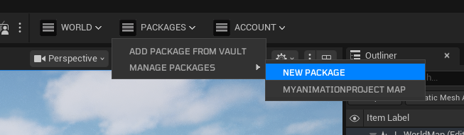

2. Fill in the details for your vault package. Set the **type** to **Asset Pack**.

    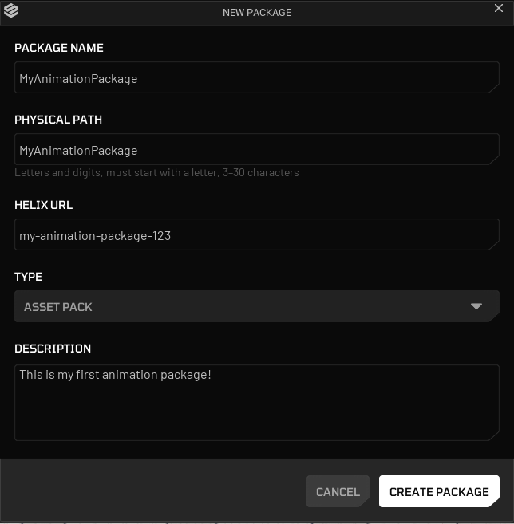

3. Click **Create Package**.

    Package creation generates a new plugin folder named after your package. This folder is the **root** where you gather all your animation related assets.

    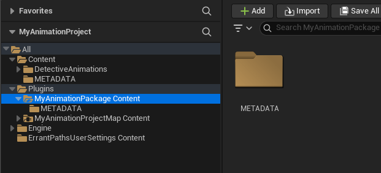

---

## 4. Set Up Your HELIX Addon Package

Next, you will prepare your imported assets for packaging.

### Option A: For UE5 Rig-Based Packs (Replace Skeleton)

This is the simpler method, used for modern packs that are already compatible with the `UE5` skeleton.

1. Find your imported Fab asset folder under **Content**, and right click to it. Select **Migrate**.

    

2. Make sure only root folder of your imported pack is selected, and click **OK** button.

    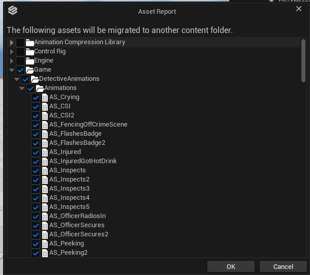

3. On the folder pick window, select `<Your Project Root>/Plugins/<Your Package Name>/Content` folder.

    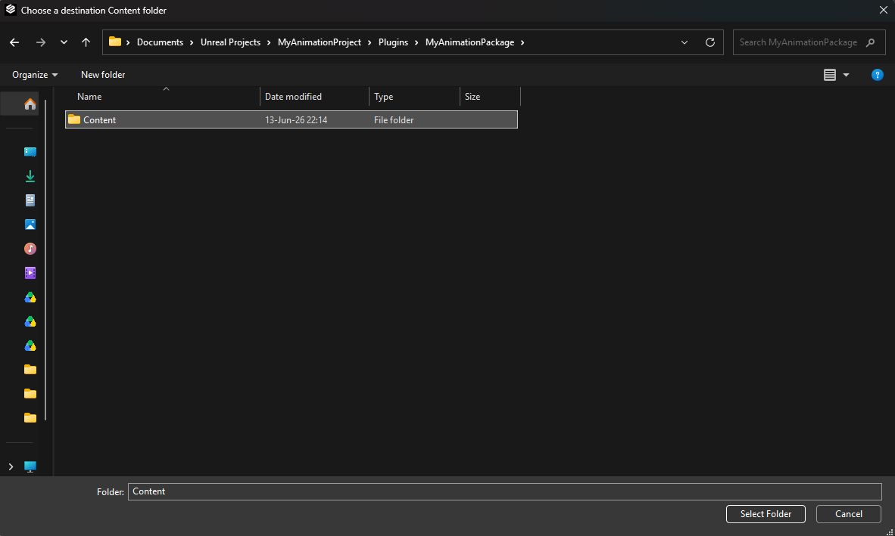

4. Ensure assets are copied over into your new package content folder.

    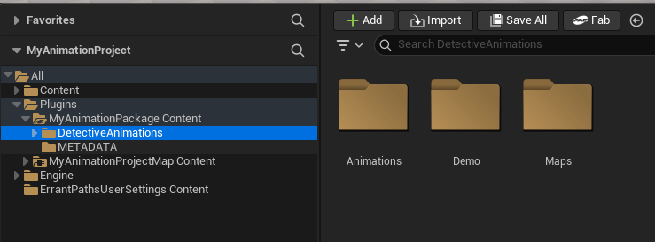

5. Select all the **Animation Sequence** assets in your package folder.

6. Right-click the selection and choose **Replace Skeleton...**

    

7. In the dialog, select **SK_Unified** from the list (Path: `/HelixAnimation/Unified/Meshes`). This is the primary skeleton used by default for HELIX characters. Click **OK**.

    

8. Verify that the selected animations now reference the **SK_Unified** skeleton. Save all modified assets (`Ctrl+ShiftS`).

    

### Option B: For `UE4` or Custom Rig-Based Packs (Retarget Animation)

This method is for older packs built for the `UE4` Mannequin or packs using a custom rig. It uses the **IK Retargeting** system to create new, compatible animations.

1. Repeat same steps described on Option A, until step 5. This will move all your assets into your new HELIX package folder.

2. Select all the **Animation Sequence** assets in your new package folder, right-click the selection, and choose **Retarget Animation Assets** -> **Duplicate and Retarget Animation Assets**.

    

3. The Animation Retargeting window will open. For **Source Skeleton**, select the original skeleton from the downloaded pack (e.g., **SK_Mannequin**).

    

4. For **Target Skeleton**, choose **SKM_Manny** located in `/HelixAnimation/Unified/Meshes` folder.

    

    /// info | Note
    Your project may contain multiple assets named **SKM_Manny**. Ensure you select the one from the `/HelixAnimation/Unified/Meshes` folder, as shown in the screenshot. This is the mesh associated with our **SK_Unified** skeleton.
    ///

5. You can typically leave **Generate Auto Retargeter** checked to automatically map bones. For advanced use cases where the automatic mapping is incorrect, you can uncheck this and provide your own custom **IK Rig** and **IK Retargeter** assets.

6. Review the list of animations to be generated. You can uncheck any you don't need. Click **Export Animations** button.

    

7. On the new window, select a new folder in helix package folder to put new retargeted animations (e.g., **Plugins/MyAnimationPackage/Retargeted**). Click **Export**.

    

8. Click **Export** button again in next window.

    

9. The engine will now process and retarget all selected animations, creating new copies in your package folder that are compatible with the HELIX skeleton.

---

## 5. Finalize and Cook The Package

With your animations successfully adapted and moved to your package folder, you can make final adjustments and upload your package to vault.

1. Open the final animation assets inside your package folder (e.g., **Plugins/MyAnimationPackage**).

2. Perform any necessary final adjustments. This is a good time to:
    - Enable/Disable **Root Motion**.
    - Add **Animation Notifies** (AnimNotifies) for events like footsteps or impacts.
    - Add or modify **Animation Curves**.
    - Adjust play rate or other settings.
  
3. If your package folder has any asset type unrelated to animations (textures, materials, levels, skeletal meshes etc.), remove them to reduce clutter. If you've retargeted your animations, you should remove the source versions to prevent them from getting packaged with retargeted versions.

4. After finishing setting up your data asset, find your package from top toolbar and click on it.

    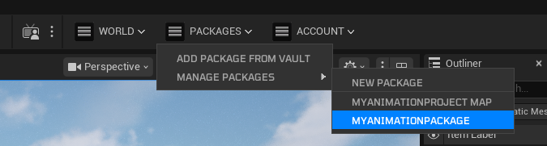

5. Ensure information on the properties windows is correct, and fill any missing fields if needed. Click **Publish**.

    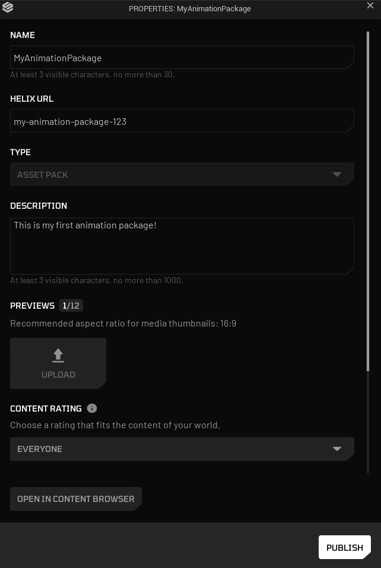

6. Select **Upload to Vault** option and choose what you want to do with the current package (update current, make latest, publish as new). For current tutorial, we'll choose publish as new. Click **Start** button to start packaging process.

    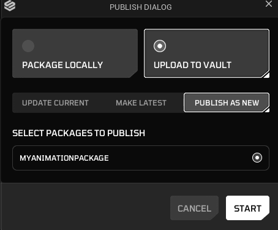

7. Once packaging is completed, your package will be ready to use from HELIX Vault on game build.

---

## 6. (Bonus) Importing Animations From Mixamo

It's also possible to download animations from [Mixamo.com](http://www.mixamo.com) and import them into Creator Kit for packaging with same retargeting steps done for `UE4` rig-based packs.

1. Find an animation you'd like to use from Mixamo and use **Y-Bot** as your character for best retargeting results.

    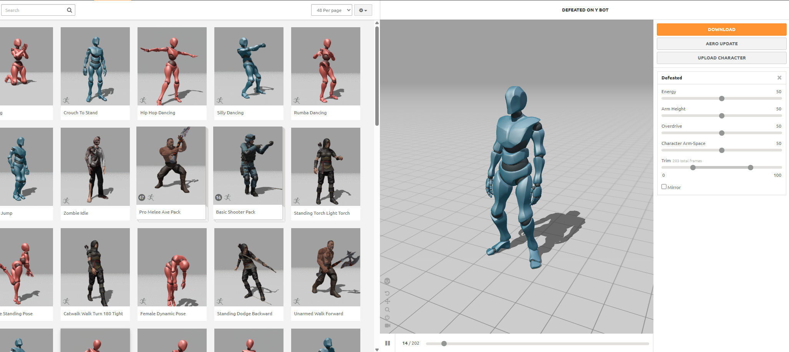

2. Click **Download** button after tweaking your animation.

3. On the new window, select options as shown on the image below and click **Download** button. This will download an `.fbx` file, ready to be imported into Creator Kit.

    

4. Create a temporary folder in Creator Kit project, and click **Import** in content browser to import your mixamo animation `.fbx` file.

    

5. This will import character mesh, materials and animation sequence asset into the target folder.

    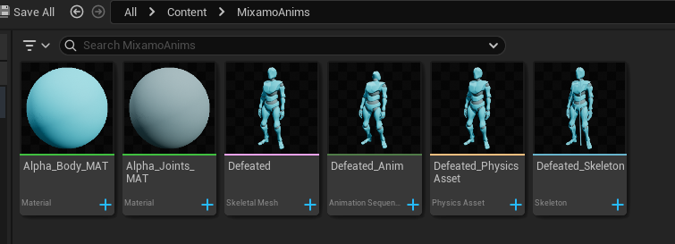

6. Follow the same steps starting from `Option B: For UE4 Rig-Based Packs (Retarget Animation)` section for your imported animation sequence. While retargeting, make sure source & target skeletal meshes are selected correctly. Source mesh should be the skeletal mesh imported from your `.fbx` file in that case, as shown on the image below.

    

    

---

## 7. Using Packaged Custom Animations In Worlds

For this example use case, we will try to load our packaged custom animation sequence asset and play it on player character with a Lua script.

1. After creating your workspace, open build mode by pressing **N** button and add the package you created in **Creator Kit HELIX Packaging Tool** from Vault section to your world.

2. After import is completed, you will get a panel on the left side of window with the package's name. It might appear empty if your package doesn't have any world placeable assets, which is not a problem.

    

3. Now we need to write our Lua script to access the assets inside this package. Click **Edit Scripts** button and open your workspace folder.

    

    

4. To play an animation with [Animation API](../api/apiImport/classes/animation.md) after a player is spawned, add the server lua script below into  `WORKSPACE_ID/scripts/main/server/main.lua` path in your workspace. If the file doesn't exist, create it.

    ```lua
    -- Register a function to listen for player joined global event
    RegisterServerEvent('HEvent:PlayerReady', function(source)
        local AnimParams = UE.FHelixPlayAnimParams()
        Timer.Delay(HWorld, 2, function()
            local MyCharacter = GetPlayerPawn(source)
            -- Our custom package is named "MyAnimationPackage", and animation sequence asset inside is named "AS_Crying"
            local result = Animation.Play(MyCharacter, '/MyAnimationPackage/AS_Crying.AS_Crying', AnimParams, function() print('Animation Ended') end)
            print('Animation play result: ', result)
        end)
    end)
    ```

5. Click the **Reload** button and then the **Play** button respectively to re-execute your lua scripts in workspace and then get back into play mode.

    

    

6. Observe your character plays the custom animation after a second.

    
