# Import Animations

This guide walks you through the complete process of acquiring animation packs from Fab, adapting them for the standard Helix character rig, and packaging them as an Addon for the **Helix Vault** using the **Creator Kit**.

The process for adapting animations differs depending on whether the asset pack was designed for the older Unreal Engine 4 skeleton or the modern Unreal Engine 5 rig. This guide covers both scenarios.

## 1 - Acquiring & importing marketplace assets
First, you need to get your animation assets from the marketplace and add them to the **Creator Kit** project.
1. Acquire your desired animation pack from Fab.com (formerly the Unreal Marketplace).
2. Open the **Epic Games Launcher** and navigate to the **Unreal Engine** -> **Library** tab.
3. Locate your newly acquired pack in the **Fab Library** section and click **Add To Project**.

    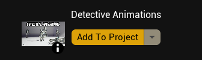

4. From the project list, select **CreatorKit**.
    > **Important:** Ensure the **Creator Kit** editor is closed during this process. Wait for the launcher to download and import all assets.

    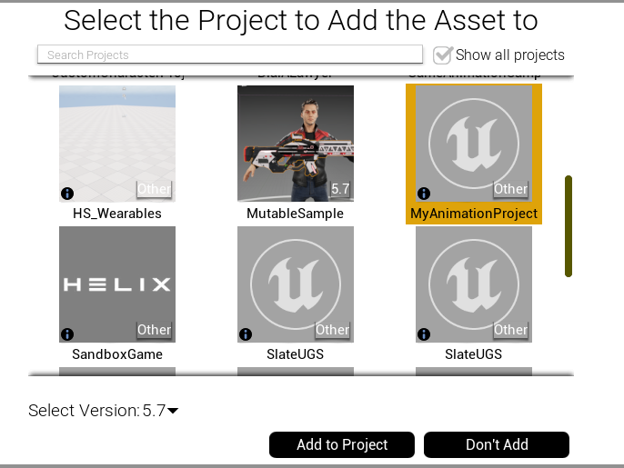

## 2 - Setting up your Helix addon package
Next, you will use the **Helix Packaging Tool** to create a dedicated folder for your new addon.
1. Launch the **Creator Kit** editor.
2. Access the **Helix Packaging Tool** from the main toolbar.
3. In the packaging tool window, click **New Package**.

    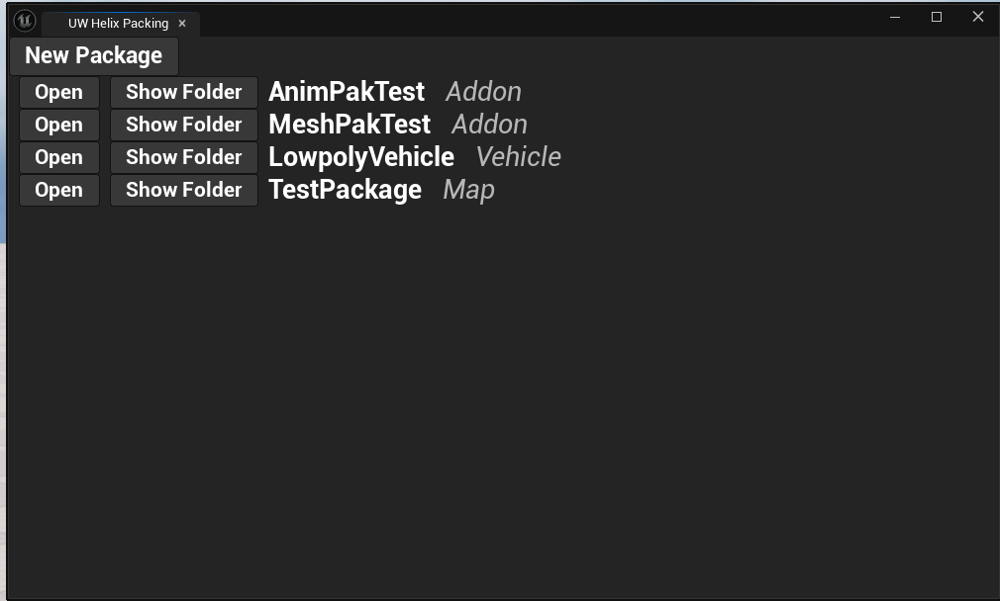

4. Enter a unique **Package Name** (e.g., `MyFirstAnimationPack`).
5. Select **Addon** as the **Package Type**.
6. Click **Add New Package**. This action creates a dedicated folder for your assets (e.g., **Content/Addon_MyFirstAnimationPack**).

    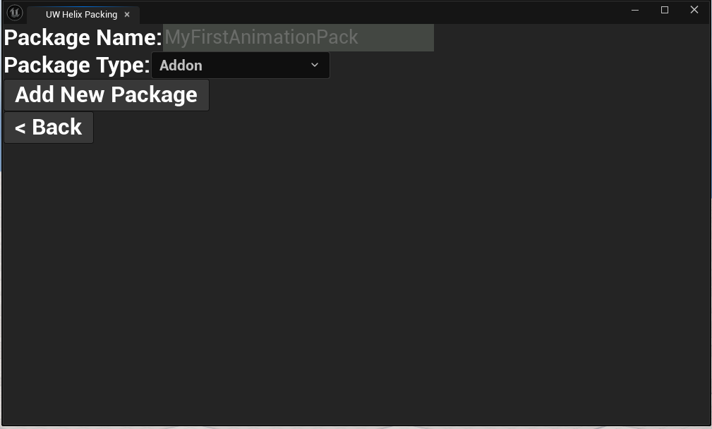

7. In the **Content Browser**, locate the main folder for the animation assets you imported in Section 1.

    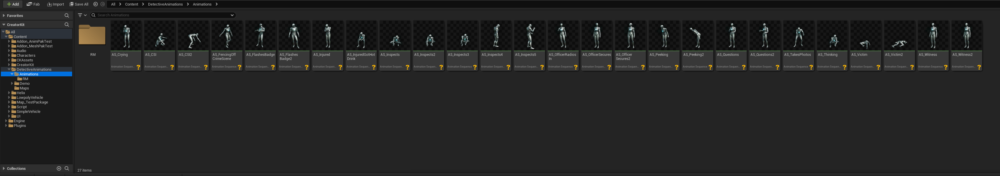

## 3 - Adapting animations for the Helix rig
This is the most critical step. The method you use depends on the skeleton the asset pack was built for. Follow the section that matches your asset pack.

### Option A: For UE5 rig-based packs (replace skeleton)
This is the simpler method, used for modern packs that are already compatible with the `UE5` skeleton.
1. Select all the **Animation Sequence** assets you wish to package.
2. Right-click the selection and choose **Replace Skeleton...**

    

3. In the dialog, select **SK_Unified** from the list. This is the primary skeleton used by default for Helix characters. Click **OK**.

    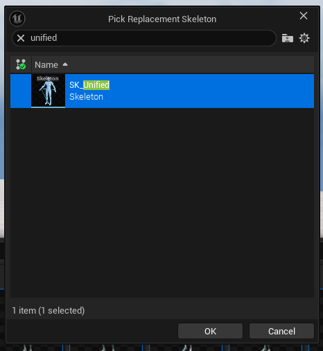

4. Verify that the selected animations now reference the **SK_Unified** skeleton. Save all modified assets (`Ctrl+ShiftS`).

    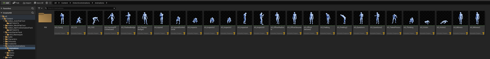

5. In the **Content Browser**, move all the modified animation assets into your package folder (e.g., **Content/Addon_MyFirstAnimationPack**).

    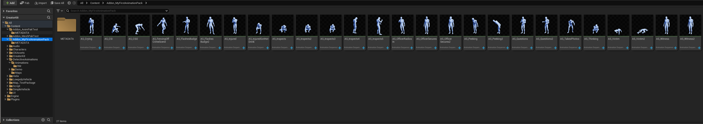

### Option B: For `UE4` rig-based packs (retarget animation)
This method is for older packs built for the `UE4` Mannequin. It uses the **IK Retargeting** system to create new, compatible animations.
1. Select all the **Animation Sequence** assets you wish to package.
2. Right-click the selection and choose **Retarget Animation Assets** -> **Duplicate and Retarget Animation Assets**.

    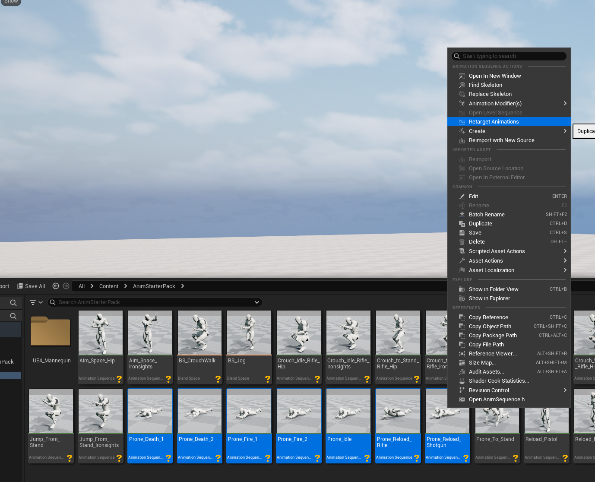

3. The Animation Retargeting window will open.
4. For **Source Skeleton**, select the original skeleton from the downloaded pack (e.g., **SK_Mannequin**).

    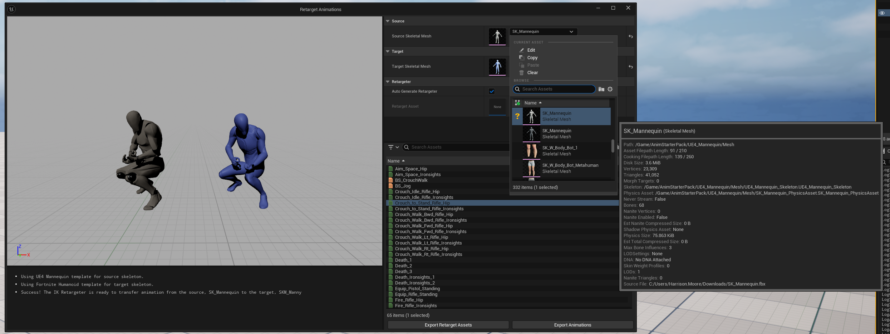

5. For **Target Skeleton**, choose **SKM_Manny** located in **Content/Characters/Heroes/Unified/**.
    > **Note:** Your project may contain multiple assets named **SKM_Manny**. Ensure you select the one from the **Unified** folder, as shown in the screenshot. This is the mesh associated with our **SK_Unified** skeleton.

    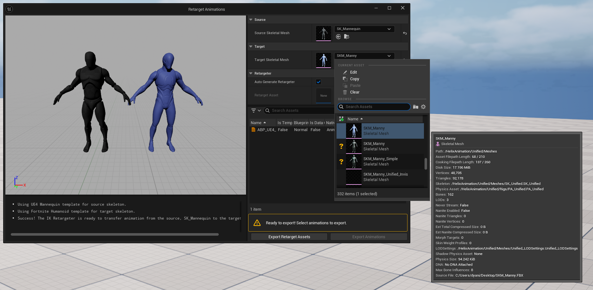

6. You can typically leave **Generate Auto Retargeter** checked to automatically map bones. For advanced use cases where the automatic mapping is incorrect, you can uncheck this and provide your own custom **IK Rig** and **IK Retargeter** assets.
7. Review the list of animations to be generated. You can uncheck any you don't need. Click **Export Animations** button.

    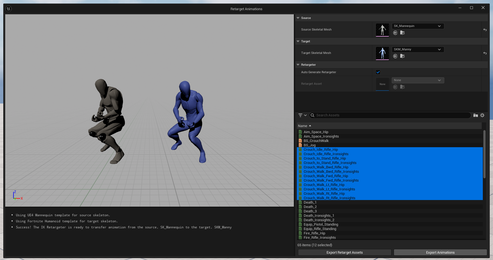

8. On the new window, select your helix package folder (e.g., **Content/Addon_MyFirstAnimationPack**) as the destination. Click **Export**.

    

9. Click **Export** button again in next window.

    

10. The engine will now process and retarget all selected animations, creating new copies in your package folder that are compatible with the Helix skeleton.

## 4 - Finalizing and cooking the package
With your animations successfully adapted and moved to your package folder, you can make final adjustments and "cook" the final `.pak` file.
1. Open the animation assets inside your package folder (e.g., **Content/Addon_MyFirstAnimationPack**).
2. Perform any necessary final adjustments. This is a good time to:
    - Enable/Disable **Root Motion**.
    - Add **Animation Notifies** (AnimNotifies) for events like footsteps or impacts.
    - Add or modify **Animation Curves**.
    - Adjust play rate or other settings.
3. Return to the **Helix Packaging Tool** window.
4. With your package selected, click the **Package** button. This process will cook your assets into the final `.pak` file format required by the **Helix Vault**. This may take some time.

    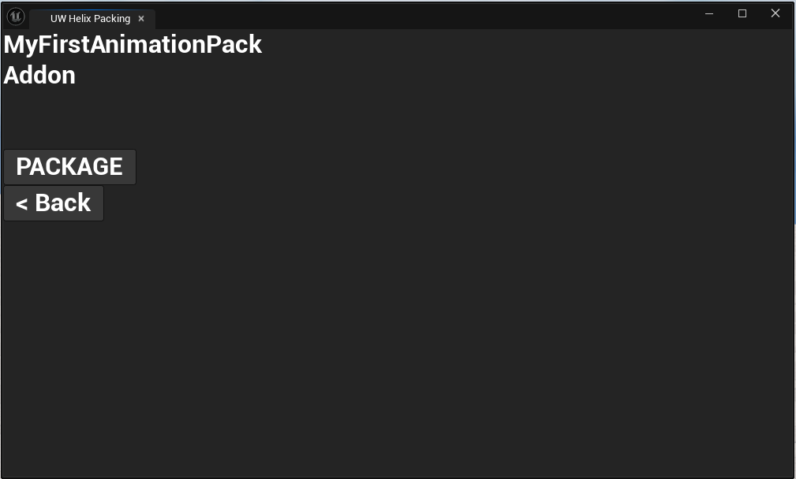

5. Once cooking is complete, a file explorer window will automatically open, displaying your final `.pak` file. Your animation pack is now ready to be uploaded to the **Helix Vault**!

    
