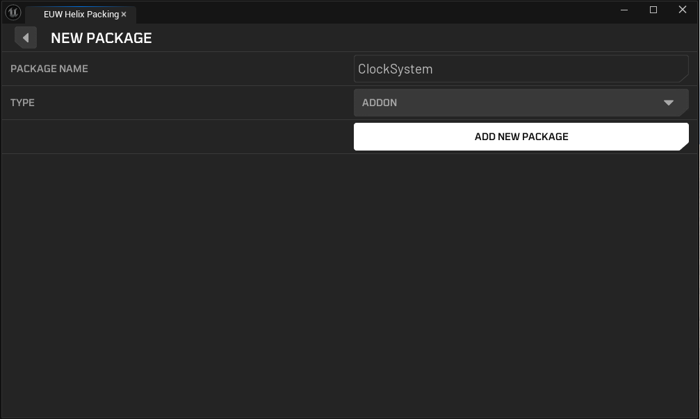
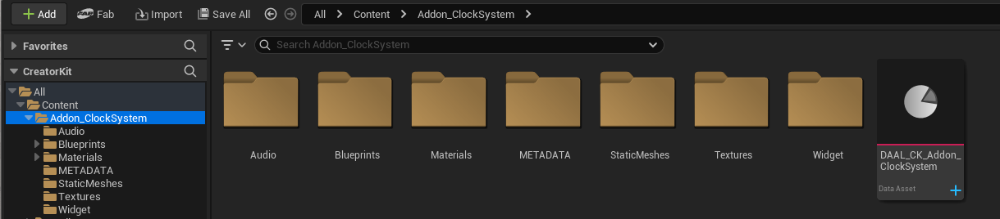
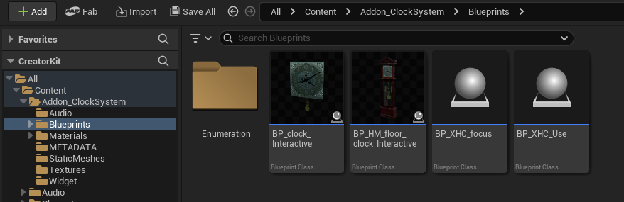
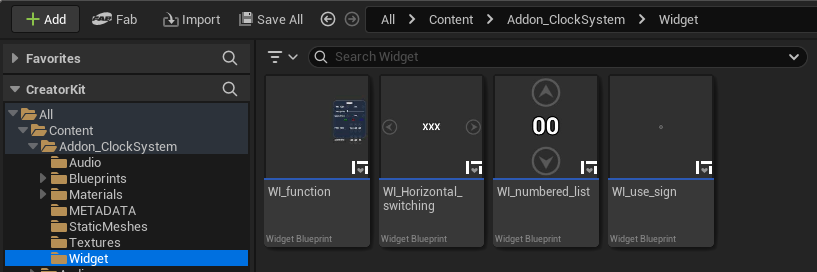
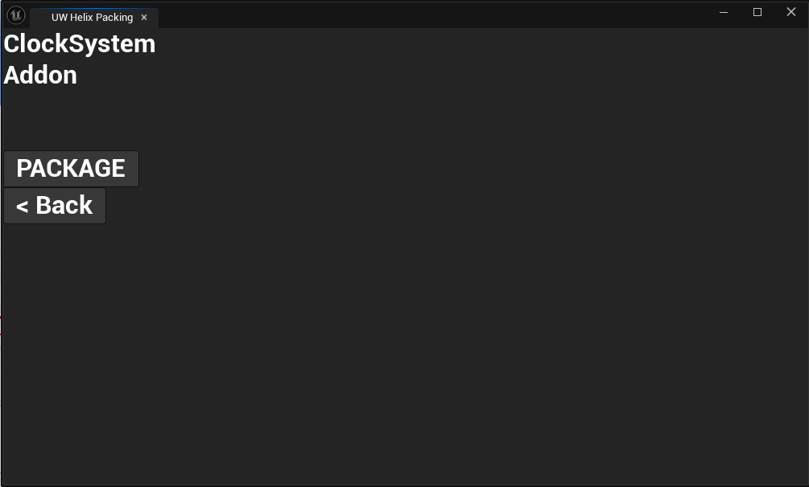

# Import Blueprints

This guide walks you through the process of packaging blueprint assets as an Addon for the HELIX Vault using the Creator Kit.

## 1. Preparing Blueprint Assets To Package

First, you need to get the blueprint assets you would like to package into **Creator Kit**. Packaging blueprints is technically not different than packaging any type of Addon `.pak` file.

For this tutorial, we have a blueprint based clock system pack, which has a main clock actor blueprint, materials, textures, widgets, and sound files.

1. Launch the **Creator Kit** editor.

2. Access the **HELIX Packaging Tool** from the main toolbar.

3. In the packaging tool window, click **New Package**.

    

5. Enter a unique Package Name (e.g., ClockSystem).

7. Select **Addon** as the **Package Type**.

    

9. Click **Add New Package**. This action creates a dedicated folder for your assets (e.g., **Content/Addon_ClockSystem**).

10. Move (or create) the blueprints and all the dependent assets into the package folder you've just created.

    
  
    
  
    

---

## 2. Finalizing and Cooking The Package

1. Make sure all the depending assets by your blueprint are placed inside package folder. If one of those assets are placed outside of the created package folder, created .pak file will have missing dependencies and this might cause crashes or runtime errors during playthrough with this package.

2. Make sure you have defined all the required functions, events, variables etc. in your blueprints to later access them with Lua inside Helix after importing your package there.

    

4. Return to the HELIX Packaging Tool window.

5. With your package selected, click the **Package** button. This process will cook your assets into the final `.pak` file format required by the HELIX Vault. This may take some time.

    

6. Once cooking is complete, a file explorer window will automatically open, displaying your final `.pak` files. Your blueprint addon pack is now ready to be uploaded to the **HELIX Vault**!

    

---

## 3. Using Packaged Custom Blueprints In Worlds

Please refer to [Use Custom Blueprints](https://development.helix-documentation.pages.dev/tutorials/use_custom_blueprints) to use your packaged custom blueprints in your worlds.
