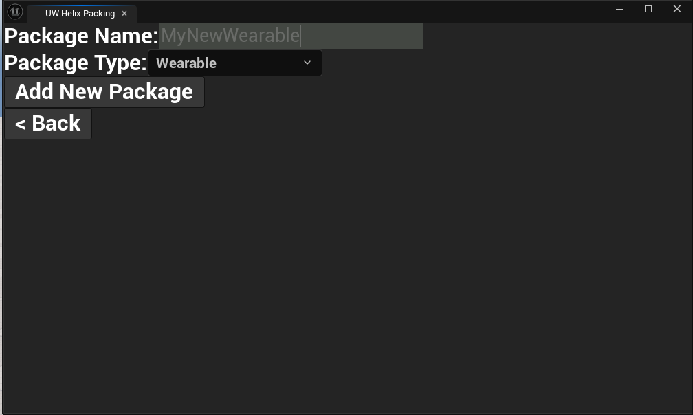
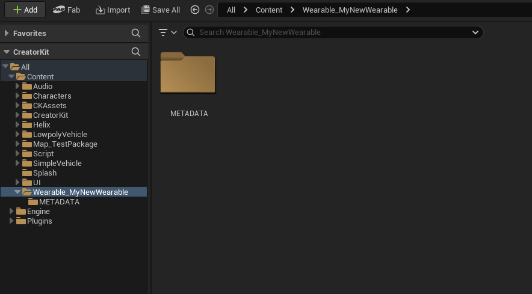

# Face Tattoo

This guide walks you through the process of creating and packaging Face Tattoos for the [Creator Hub](creatorhub.md) using the [Creator Kit](creatorkit.md).

## 1. Acquire Your Required Template Resources

/// warning | Notice
We have supplied Template assets inside of Creator Kit to make custom asset development easier. This can currently be found in **Content/CKTemplateAssets**
///

For this tutorial we will need T_HeadTextureTemplate_Male for visual guidance.

1. Launch the **Creator Kit** editor.

2. Navigate to **CKTemplateAssets** in the Content Browser.

3. Search for **T_HeadTextureTemplate_Male**, or look in the appropriate folders (e.g. **CKTemplateAssets/Textures**).

4. Right Click the texture and select **Asset Action > Export**.

---

## 2. Image Editing

After acquiring the template asset we need to put them to use in an image editor such as **Photoshop**. I recommend **Photopea** as a free, accessible option

1. Launch your image editor **e.g. Photopea**.

2. Open the downloaded head texture.

3. Create a new layer above it.

4. Add/ create your Tattoo design in the above layer.

5. Hide the background layer/ face texture (depending on software and opening type - The Background Layer may need to be unlocked)

6. Export as a .png (keep the resolution low where possible e.g. 512x512 or 1024x1024)

---

## 3. Creator Kit Package setup

1. Launch the **Creator Kit** editor.

2. Access the **HELIX Packaging Tool** from the main toolbar.

3. In the packaging tool window, click **New Package**.

4. Enter a unique Package Name (e.g., MyNewWearable).

5. Select **Wearable** as the **Package Type**.

    

6. Click **Add New Package**. This action creates a dedicated plugin folder for your assets (e.g., **Plugins/Wearable_MyNewWearable**).

    

7. Go into the folder you've created and click **Import** button in content browser. Choose your `.png` texture file

8. Make sure the texture is not a Virtual texture (VT) - If it is, convert it to a regular texture by right clicking and selecting convert VT to regular texture.

---

## 4. Data Asset Initial Setup

1. ..

