# Custom MetaHumans

This guide walks you through creating a custom MetaHuman head in **Helix Studio**, packaging it as a wearable vault package, and registering it so it appears in the in-game character creator.

By the end you will have a custom MetaHuman head that players can select and equip on their characters at runtime.

---

## Prerequisites

- Helix Studio installed.
- An Epic account (required for the cloud rigging step).
- Familiarity with the Unreal Engine content browser and Play-in-Editor (PIE).

---

## 1. Create a Project

Launch Helix Studio and create either a **new wearable sample project** or a **blank project** to start from.

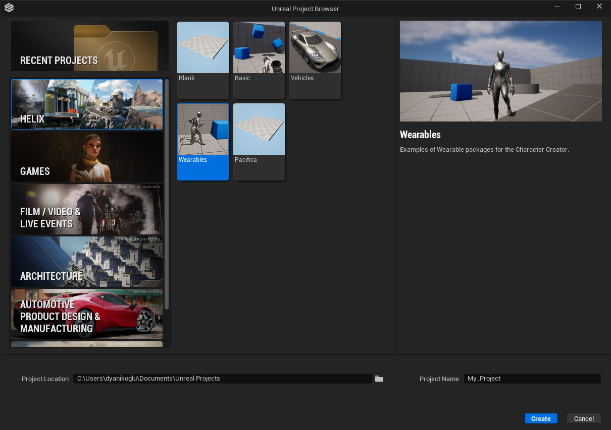

---

## 2. Create a Wearable Vault Package

1. From the toolbar menu, select **Packages → Manage Packages → New Package**.
2. Fill in the details for your wearable vault package. Set the **type** to **Wearable**.
3. Click **Create Package**.

Package creation generates a new plugin folder named after your package. This folder is the **root** where you gather all MetaHuman-related assets.

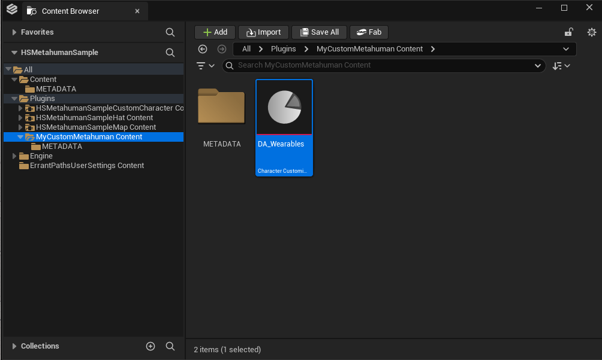

---

## 3. Create the MetaHuman Character Asset

1. Open your new package plugin folder.
2. Right-click an empty area in the content browser and choose **MetaHuman → MetaHuman Creator**.
3. Name your MetaHuman character asset and open it.

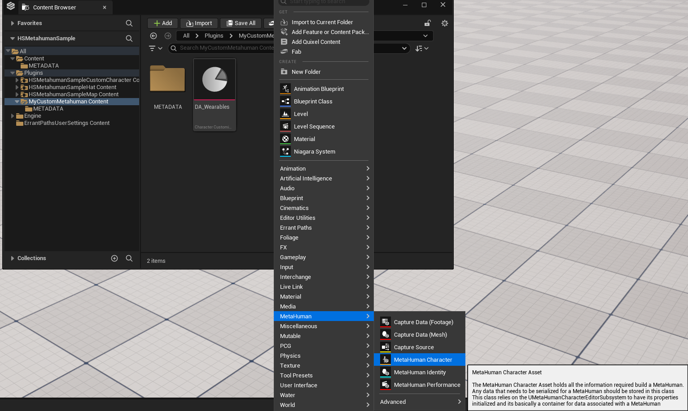

You are presented with the character editor.

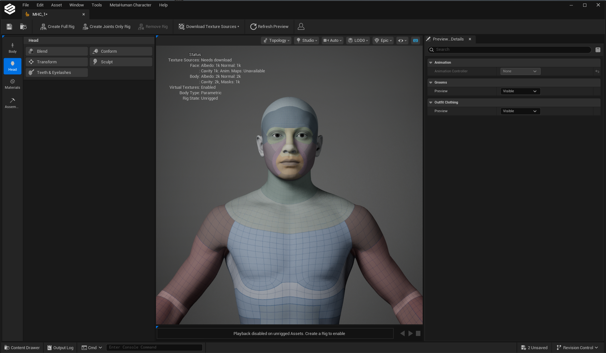

/// note | Feature Parity
The MetaHuman Creator UI is tailored to HELIX requirements. Some features available in standard Unreal Engine may not be available in the HELIX MetaHuman character creator.
///

---

## 4. Enable Skin Textures

To display skin textures on the character, select **Topology → Skin** from the viewport toolbar menu.

---

## 5. Choose a Body Type

Open the **Body** section from the side toolbar and click the body type you want.

/// warning | Body Type Compatibility
The body type determines gender compatibility for items, so choose it carefully. If you select a **female** body type and then create a **male** head on top of it, the height difference between the two MetaHuman bodies will make the head incompatible with male facial accessories and hair.
///

/// note | Body Sculpting
Body sculpting is **not currently supported**, and the generated body mesh is not used by the character creator. Adjust body proportions in the character creator UI instead.
///

---

## 6. Sculpt the Head

Open the **Head** section from the side toolbar to begin sculpting.

For detailed head sculpting controls, see the [MetaHuman Head Controls documentation](https://dev.epicgames.com/documentation/metahuman/head-controls).

### Adjusting Head Scale

To tweak the overall scale of your character, use the **Head Scale** slider inside the **Transform** tool. From the same panel you can also:

- Reset the head to its identity state.
- Align the neck to the body after modifying the head.

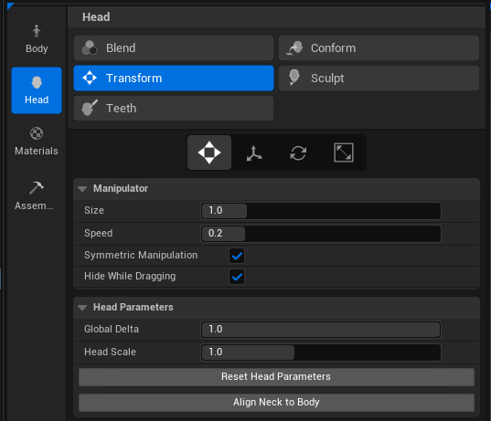

---

## 7. Adjust Materials

Open the **Materials** section to tweak your character's textures. Here you can change:

- Skin texture and color
- Eye color and iris type
- Teeth
- Makeup

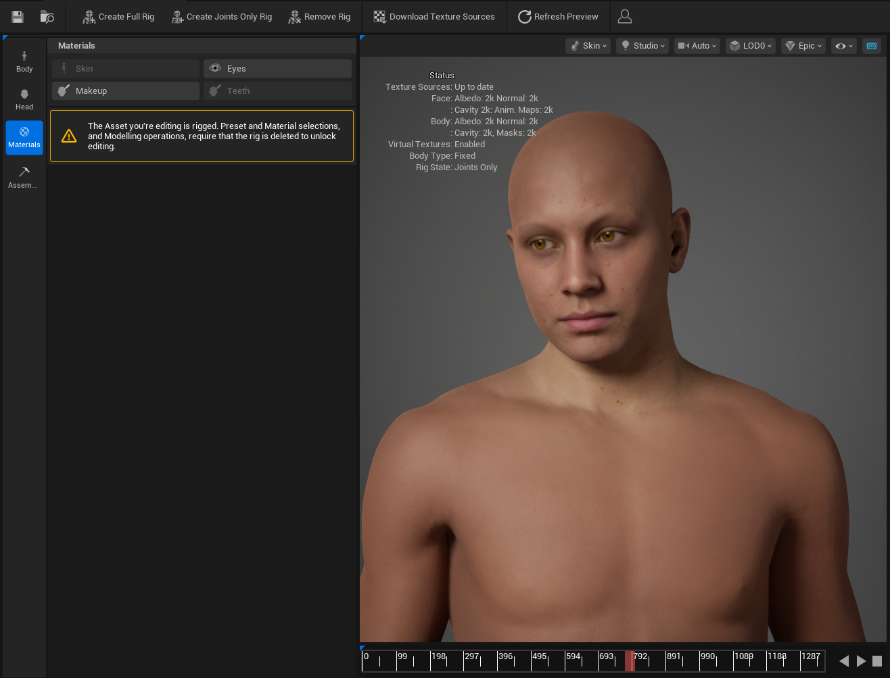

For detailed material controls, see the [MetaHuman Materials documentation](https://dev.epicgames.com/documentation/metahuman/materials-controls).

/// note | Skin Color Behavior
Even though skin color is configurable in the character creator UI, the skin color chosen in MetaHuman Creator also affects your custom head. The MetaHuman Creator color becomes the **base** skin color once the head is selected, and the in-UI skin color override is applied **additively** on top of it.
///

/// warning | Makeup Conflicts
You can add makeup to your character, but makeup added in MetaHuman Creator will conflict with makeup added through the character creator UI, and the MetaHuman Creator makeup is **always visible**. Unless you have a specific reason, do not add makeup to custom heads.
///

---

## 8. Prepare for Export (Rigging)

After finalizing your character, click the following buttons in the top toolbar:

1. **Download Texture Sources**
2. **Create Joints Only Rig**

This may prompt you to log into an Epic account for the cloud rigging process.

---

## 9. Assemble the Character

Once rigging completes, click **Assembly** in the side toolbar.

1. Set **Root Directory** to your new package plugin folder.
2. Set the assembly type to **HELIX Optimized**.

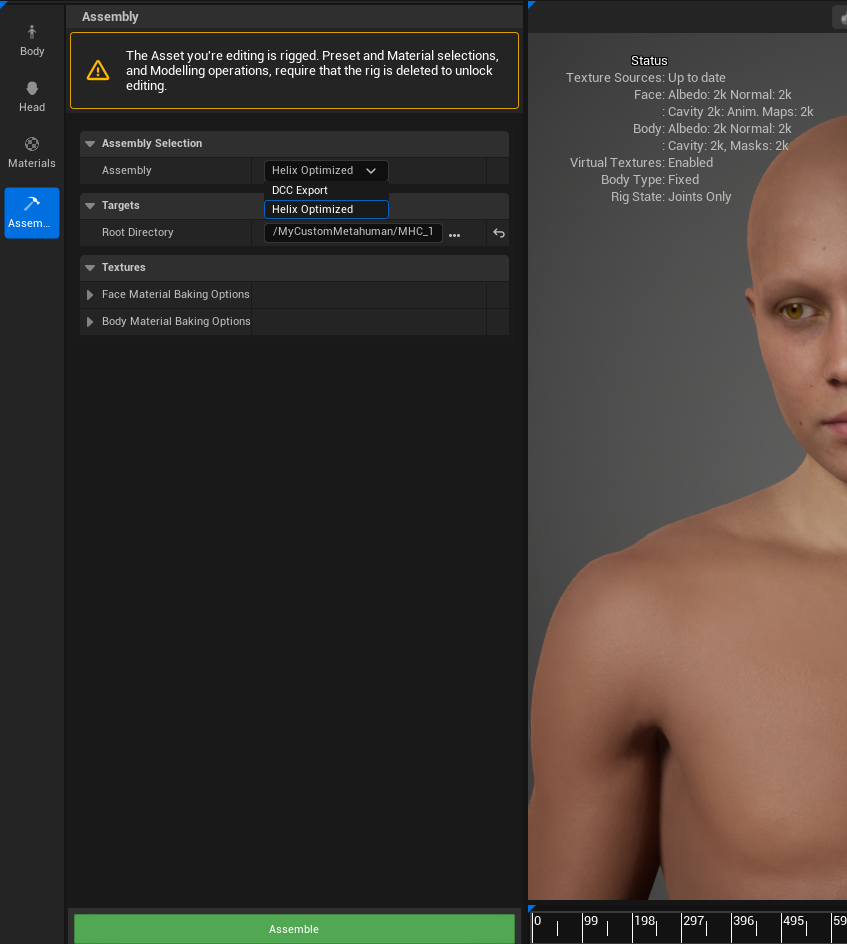

3. Ensure there are **no face or body material baking overrides**. Click the trash can icons next to those fields to clear any overrides.

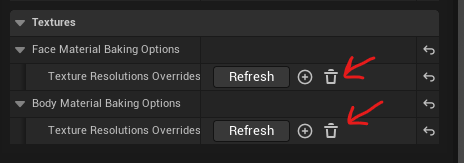

/// note | Texture Resolution
MetaHuman Creator can export higher-resolution textures via override parameters, but this is **not recommended** for performance reasons. Use the HELIX Optimized defaults by clearing any override parameters.
///

4. Once every field is correct, click **Assemble** and wait for the export to complete.

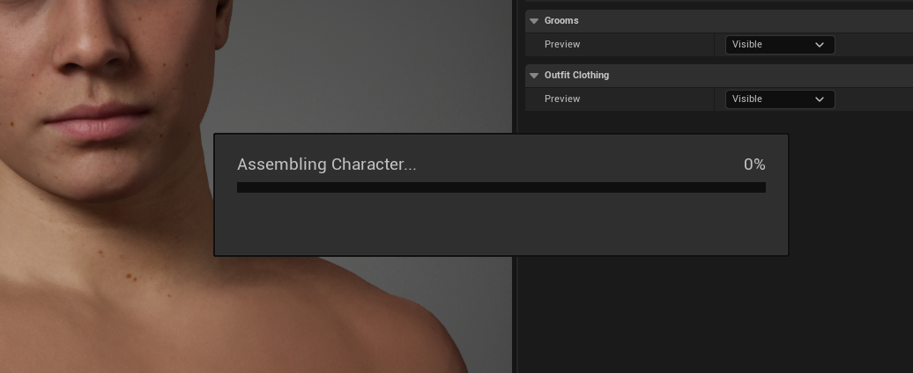

The export creates two folders: **Body** and **Face**. You will use:

- **`T_Body_VC_VT`**, the base skin texture in `Body/Baked/`.
- The custom head mesh from the **`Face`** folder.

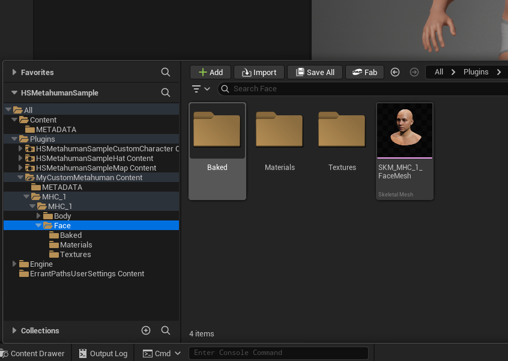

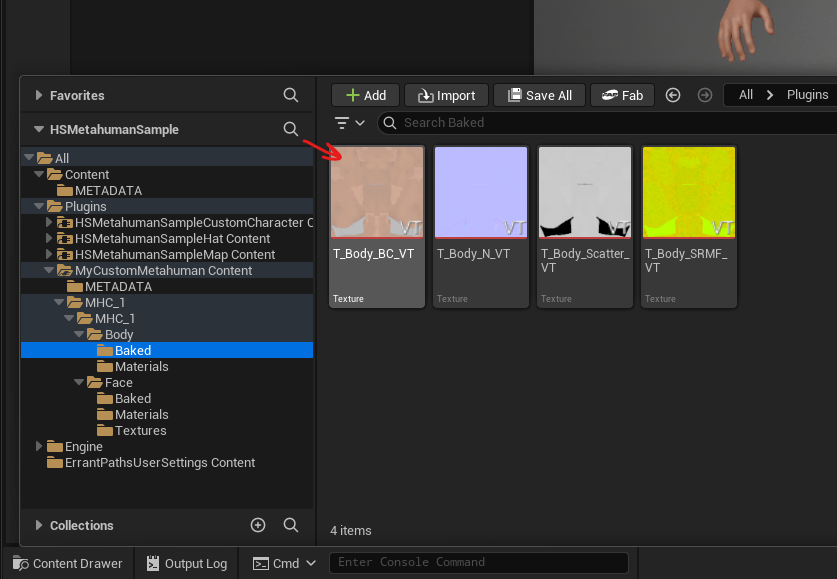

/// warning | LOD Data
The generated head mesh should have **3 LODs** and use the LOD data exported from MetaHuman Creator. Modifying the mesh's LOD data may cause it to stop working correctly in the character creator.
///

---

## 10. Register the Head in the Data Asset

1. Open the **`DA_Wearables`** data asset inside your package folder.

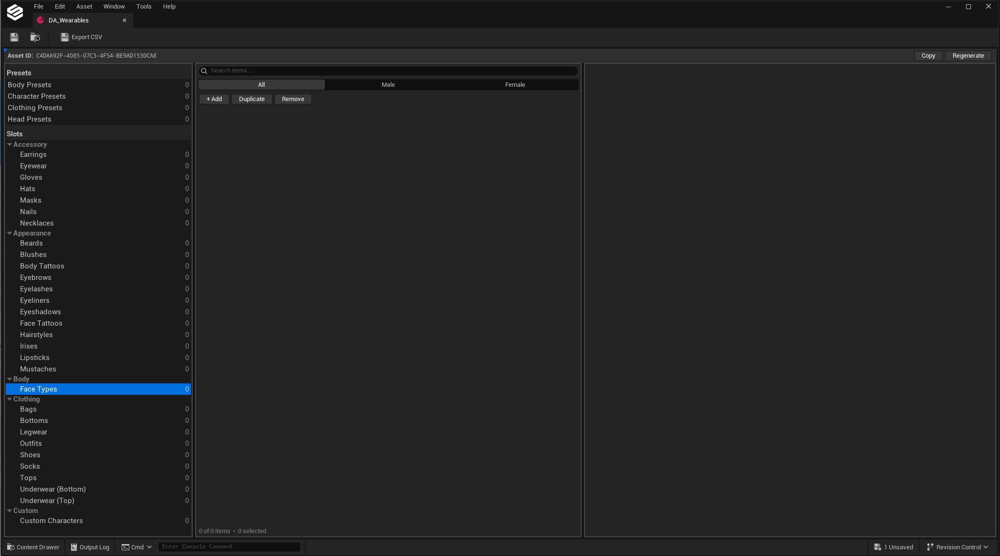

2. Select the **Face Types** category in the left panel, then click **+ Add** above it.
3. Double-click the tile's name section and give it a meaningful string ID (e.g. `M_Face_MyCustomMetahuman`).

4. In the properties panel, configure the entry:

| Field | Value |
|---|---|
| **Body Base Color Texture** | Assign the `T_Body_VC_VT` texture |
| **Supported Gender** | Match the body type you chose in MetaHuman Creator |
| **Display Name** | A meaningful name shown in the UI |
| **Preset Icon** | An icon, if you have one |
| **Preset Skeletal Mesh** | Assign your new head mesh |

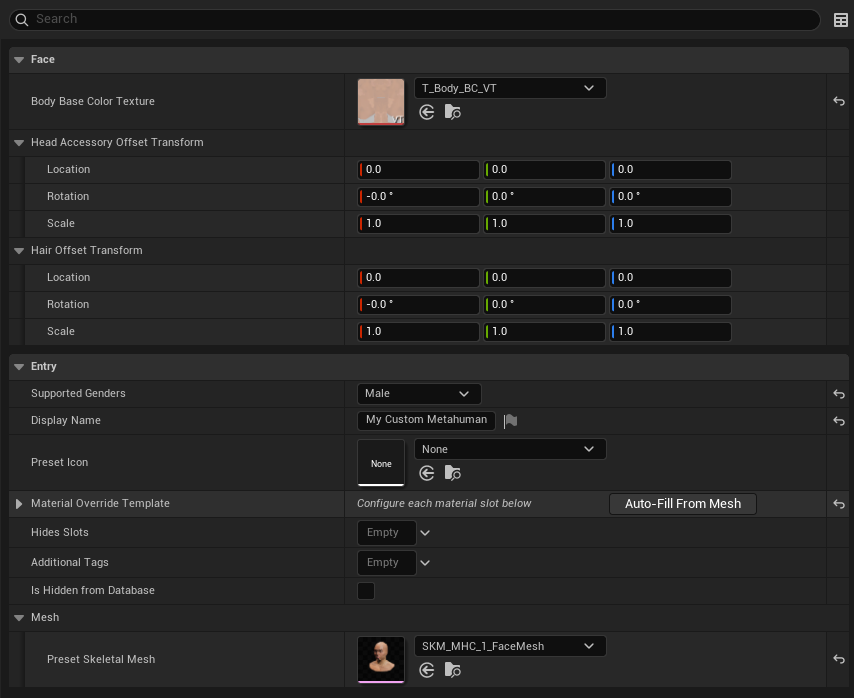

---

## 11. Enable Runtime Skin Coloring

To support runtime skin coloring:

1. Expand the **Material Override Template** section.
2. Click **Auto-Fill From Mesh**.

This adds a **Skin Tint** template to **Slot 7**, where the head's skin material resides. If it does not populate automatically, add the template type to Slot 7 manually.

3. Save the data asset.

---

## 12. Test in Play-in-Editor

1. Enter Play-in-Editor in any level.
2. Press **P** while in game to open the character creator.
3. Go to the **Head** section, your custom head mesh should appear in the list.
4. Click it to apply your custom head to the character.

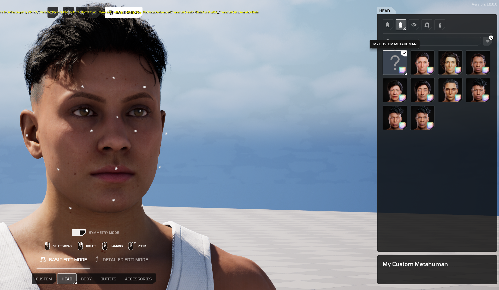

---

## 13. Fix Attachment Clipping

After equipping different hairstyles or facial accessories, you may notice clipping against your custom head. This typically happens when the head is heavily sculpted and differs noticeably in proportion from the identity MetaHuman head.

To fix this, tweak the following fields on your head mesh entry in the data asset:

- **Head Accessory Offset Transform**
- **Hair Offset Transform**

/// note | Heavily Sculpted Heads
The further you sculpt the forehead from the identity head, the harder existing hair and facial accessories are to fit. You will need to provide a custom scale per attachment type when adding the face to the data asset.
///

---

## 14. Publish the Package to the Vault

Once everything works as expected, publish your package so it is available for download.

1. From the toolbar menu, select **Packages → Manage Packages** and click your package name in the context menu. This opens the vault publish window.
2. Adjust the publish fields to your liking.
3. Click **Publish** to make your custom MetaHuman available for download in the **HELIX Vault**.

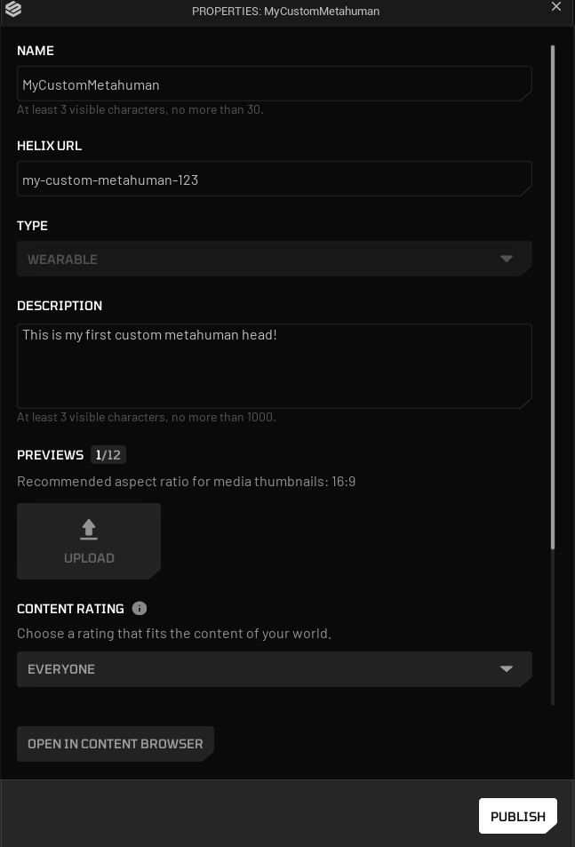

Your package can now be tested on game builds.

---

## Bonus: Alternative Creation Methods

Instead of sculpting a head manually, you can also:

- Convert an existing skeletal mesh head into a MetaHuman.
- Import a **DNA file** authored in Blender/Maya.
- Conform a MetaHuman identity from a photo scan or a static mesh.

See the [Mesh to MetaHuman documentation](https://dev.epicgames.com/documentation/metahuman/mesh-to-metahuman) for details.