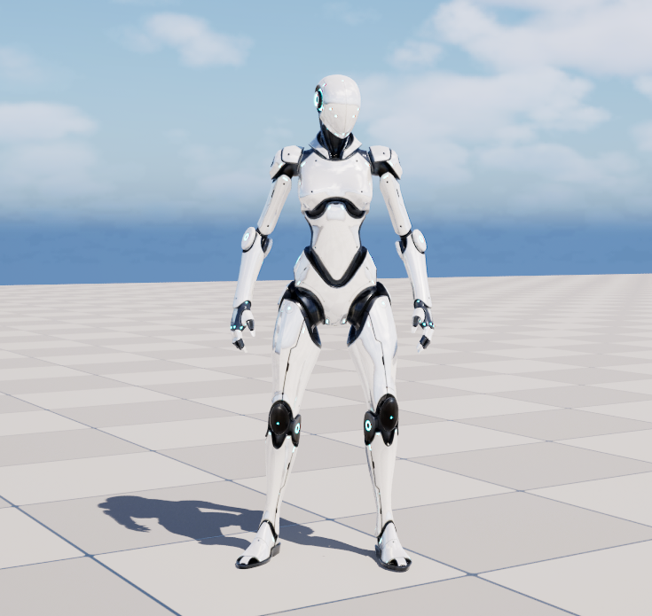
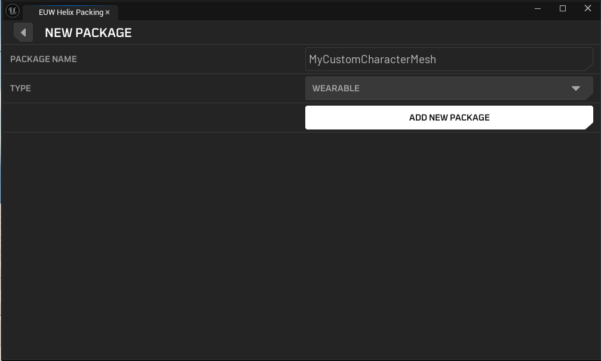
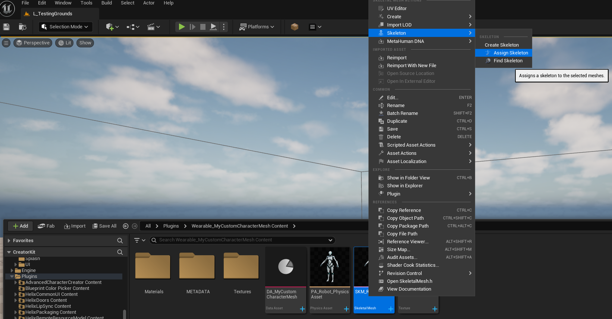
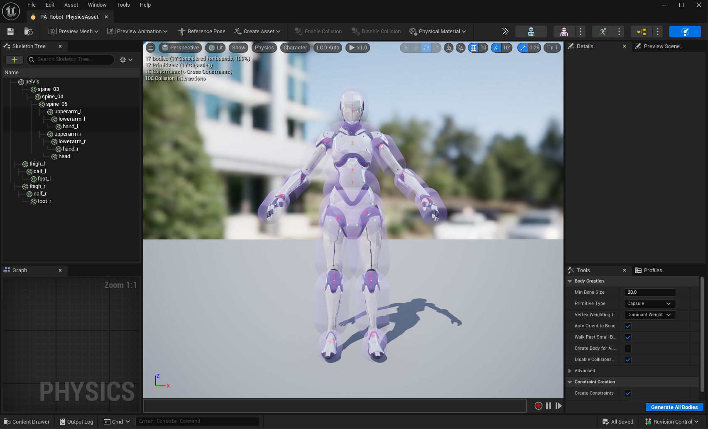
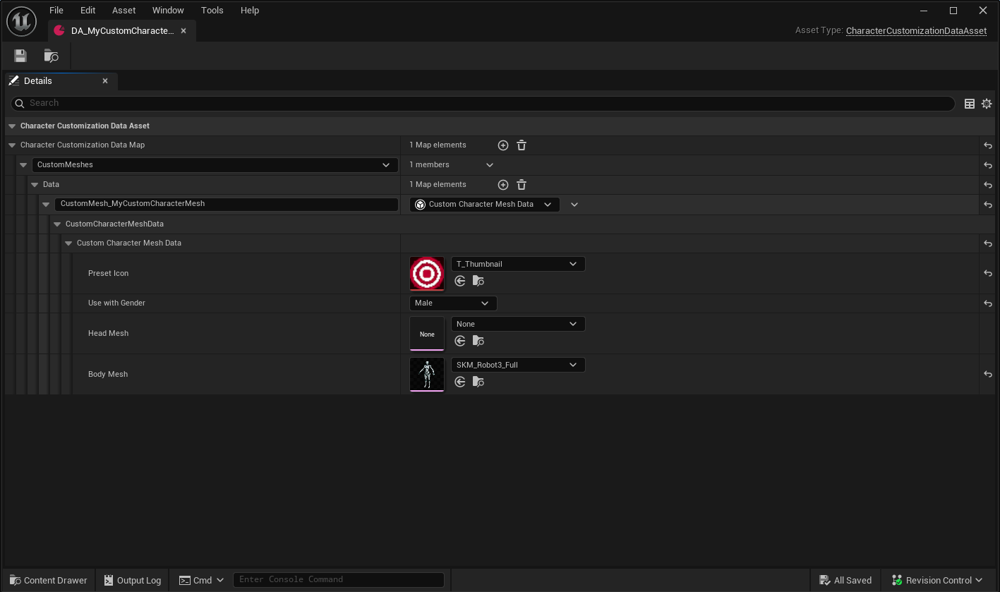
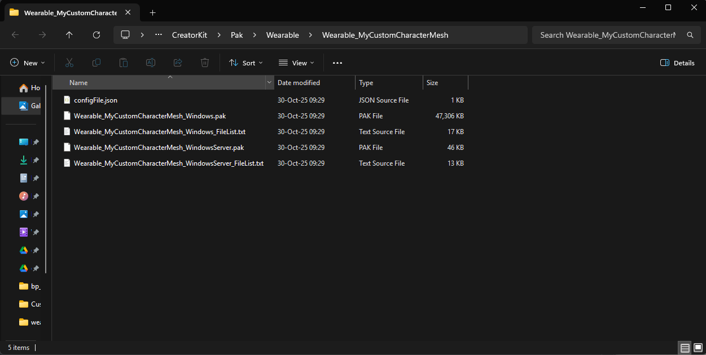
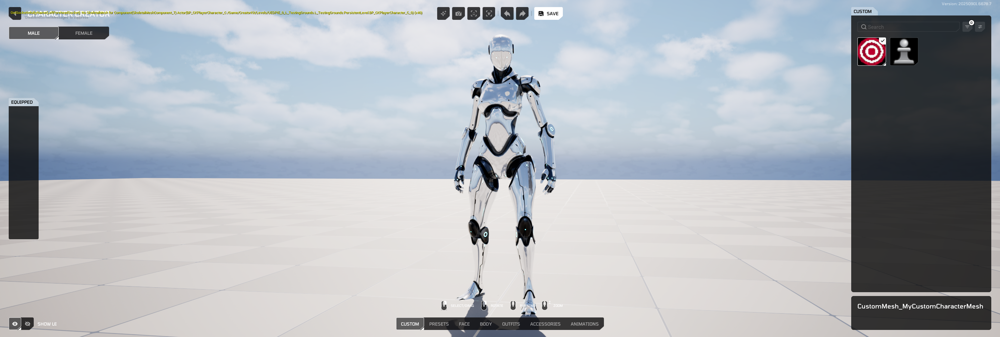
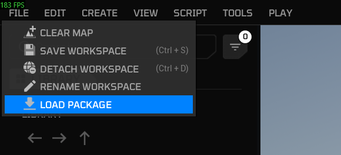

# Custom Character Meshes

This guide walks you through the process of packaging custom character mesh assets for the **Creator HUB** using the Creator Kit.

## 1. Acquiring Your Custom Character Mesh Asset

Either use your favorite modeling tool to create and skin a custom character mesh, or get a character mesh from [Fab](https://fab.com), compatible with **Unreal Engine 5 Manny Rig**.

> Note: Support for skeleton types different than Unreal Engine 5 Manny is currently in progress. We're planning to utilize **IKRig** to allow retargeting any kind of humanoid character rig to HELIX character soon.

---

## 2. Preparing Your Custom Character Mesh Package

For this tutorial, we will be using a robot character mesh acquired from Fab.

1. Launch the **Creator Kit** editor.

2. Access the **HELIX Packaging Tool** from the main toolbar.

3. In the packaging tool window, click **New Package**.

4. Enter a unique Package Name (e.g., MyCustomCharacterMesh).

5. Select **Wearable** as the **Package Type**. The workflow with custom character meshes is very similar to [wearable assets](https://development.helix-documentation.pages.dev/tutorials/custom_cc_assets/). So, the same package type is designed to work with both.

    

6. Click **Add New Package**. This action creates a dedicated folder for your assets (e.g., **Content/Wearable_MyCustomCharacterMesh**).

7. If you have an `.fbx` file to import into project, select `SK_Unified` as target skeleton during the import process.

8. If you're using a character pack, just simply move textures, materials and character mesh into the package folder. After all assets are moved, **Right Click** to your mesh asset and assign `SK_Unified` as target skeleton. This ensures your mesh is encoded with the project's main skeleton asset, making it compatible with HELIX character animations.

    

    

9. Optionally, you can also import a thumbnail image for your custom character mesh in the same folder.

---

## 3. Tweaking Your Custom Character Mesh

1. Open the automatically created physics asset and ensure the capsule covers the mesh approximately. This is required for your mesh bounds are properly calculated for FOV based occlusion. If this is not done properly, you mesh can disappear randomly from certain camera angles during gameplay. Please check [Physics Asset Editor Documentation](https://dev.epicgames.com/documentation/en-us/unreal-engine/physics-asset-editor-in-unreal-engine) for more information.

    

2. Next, open your skeletal mesh asset. Tweak any required parameters, and ensure you have LOD data generated for your mesh. This ensures your mesh does not negatively impact performance for distant characters wearing your clothing. You can set LOD count to 4 and click regenerate to automatically generate LODs for your mesh, as shown below.

    

---

## 4. Finalizing and Cooking The Package

1. Make sure all the depending assets by your custom character mesh are placed inside same package folder. If one of those assets are placed outside of the created package folder, cooked `.pak` file will have missing dependencies and this might cause crashes or runtime errors during playthrough with this package.

2. Right click to an empty space in your package folder, and choose **Miscellaneous** -> **Data Asset**.

3. Choose **Character Customization Data Asset** from the new window. This data asset is responsible for categorizing your clothing and storing the required parameters.

    

4. Give it a meaningful name, something like `DA_MyCustomCharacterMesh` and open. Click **+** button and choose the **Custom Meshes** type.

5. Create a new sub-entry inside your new entry, and give it a meaningful name.

6. Fill the required parameters for your custom mesh. Usually, you should leave the **Head Mesh** field empty, and assign your full body custom mesh to **Body Mesh** field. Choose gender type for the one closest to your character mesh body proportions. This will ensure the correct invisible base mesh is used while playing animations for your custom mesh.

    

7. Return to the HELIX Packaging Tool window.

8. With your package selected, click the **Package** button. This process will cook your assets into the final `.pak` file format required by the HELIX Creator HUB. This may take some time.

    

9. Once cooking is complete, a file explorer window will automatically open, displaying your final `.pak` files. Your custom character mesh is now [ready to be uploaded to the Creator HUB](https://development.helix-documentation.pages.dev/tutorials/creatorhub/)!

    

---

## 5. Testing Your Custom Character Mesh

### 1. In Creator Kit

1. This method doesn't require you to cook the package on the previous steps. As long as you placed all the required assets in your package folder in Creator Kit, and created the data asset as explained, it automatically becomes available for editor playthroughs.

2. Press play in **Creator Kit** editor, and press **P** button to show the **Character Customization UI** for your character.

3. In the shown UI, you should be able to navigate to your new custom mesh in **Custom** tab and click on it to test on the character.

    

### 2. In HELIX

1. Create a draft world and import the `.pak` file you've cooked in **Creator Kit**.

    

    

2. If import was successful, you should see your custom character mesh asset on left panel.

    

3. Importing also makes your custom character mesh automatically available in **Character Customization UI**. Go back to the game from build mode, and press **P** button.

4. Your imported custom character mesh should be available in the **Custom** tab.

  <iframe src="https://www.youtube.com/embed/eM2_7DWIIqM?si=qELiLj1TaBILbGUP"
          style="position: absolute; top: 0; left: 0; width: 100%; height: 100%;"
          frameborder="0"
          allowfullscreen>
  </iframe>

---

## 6. On Your Own

Once you've followed these steps, [uploaded your package to Creator HUB](https://development.helix-documentation.pages.dev/tutorials/creatorhub/), and imported it into your world, your new custom character mesh will be available for players joining your public world!
