# Custom Maps

This guide walks you through the process of packaging custom maps for the [Creator HUB](https://development.helix-documentation.pages.dev/tutorials/creatorhub/) by using the [Creator Kit](https://development.helix-documentation.pages.dev/tutorials/creatorkit).

## 1. Acquiring Your Custom Map

Either use **Creator Kit** to create your own custom map, or get a map asset from [Fab](https://fab.com).

---

## 2. Preparing Your Custom Map Package

For this tutorial, we will be using a police station asset acquired from Fab.

1. Launch the project downloaded from Fab. It's needed to migrate assets from downloaded project into **Creator Kit** project.

    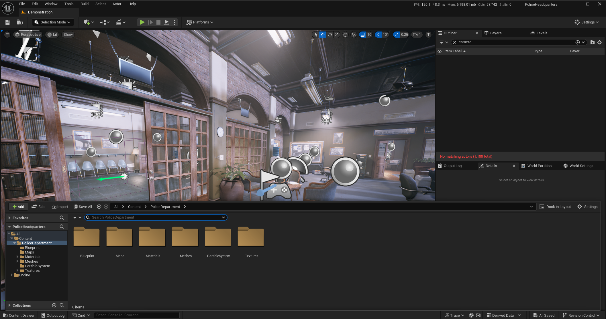

2. Right click to root folder containing all assets in content browser and click **Migrate**. Make sure all assets are gathered inside one root folder (e.g, PoliceDepartment/...), so it will be easier to move your assets into package folder in **Creator Kit**.

    

3. Ensure each dependency is shown on the next window and click **OK**.

    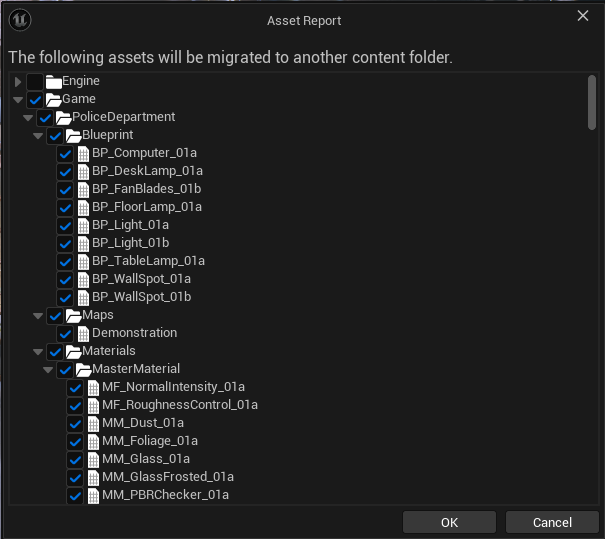

4. On the next window, find your **Creator Kit** installation's `Content` folder and select it.

    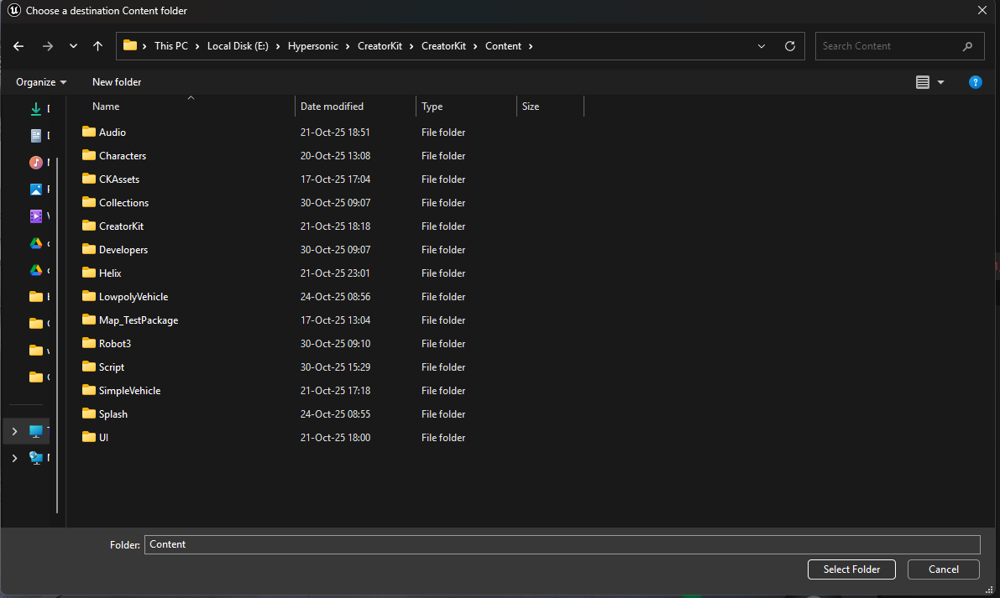

5. Your assets will be copied into **Creator Kit** `Content` folder with same folder structure after process is done.

    

6. Close the custom map project and launch the **Creator Kit** project. Ensure your custom map is migrated into **Creator Kit** correctly.

    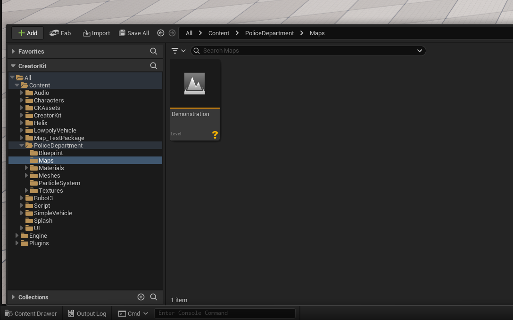

7. Ensure you can play in your migrated custom map without any errors/warnings caused by migration process.

    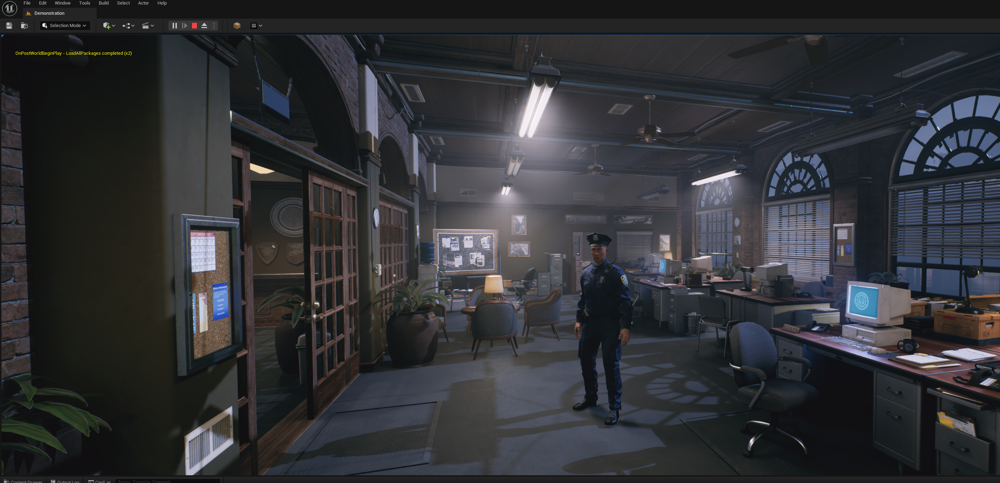

8. Access the **HELIX Packaging Tool** from the main toolbar.

9. In the packaging tool window, click **New Package**.

10. Enter a unique Package Name (e.g., MyPoliceStationMap), and select **Map** as the **Package Type**.

    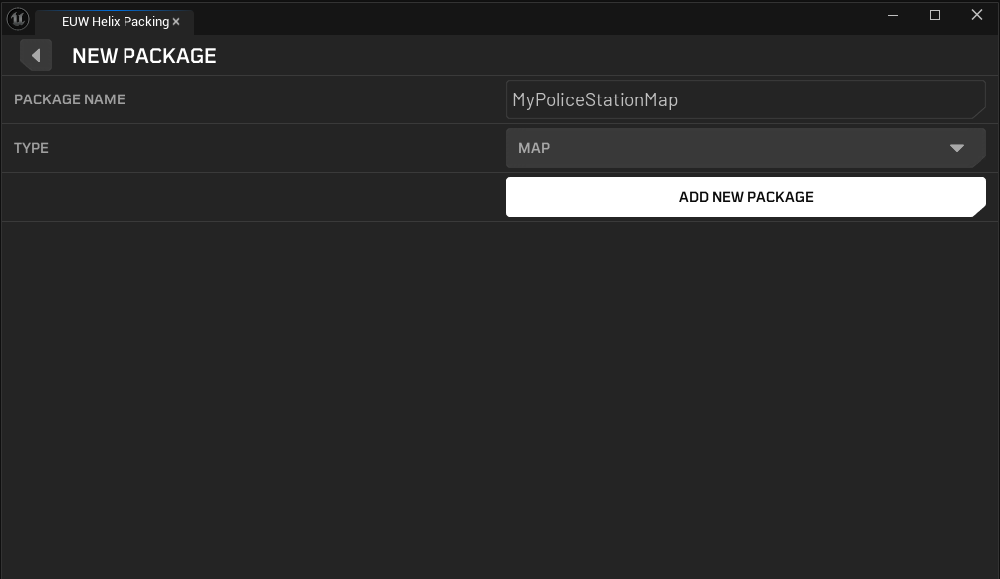

11. Click **Add New Package**. This action creates a dedicated folder for your assets (e.g., **Content/Map_MyPoliceStationMap**).

    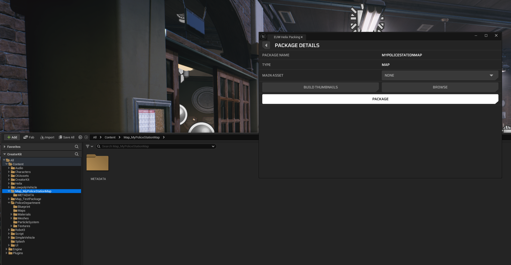

12. Now, it's needed to move your level assets into this new package folder. For current scenario, we have a `Content/PoliceDepartment` folder with all the required assets for our map.

13. Select all the folders (or just the root folder) you want to migrate, and then drag&drop them into your new package folder (e.g., **Content/Map_MyPoliceStationMap**). 

    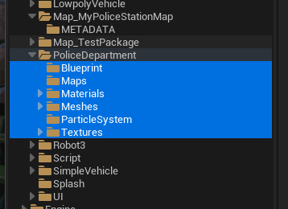

    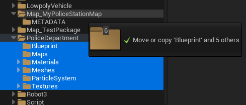

14. Select **Move Here** from the dropdown menu.

    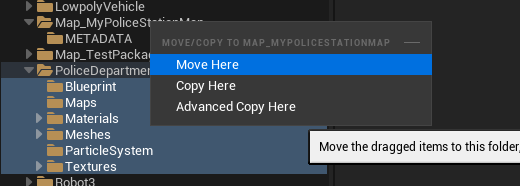

    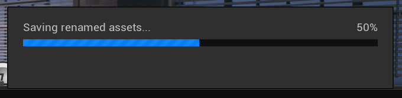

15. After process is done, right click to your old migrated folder and click **Update Redirector References** from dropdown menu. This will clean redirector assets automatically created during the previous step.

    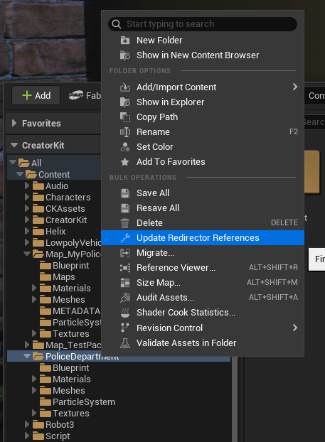

16. Click red **Delete Unreferenced Redirectors** button on next window and wait. This might take a while.

    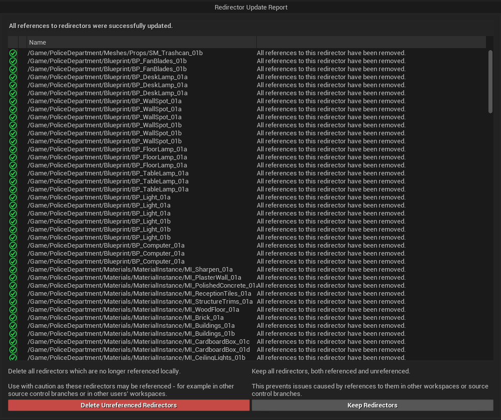

    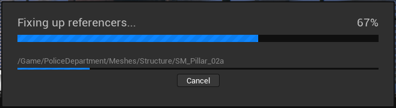

17. After process is done, you should have a custom map package with all your assets placed in.

    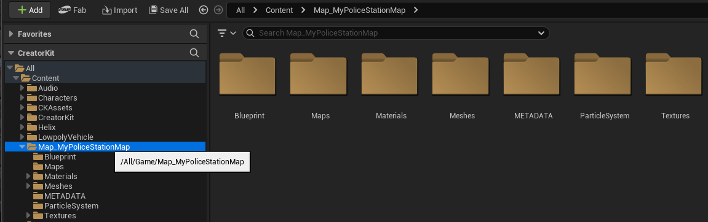

---

## 3. Making Your Custom Map Compatible With HELIX

1. Your level should at least have one **Player Start** actor placed in to define where your players will be spawned on initial login to your world. Make sure it's correctly aligned with ground floor. You can press **End** key to automatically align the actor with floor in editor.

    

2. HELIX currently utilizes **Lumen** for dynamic lighting, and static lighting is not supported. Make sure lighting actors in your map are set to **Dynamic** mobility for them to work properly in builds.

---

## 4. (Bonus) Adding Interactable Doors To Your Custom Map

If your level has door meshes that you want to make interactable by players, you can take additional steps to replace them with **Helix Doors**.

1. You can find all the available template blueprints for different door types in `Helix/Blueprints/Door` folder.

    

2. After choosing the applicable door blueprint for your use case, just remove the door static mesh from your level and drag the blueprint to your scene. We will use `BP_Door_Classic` for first example, which acts as a classic house door.

    

3. Find the **Visual Door Mesh** component in your placed actor and change its mesh to the door static mesh previously used in the level. Tweak its transform to correctly center actor location as shown below. 

    

4. Tweak the orange colored door collision box from the actor's **Door Collision Size** property. As a rule of thumb, the collision should be slightly smaller than the visual door mesh. This is required to prevent physics doors getting stuck by hitting to ground mesh or walls covering the door.

    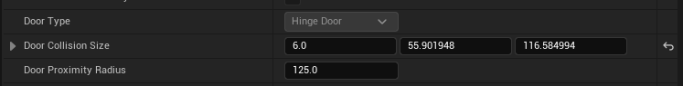

    

5. Tweak the location of door handle marker from **Door Handle Right Offset** and **Door Handle Up Offset** properties of the actor. The small orange sphere shape should approximately placed onto your door handle's connection point to door.

    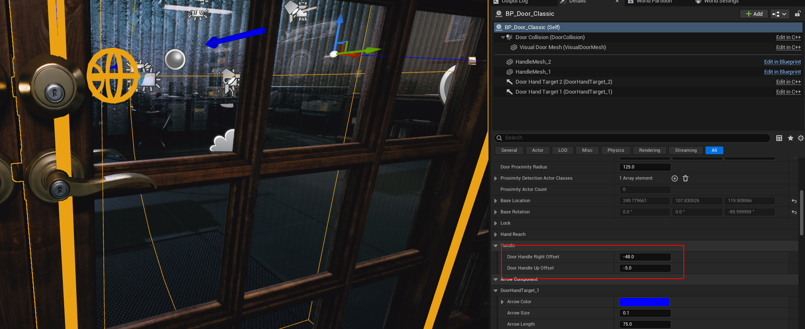

6. Tweak the local transforms of **Door Offset Handle** components in door actor. Those components are used to correctly align character's hand with door handle while interacting with door. Keep the arrow component directed towards door with perpendicular angle, and move it slightly above the actual door handle mesh as shown on the screenshot.

    

7. You can tweak the handle location by playing in the level from editor and find the best transform value for the handle component.

  <iframe src="https://youtube.com/embed/pvT46ot4wfU?si=eeqvZvWVsqAoshFp"
          style="position: absolute; top: 0; left: 0; width: 100%; height: 100%;"
          frameborder="0"
          allowfullscreen>
  </iframe>

8. After your door is fully tweaked, you can play in editor and test it out!

  <iframe src="https://youtube.com/embed/RiNXVfrfgeU?si=V1rBtR0Q8yOswVBT"
          style="position: absolute; top: 0; left: 0; width: 100%; height: 100%;"
          frameborder="0"
          allowfullscreen>
  </iframe>

9. Now we will replace another door in the level, this time by using `BP_Door_Swinging`, which is acts like entrance doors on the markets etc.

    

  <iframe src="https://youtube.com/embed/Vy1U2Um0KgY?si=qWNrv-Rscqb6zrEK"
          style="position: absolute; top: 0; left: 0; width: 100%; height: 100%;"
          frameborder="0"
          allowfullscreen>
  </iframe>

10. If required, you can create a child blueprint from the HELIX template door blueprints, tweak defaults as you like, and reuse them in your custom map. Make sure the new blueprint is placed in your map package folder. See [Custom Blueprints](https://development.helix-documentation.pages.dev/tutorials/custom_blueprints/) for more information.

11. See [Door Lua API](https://development.helix-documentation.pages.dev/api/apiImport/classes/door/) for more information about available properties for doors.

---

## 5. Finalizing and Cooking The Package

1. Make sure all the depending assets by your custom character mesh are placed inside same package folder. If one of those assets are placed outside of the created package folder, cooked `.pak` file will have missing dependencies and this might cause crashes or runtime errors during playthrough with this package.

2. Return to the HELIX Packaging Tool window.

3. Go into your package and choose **Main Asset** to the level asset you would like to use for your package. This is should be the persistent level you used for your map.

    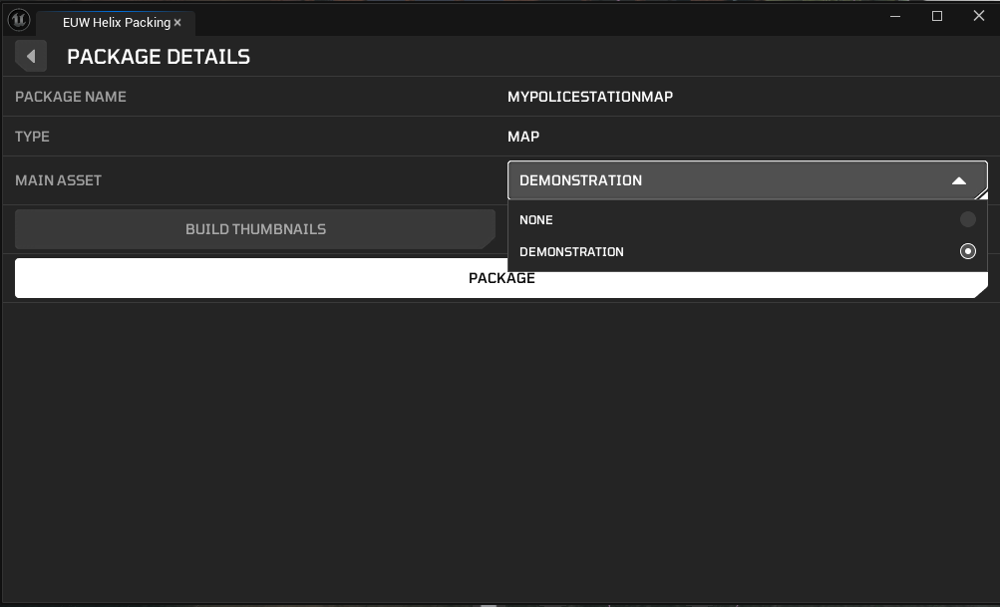

3. Click package button and wait for cook process to complete.

4. Once cooking is complete, a file explorer window will automatically open, displaying your final `.pak` files. Your custom character mesh is now ready to be uploaded to the **Creator HUB**!

    

---

## 6. Testing Your Custom Map

### 1. In Creator Kit

As shown on the previous steps, you can directly test your map in **Creator Kit** by pressing play button from editor toolbar. This doesn't require you to cook any package.

### 2. In HELIX

1. Create a draft world with **Local File** option.

    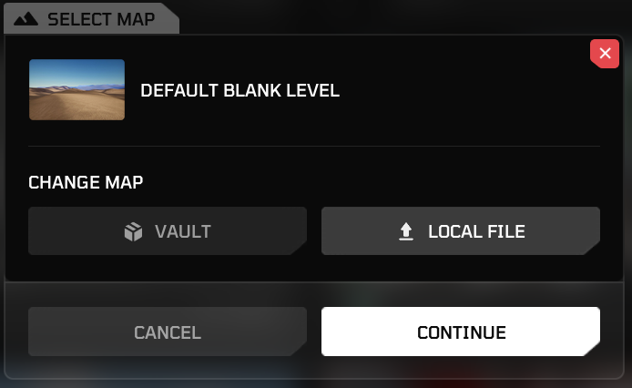

2. Select the `.pak` file you've cooked in **Creator Kit**.

    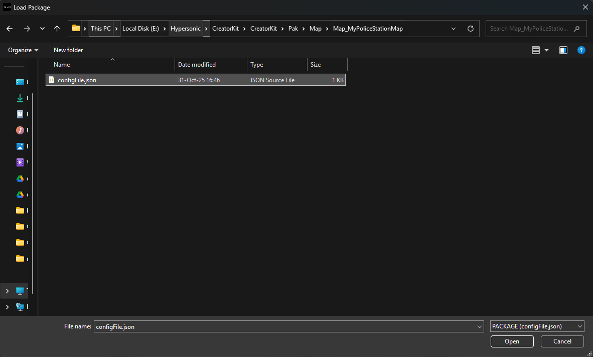

3. If import was successful, your new world should be automatically created with your custom map placed in. If you don't see your map on the spawn location, or your character starts falling down just after game starts, ensure you have a valid **Player Start** actor placed in your level as explained in the previous steps.

  <iframe src="https://youtube.com/embed/S3ikj9rI9s8?si=YdcmI64ysvrKTH9H"
          style="position: absolute; top: 0; left: 0; width: 100%; height: 100%;"
          frameborder="0"
          allowfullscreen>
  </iframe>

---

## 7. On Your Own

Once you've followed these steps and uploaded your package to **Creator HUB**, your should be able to create new worlds with your custom map package!
