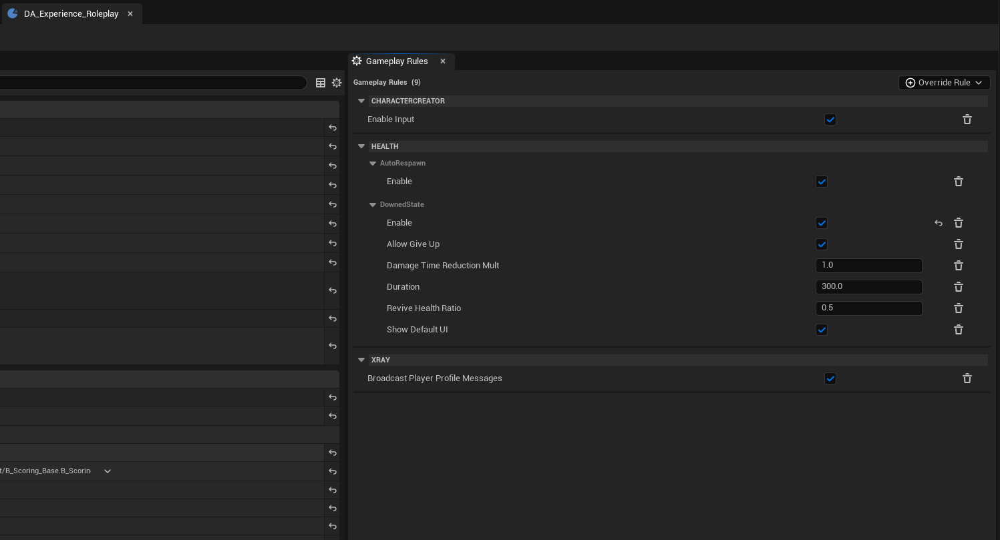

# Working With Gameplay Rules

**Gameplay rules** are named, replicated settings that tune how systems behave in a match, without hard-coding values. For example, the character health systems use rules to decide whether the downed state is enabled, how long bleed-out lasts, and whether players auto-respawn after death.

This page explains how the rule system works and how to read and change rules from script. For the specific rules a system exposes, see that system's own documentation (e.g. the [Character Health](character_health.md) page lists the downed and respawn rules).

---

## How Rules Work

Each rule is identified by a **gameplay tag** under the `GameplayRule` parent tag (e.g. `GameplayRule.Health.DownedState.Enable`). A rule holds one of two kinds of value:

- **Toggle**: an on/off boolean.
- **Scalar**: a single floating-point number.

Rules live on a ruleset component attached to the **GameState**, so a rule applies to the whole match and is shared by everyone in it. The values are **replicated**, so clients see the same rule values the server does and can read them for UI and presentation.

There are two layers of values:

- **Base values**: the defaults an experience ships with.
- **Overrides**: runtime changes applied on top of the base values. An override takes precedence over the base value, and clearing it falls back to the base again.

When you read a rule, you get the override if one exists, otherwise the base value, otherwise the default you passed in.

---

## Setting Base Values (Per Experience)



Base values are authored on an experience using the **Set Gameplay Rules** game feature action, which exists on each experience definition asset by default and shown on the right panel on the UI when experience data asset is being modified. When the experience is loaded, those values are applied to the ruleset on the GameState as the match's starting rules.

This is the right place to set the defaults a mode should always start with, for example, "downed state on, bleed-out 120s" for a co-op experience.

---

## Overriding Rules at Runtime

You can change rules while the match is running through the ruleset component. This is useful for dynamic behavior, for example, turning off auto-respawn during a final round, or speeding up bleed-out as a match progresses.

/// warning | Warning
Runtime overrides are **server-authoritative**. The override and clear functions only take effect when called with authority (on the server). The resulting values replicate down to clients automatically.
///

Get the component from the GameState, then read or change values:

| Function | Purpose |
|---|---|
| `GetGameplayRulesetComponent(WorldContext)` | Fetches the ruleset component from the GameState. |
| `GetToggleRuleValue(RuleTag, DefaultValue)` | Reads a toggle rule. Returns `DefaultValue` if the rule isn't set. |
| `GetScalarRuleValue(RuleTag, DefaultValue)` | Reads a scalar rule. Returns `DefaultValue` if the rule isn't set. |
| `OverrideToggleRule(RuleTag, bValue)` | **Server only.** Overrides a toggle rule at runtime. |
| `OverrideScalarRule(RuleTag, Value)` | **Server only.** Overrides a scalar rule at runtime. |
| `ClearOverriddenRule(RuleTag)` | **Server only.** Removes a single override, reverting to the base value. |
| `ClearAllOverriddenRules()` | **Server only.** Removes all overrides. |

Reading rules (the `Get...` functions) is safe to call from anywhere, including clients.

### Reacting to changes

| Delegate | When it fires |
|---|---|
| `OnRulesChanged` | Fires whenever replicated rule state changes. Bind to this to refresh UI or re-evaluate logic that depends on a rule. |

---

## Sample Scripts

/// note | Getting gameplay tags in Lua
Rule functions take an `FGameplayTag`, which you resolve from its string name through the tag manager. The samples assume a small helper:

```lua
local function Tag(name)
    return UGameplayTagsManager.Get():RequestGameplayTag(name)
end
```
///

### 1. Read a rule value

```lua
-- Safe to call on client or server.
local Ruleset = HGameplayRulesetComponent.GetGameplayRulesetComponent(WorldContextObject)
if Ruleset then
    local downedEnabled = Ruleset:GetToggleRuleValue(Tag("GameplayRule.Health.DownedState.Enable"), false)
    local bleedoutTime = Ruleset:GetScalarRuleValue(Tag("GameplayRule.Health.DownedState.Duration"), 300.0)
end
```

### 2. Override rules at runtime (server)

```lua
-- Run on the server (authority).
local Ruleset = HGameplayRulesetComponent.GetGameplayRulesetComponent(WorldContextObject)
if Ruleset then
    -- Turn the downed state on for this match.
    Ruleset:OverrideToggleRule(Tag("GameplayRule.Health.DownedState.Enable"), true)

    -- Make bleed-out faster (60 seconds instead of the default 300).
    Ruleset:OverrideScalarRule(Tag("GameplayRule.Health.DownedState.Duration"), 60.0)

    -- Require healing to 75% to revive.
    Ruleset:OverrideScalarRule(Tag("GameplayRule.Health.DownedState.ReviveHealthRatio"), 0.75)
end
```

### 3. Clear an override (server)

```lua
-- Revert a single rule back to the experience's base value.
local Ruleset = HGameplayRulesetComponent.GetGameplayRulesetComponent(WorldContextObject)
if Ruleset then
    Ruleset:ClearOverriddenRule(Tag("GameplayRule.Health.DownedState.Duration"))
end

-- Or clear everything at once.
-- Ruleset:ClearAllOverriddenRules()
```

### 4. Refresh UI when rules change

```lua
local Ruleset = HGameplayRulesetComponent.GetGameplayRulesetComponent(WorldContextObject)
if Ruleset then
    Ruleset.OnRulesChanged:Add(self, function(self)
        RefreshRulesDependentUI()
    end)
end
```