# Working With Seatable Entities

If your level has seatable entities such as benches, beds, chairs etc, you can take additional steps to make them interactable by players. Currently there are two ways of converting world actors into seatable entities.

### Seatable Entity Component Based Interaction

It's possible to convert **actors** in worlds into seatable entities by attaching a specific scene component on them.

/// warning | Actor Compatibility
This only works with individual actors placed in levels. Use cases like Instanced Static Mesh, Hierarchical Instanced Static Mesh, Fast Geometry Container etc. are not going to work properly with this method.
///

1. After selecting the actor you would like to convert in your level, click **Add Component** button in properties panel and select `HELIX Seatable Entity Component` from the list. This component provides all the required functionality for your actor.

    

2. After adding the component, tweak its location to center the spot where character should be seated on your actor. The direction of the arrow should be same as character's seated direction. The sphere radius defines interaction radius for your actor, which also can be tweaked from component properties.

    

3. Lastly, choose the most suitable interaction data and interact option for your actor from the `Interaction Payload` property of the component. Interaction data changes the animations played during the interaction, and interaction option changes how the interaction is triggered.

     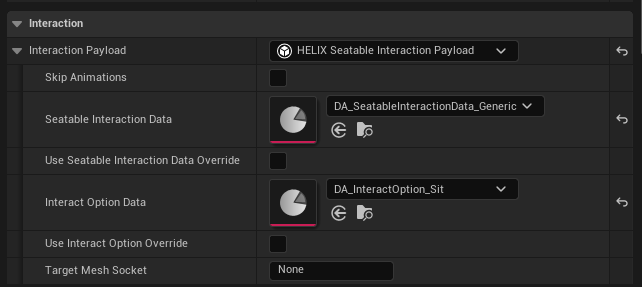

### Asset User Data Based Interaction

As an alternative method, interaction data can be defined per source static mesh, and automatically propogate interaction capability to each use case of this asset in your worlds. This is the recommended approach if your static mesh is mass used in your world, or used as Instanced Static Mesh, Hierarchical Instanced Static Mesh, Fast Geometry Container etc.

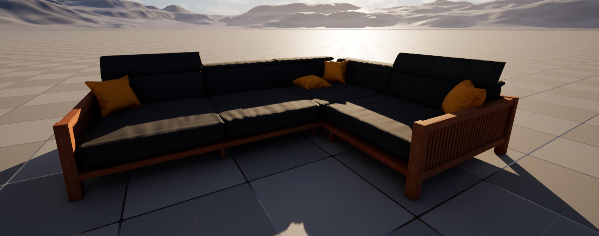

1. Open the static mesh you'd like to add interaction, and find **Asset User Data** array field.

    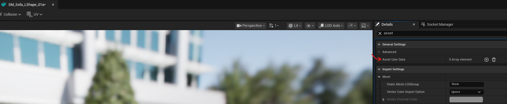

2. Click **+** button and pick **HELIX Interactable Asset User Data** from the dropdown menu.

    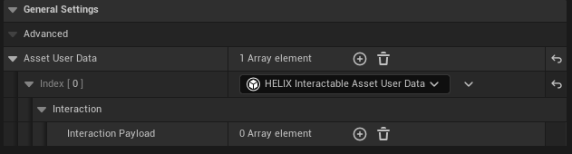

3. Click **+** button near **Interaction Payload** to define your first interaction metadata for the mesh and select **HELIX Seatable Interaction Payload** from the dropdown menu.

    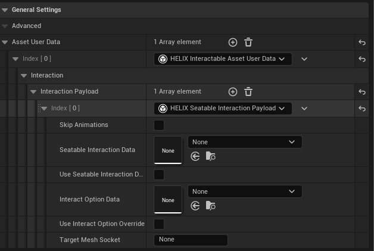

4. Go to socket manager tab on same panel and create a socket to define where the character should be seated after interaction. +X (red axis) defines the direction your character will be facing towards while seated to your mesh. Translate/rotate the socket according to your needs.

    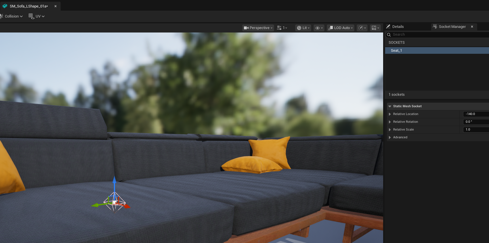

5. Go back to details panel and write down name of the socket you just created into the **Target Mesh Socket** field.

6. Assign **Seatable Interaction Data** and **Interact Option Data** fields.

    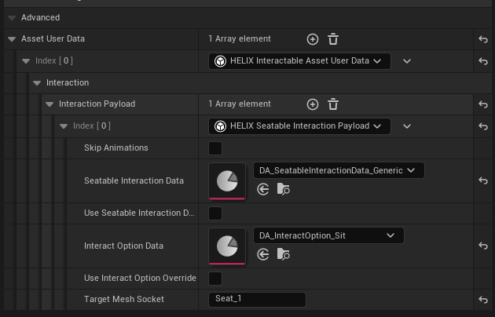

7. If you'd like to have specific data only for this mesh, you can toggle **Use Seatable Interaction Data Override** or **Use Interact Option Override** fields to add the required details without requiring a data asset.

8. Repeat the steps starting from 3 to add multiple seating locations to your mesh.

9. Drag & drop your mesh in any level. Your character should be able to interact with it out of the box!

    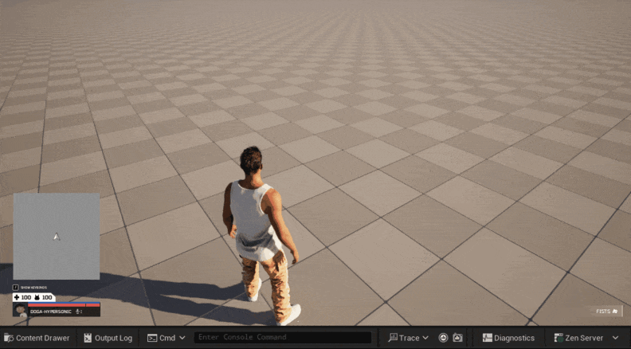

## Creating Your Own Seatable Interaction Animset

HELIX already provides a few interaction data assets to choose from, but in case of you need a brand new set of montages for your custom seatable entity, you can create a new data asset with the type of `HSeatableEntityInteractionDataAsset`, and assign list of entry/exit montages.

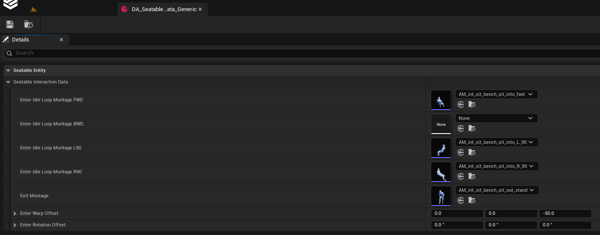

You can check our `/HelixAnimation/Unified/Animations/Interactions/AM_int_sit_bench_sit_into_fwd` sample animation to see how a such enter/loop montage is composed, including loop section and motion warping notifies.

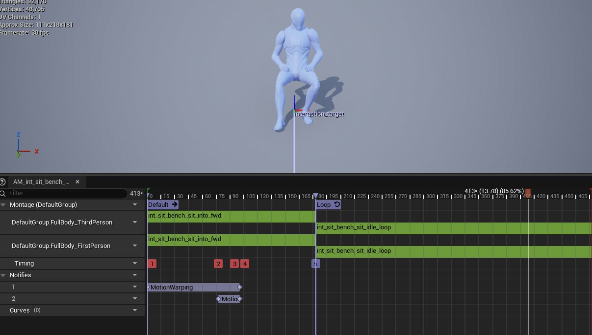

| Seatable Entity Interaction Data | Description
|---|---|
| `DA_SeatableInteractionData_Generic` | Generic sit interaction animation set |
| `DA_SeatableInteractionData_BarStool` | Generic bar stool interaction animation set |
| `DA_SeatableInteractionData_Bed_Single` | Generic single bed interaction animation set |
| `DA_SeatableInteractionData_Bed_Double_Left` | Generic double bed interaction animation set (left-side) |
| `DA_SeatableInteractionData_Bed_Double_Right` | Generic double bed interaction animation set (right-side) |

## Creating Your Own Interact Option Data

In case of you'd like to implement your own custom logic for seating interaction, you can create your interact option data asset.

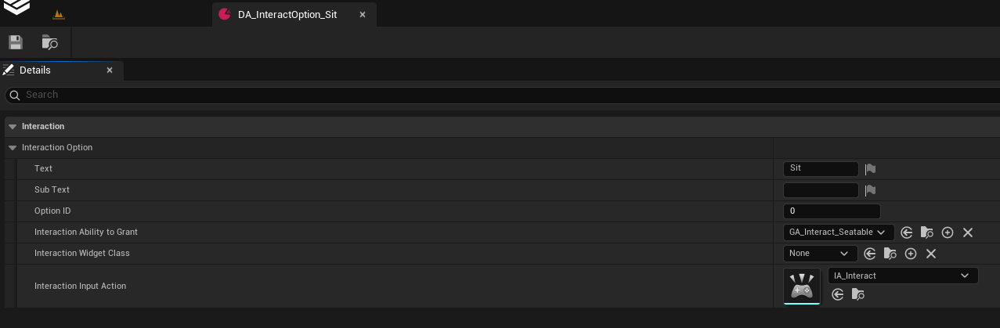

HELIX provides a few interact option data for seatables by default:

| Interaction Option Data | Description
|---|---|
| `DA_InteractOption_Sit` | Trigger default seatable interaction ability with default interaction key. Shows "Sit" prompt on screen. |
| `DA_InteractOption_Rest` | Trigger default seatable interaction ability with default interaction key. Shows "Rest" prompt on screen. |

If those data assets do not cover your needs, you can create a new data asset with the type of `HInteractOptionDataAsset` and customize the fields to your liking. You can also create your own gameplay ability blueprint, derived from `HGameplayAbility` class, and use within your data asset to activate when interaction is triggered. See `/HelixGameplay/Abilities/GA_Interact_Seatable` as our sample ability to interact with seatable entities.
