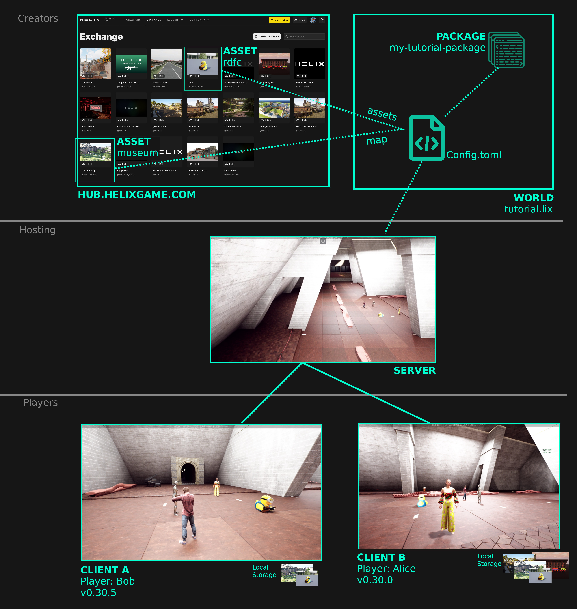
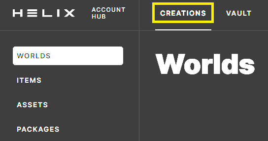
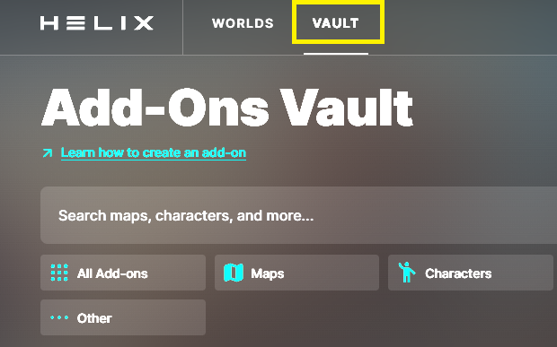

# Key Terms

--8<-- "old.md"

💡 In this guide you’ll familiarize yourself with key terms and learn the basics of how HELIX works.

### For creators, HELIX consists of two primary components: The Client and Server.

- The Client is what every regular HELIX player downloads and plays.
- The Server is what Clients connect to and run on.

### A World consists of Assets and Packages.

- **Assets are cooked Unreal Engine files** (levels, static/skeletal meshes, animations, blueprints, audio, etc.).
- **Packages are Lua script files** that run on the client or server or both, as well as any files related to UI.

### Technical Overview (Diagram)

### Definitions

- A **CLIENT** is a player’s local installation of HELIX.
    - Players will install HELIX Client through [the HELIX Launcher](../getting_started/creatorTools.md)
    - The client requires a local storage, where ASSETS, PACKAGES and other files are downloaded to and stored
    - CLIENTS will run on different resolutions, hardware and settings. All this shall be considered when designing ASSETS and WORLDS

- A **SERVER** is a running instance of a WORLD.
    - Multiple players will connect to a SERVER and play together
    - The SERVER maintains a state of the WORLD that is shared with all connected CLIENTS
    - Multiple SERVERS of the same WORLD can exist, although typically there is only one server.

- A **WORLD** is an experience built by a creator. It is the organizational bundle, which combines MAP, ASSETS and PACKAGES into a playable experience.
    - A WORLD supports multiple ASSETS
    - A WORLD features one MAP
    - A WORLD loads at least one PACKAGE

- An **ASSET** is a bundle combining one or more 3D-Objects, Images or other media files.
    - An ASSET is downloaded to a CLIENT’s local storage
        - It is downloaded when a CLIENT connects to a SERVER requesting a particular ASSET.  
        :memo: NOTE: if an ASSET is supported in multiple servers, a CLIENT will only download it once
        - There are HELIX-Assets built into the CLIENT. If these ASSETS are used in a world, they are already available and won't be downloaded.

- A **MAP** is a special type of ASSET and provides the landscape of a world, where players can navigate their characters.

- A **PACKAGE** is essentially source code defining the mechanics of a WORLD and consists of the following:
    - SERVER logic code, runs on the server and is synchronized to all clients.
    - CLIENT logic code, which is run on each individual client and not synchronized.

- The [HUB](https://hub.helixgame.com/){.external} is the heart of the platform and allows creators to manage their creations.
    - In Creations you can manage WORLDS, ITEMS, ASSETS and PACKAGES. 
    
    
    - In the Vault a creator can explore published Add-ons and then use them in the worlds. 
    
    

- After reading this concepts, the development can start using the following links:
    - [Create, Test and Publish WORLDS](../tutorials/tutorialImports/world-creation/1create-first-world.md)
    - [Create, Test and Publish Items](../tutorials/tutorialImports/creating-assets/characters/1create-char-items.md)

<!-- TODO: consider moving to glossary w/ underlines
https://squidfunk.github.io/mkdocs-material/reference/tooltips/?h=glossary#adding-a-glossary
 -->
