# Unreal Engine 5.7 migration guide for Creator Kit users

>💡 This guide helps creators migrate their assets/projects from the now-deprecated **Creator Kit** (UE 5.5) into the new **HELIX Studio** (UE 5.7).

Legacy packages created in the **Creator Kit** and published via **Creator Hub** are not compatible with **HELIX Game Client** builds that use Unreal Engine 5.7. Those packages must be converted to **HELIX Studio** projects and re-published to the Vault.

Suggested steps to achieve this, using the default **Creator Kit** packages as an example:

1. Open HELIX Studio and create a **Blank** **HELIX Studio** project:
    
    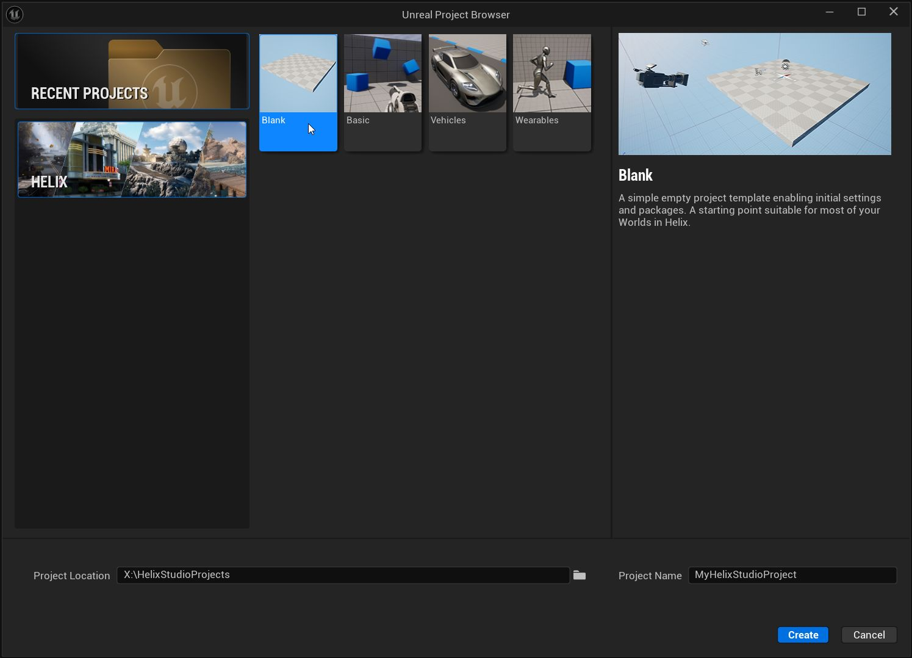

2. Open Creator Kit using Unreal Engine 5.5 and identify the package folders to migrate (**Content** subfolders and/or **Content Plugins**):
    
    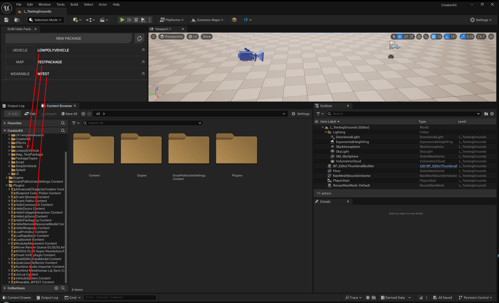

    ??? note "HELP! I'm struggling to find the right folders!"
        If you are struggling to locate the folders, click on "Open Helix Packaging" menu at the top, access the package you need to check and click "Browse". This will show you the folder it's linked to.

3. Open both the **Creator Kit** and **HELIX Studio** project folders in Windows Explorer, then copy the package folders to their corresponding places (**Content** Subfolders to **Content**, **Content Plugins** to **Plugins**):
    
    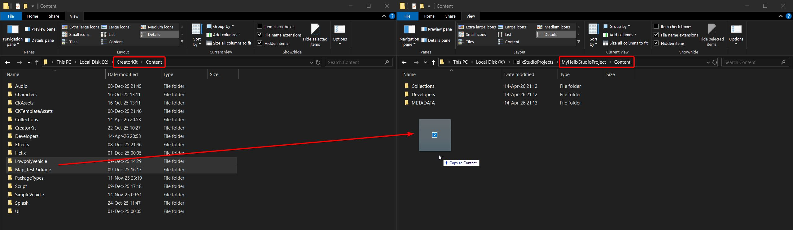
    
    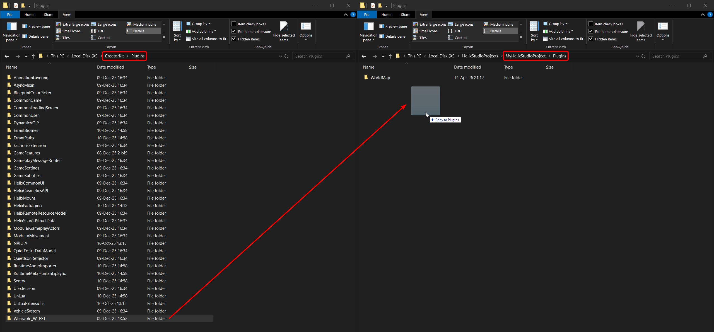
    
4. Restart **HELIX Studio**
                 
5. The next step is different depending on the package

    1. For Map packages:

        - Move all assets except the **METADATA** folder and any **DAAL_*** data assets into the **WorldMap** Content Plugin:
            
            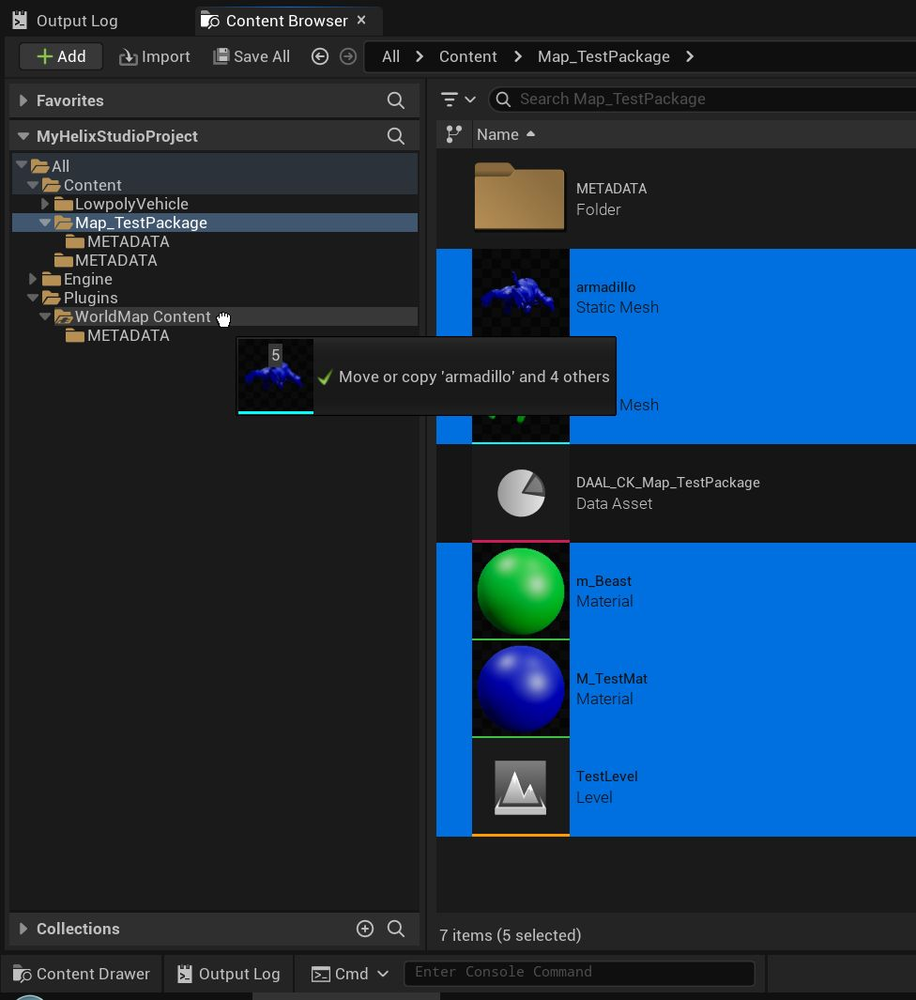
        
         
            
        - If references get broken during migration, you will need to repair them manually. After that, click **Update Redirectors** and then Delete the remaining folder:
            
            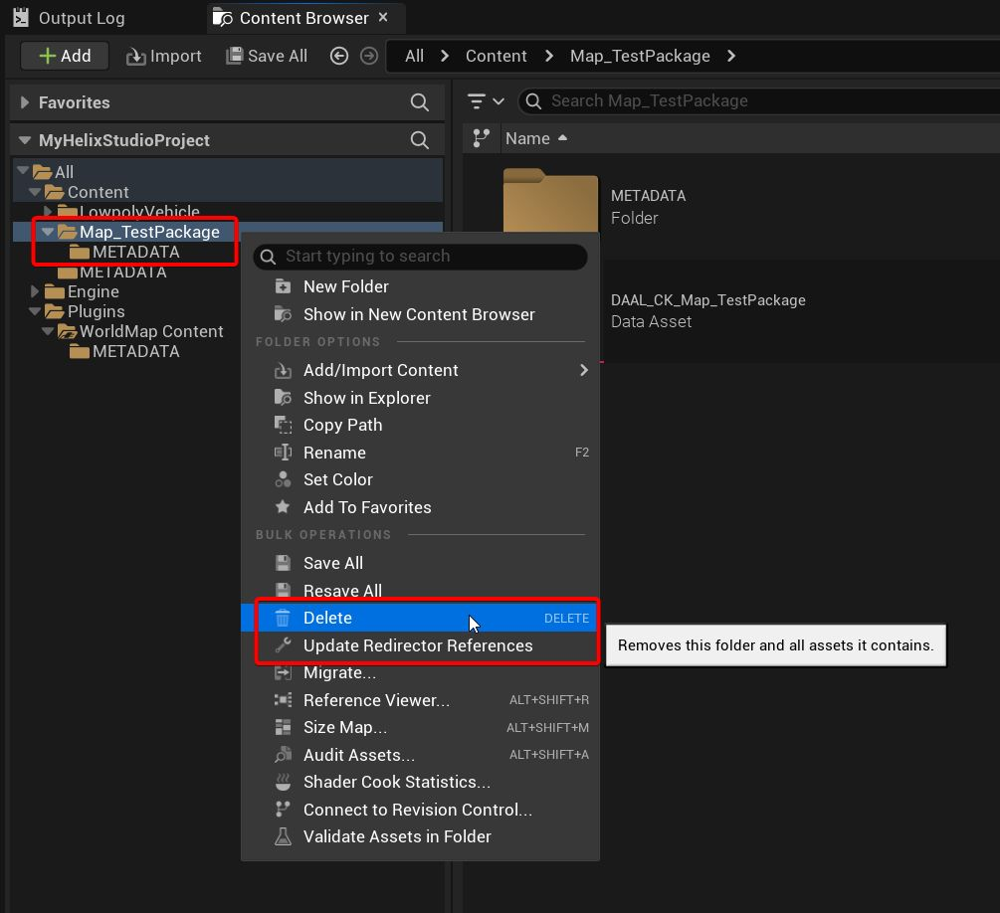
         
         
           
        - Open the **World Map** package properties and set your Level asset as the **Main Asset**:
            
            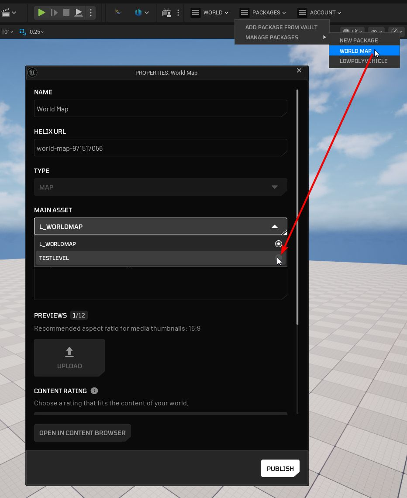

         
           
        - Close properties, then **leave** the World and join it again:
            
            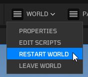
         
         
           
        - The new level will be opened; you may now delete the default level asset (**L_WorldMap**)

    2. For other packages:

        - Create a new package of the corresponding package type:
            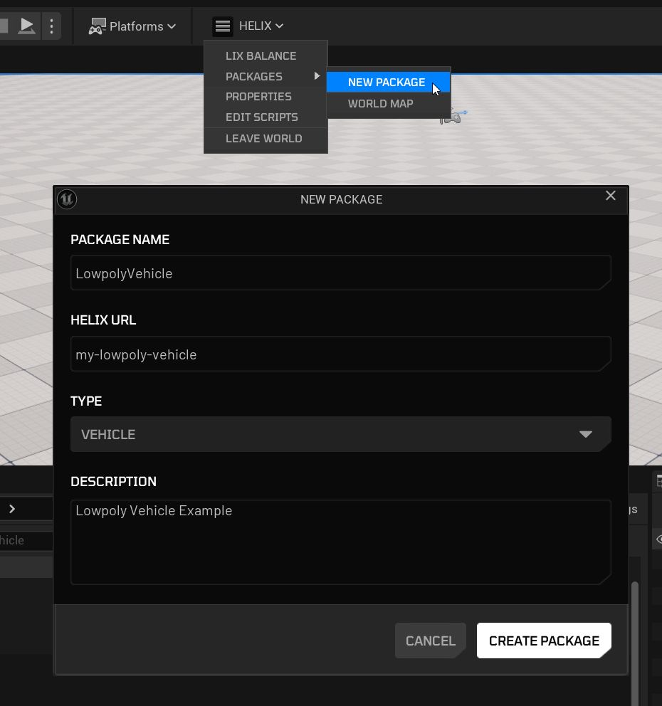
        
         

        - Move all assets except the **METADATA** folder and any **DAAL_*** data assets into the created **Content Plugin**:

            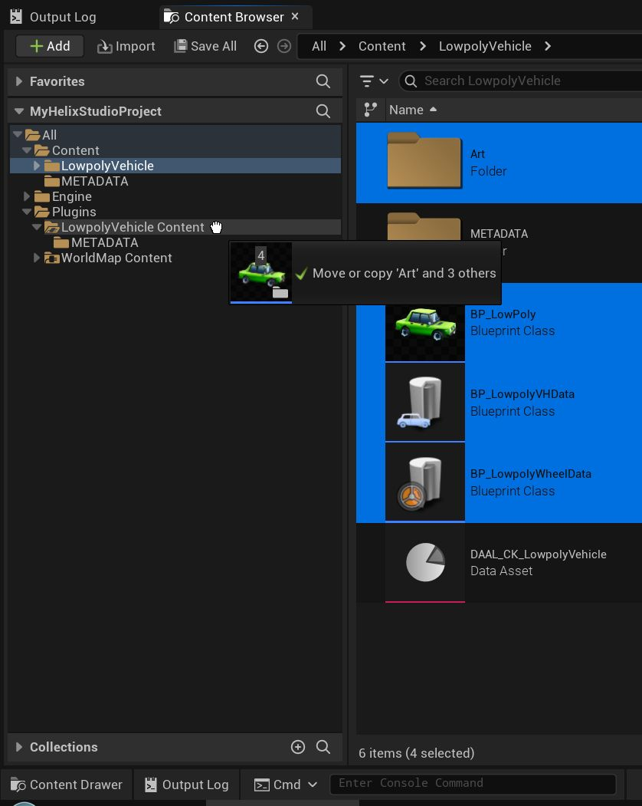
        
           

        - If references get broken during migration, you will need to repair them manually. After that, click **Update Redirectors** and then Delete the remaining folder:

            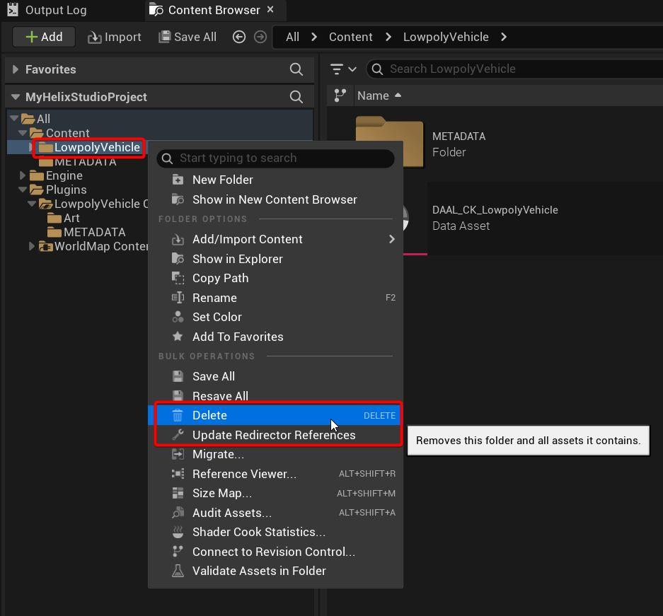

6. [Optional] In case your package has dependencies, you need to select it in the Properties menu ([please refer to this guide for details](studio.md#dependencies)).

    ??? note "reveal screenshot"
        

7. Test your migrated packages inside **HELIX Studio** ([refer to this guide](studio.md#testing-in-editor)).

8. Publish the migrated & tested packages to the Vault following the [**HELIX** Studio User Guide](studio.md#publishing).