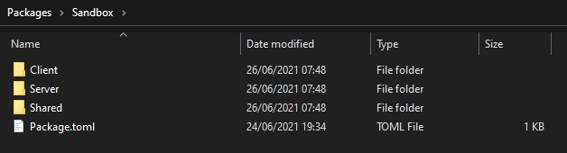

--8<-- "old.md"


**Packages** are pieces/components of your server which will execute Lua scripts to interact to the game.




## Folder Structure

All Packages must go under `Server/Packages/` folder. Each Package is a folder under that.

They can contain the following folders: `Server`, `Client` and `Shared`. Only **Client** and **Shared** folders will be sent and loaded by the clients when they connect.

Each **Package** must have a file called `Index.lua` inside **Server**, **Client** or **Shared** folders, this is the only file which will be triggered when the Package is loaded, this way this file is responsible for including other files and starting up your functionalities.

```text title="Server Folder"
HELIXGameServer.exe
Packages/
├── my-package-01/
│	├── Server/
│	│   ├── Index.lua
│	│   └── *.lua
│	├── Client/
│	│   └── *.lua
│	├── Shared/
│	│   └── *.lua
│	└── Package.toml
├── my-package-02/
│	├── Package.toml
│	└── ...
Assets/
Config.toml
```


## Package Configuration

Packages have a configuration file in the root of the package folder, called `Package.toml`, in this file we can setup all pertinent settings related to the Package. Each [Package Type](#package-types) has it's own configuration file format.

They all share the same header `[meta]`, which contains the following settings:

```toml
# meta configurations
[meta]
    # friendly name
    title =                 "My Awesome Package"
    # contributors
    author =                "Contributor Names"
    # version
    version =               "0.1.0"
```

| Setting | Description |
| :--- | :--- |
| **`title`** | Friendly name |
| **`author`** | Contributor(s) |
| **`version`** | Version - in the [SemVer](https://semver.org/) format `X.Y.Z` |


## Package Types

We have 3 types of packages: [script](#script), [game-mode](#game-mode) and [map](#map), each one with with a specific functionality and an unique purpose:


### `script`

Script is a normal Package, you can load as many as you want. They are defined in the `packages` entry of Config.toml.

```toml title="Package.toml"
# vault configurations
[meta]
    # friendly name
    title =                 "My Awesome Package"
    # contributors
    author =                "Contributor Names"
    # version
    version =               "0.1.0"

# script configurations
[script]
    # whether to force the custom map package to do not load
    force_no_map_package =  false
    # auto destroy all entities spawned by this package when it unloads
    auto_cleanup =          true
    # whether to load all level entities on client - only enable it if your package needs to use level static meshes entities
    load_level_entities =   false
    # the game version (major.minor) at the time this package was created, for granting compatibility between breaking changes
    compatibility_version = "1.25"
    # packages requirements
    packages_requirements = [

    ]
    # asset packs requirements
    assets_requirements = [

    ]
    # compatible game modes
    compatible_game_modes = [

    ]
```


### `game-mode`

GameModes are Like `script` but you can only load one `game-mode` package at once. They are defined in the `game_mode` entry of Config.toml.

They are used when you are creating full games which cannot be loaded with other full games packages.

```toml title="Package.toml"
# vault configurations
[meta]
    # friendly name
    title =                 "My Awesome Package"
    # contributors
    author =                "Contributor Names"
    # version
    version =               "0.1.0"

# game-mode configurations
[game_mode]
    # whether to force the custom map package to do not load
    force_no_map_package =  false
    # auto destroy all entities spawned by this package when it unloads
    auto_cleanup =          true
    # whether to load all level entities on client - only enable it if your package needs to use level static meshes entities
    load_level_entities =   false
    # the game version (major.minor) at the time this package was created, for granting compatibility between breaking changes
    compatibility_version = "1.25"
    # packages requirements
    packages_requirements = [

    ]
    # asset packs requirements
    assets_requirements = [

    ]
    # compatible maps - maps to be highlighted when starting a new game through main menu
    compatible_maps = [

    ]

# game-mode custom settings configurations
# those settings can be overriden through new game menu and through command line
# and are accessed through Server.GetCustomSettings() method
[custom_settings]
    # my_toggle = { label = "awesome toggle", type = "boolean", description = "press this!", default = true }
```


### `map`

Map is a special Package which defines the configuration of a Map entry. They are defined in the `map` entry of Config.toml.

It contains all functionalities from a `script`, being able to execute scripts as well. With the addition it is used to load a map, having the options to have custom data and spawn points defined on its Package.toml natively.

```toml title="Package.toml"
# vault configurations
[meta]
    # friendly name
    title =                 "My Awesome Map"
    # contributors
    author =                "Contributor Names"
    # version
    version =               "0.1.0"

# map configurations
[map]
    # auto destroy all entities spawned by this package when it unloads
    auto_cleanup =          true
    # whether to load all level entities on client - only enable it if your package needs to use level static meshes entities
    load_level_entities =   false
    # the game version (major.minor) at the time this package was created, for granting compatibility between breaking changes
    compatibility_version = "1.25"
    # packages requirements
    packages_requirements = [

    ]
    # asset packs requirements
    assets_requirements = [

    ]
    # compatible game modes
    compatible_game_modes = [

    ]
    # map asset
    map_asset =             "default-blank-map"
    # list of spawn points
    spawn_points = [
                            { location = "Vector(-140.000000, -120.000000, 100.000000)", rotation = "Rotator(0.000000, -60.000000, 0.000000)" }
    ]

# map custom data
# those data can be accessed through Server.GetMapConfig() method from any package
[custom_data]
    # something = 123
```

/// tip

As HELIX server is not aware of Unreal or it's Assets, we need to somehow say to the server where are the scriptable part of the map, such as Spawn Points, Props locations, Weapon locations and so on.

It is a recommended approach to implement all Props and Weapons spawn locations in your Map Package `Server/Index.lua` and define all Player's Spawn points in the `Package.toml` file.

/// 


## Settings Detailed

| Setting | Package Types | Description |
| :--- | :--- | :--- |
| **`force_no_map_package`** | `script`<br/>`game-mode` | Enabling this will force the map package (if any) to do NOT load |
| **`auto_cleanup`** | `script`<br/>`game-mode`<br/>`map` | Enabling this will destroy all entities spawned by this Package when it unloads |
| **`compatibility_version`** | `script`<br/>`game-mode`<br/>`map` | The game version (`major.minor`) at the time this package was created, for granting backwards compatibility between breaking changes |
| **`packages_requirements`** | `script`<br/>`game-mode`<br/>`map` | List of Packages dependencies used by this Package which need to be loaded first |
| **`assets_requirements`** | `script`<br/>`game-mode`<br/>`map` | List of Asset Packs to be loaded when this package loads |
| **`compatible_game_modes`** | `script`<br/>`map` | List of Game Modes compatible/recommended to work with this Package |
| **`compatible_maps`** | `game-mode` | List of Maps compatible/recommended to work with this Game Mode |
| **`custom_settings`** | `game-mode` | List of Custom Settings which can be set when starting a new game or passed through command line to the server. See more [here](#custom-settings) |
| **`map_asset`** | `map` | Asset Path to the Map Asset in the format `[ASSET_PACK]::[ASSET_KEY]` |
| **`spawn_points`** | `map` | List of Spawn Points in the format `{ location = "Vector()", rotation = "Rotator()" }, ...` which can be accessed through [Server.GetMapSpawnPoints()](/docs/scripting-reference/static-classes/server.mdx#static-function-getmapspawnpoints) |
| **`custom_data`** | `map` | List of Custom Data which can be accessed when this Map is loaded. See more [here](#custom-data) |


### Custom Settings

GameModes can define Custom Settings in the `[custom_settings]` section to be set when creating a new game through main menu, or set when starting the server with the command `--custom_settings "var1 = value1, var2 = value2, ..."`

The values defined can be accessed through the method [Server.GetCustomSettings()](/docs/scripting-reference/static-classes/server.mdx#static-function-getcustomsettings).

#### List of Types

| Type | Description |
| :--- | :--- |
| `boolean` | A toggleable checkbox |
| `integer` | Integer numeric values |
| `floating` | Floating numeric values |
| `select` | List of string values displayed as a Dropdown |
| `text` | Text Box |


### Custom Data

Maps can define Custom Data in the `[custom_data]` section.

The values defined are loaded when this Map Package is loaded and can be accessed through the method [Server.GetMapConfig()](/docs/scripting-reference/static-classes/server.mdx#static-function-getmapconfig).

#### Usage Example

```toml
[custom_data]
	my_key = 123
	my_another_key = "hello world!"
	my_array = [ "whoa", "yeah", 123 ]
```


## Ignoring Client Folders

Sometimes you want to ignore some folders from being sent to the clients (e.g. auto generated folders from Node.js HTML ones).

So, to make the server ignore it you just need to add an `.ignore` file in the root of that folder. Simple as that 😉.


## Logo Image

It is possible to have a custom image to be displayed in the Vault. For that, add a file called `Package.jpg` besides the Package.toml with the image you wish. The recommended size is `300x150`.


## Upload via Github Actions

You can also use Github actions to automatically zip your package and upload it to the Helix Platform!

More info on the [repository](https://github.com/hypersonic-laboratories/deploy-package){.external}