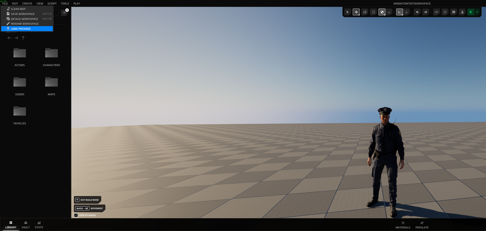
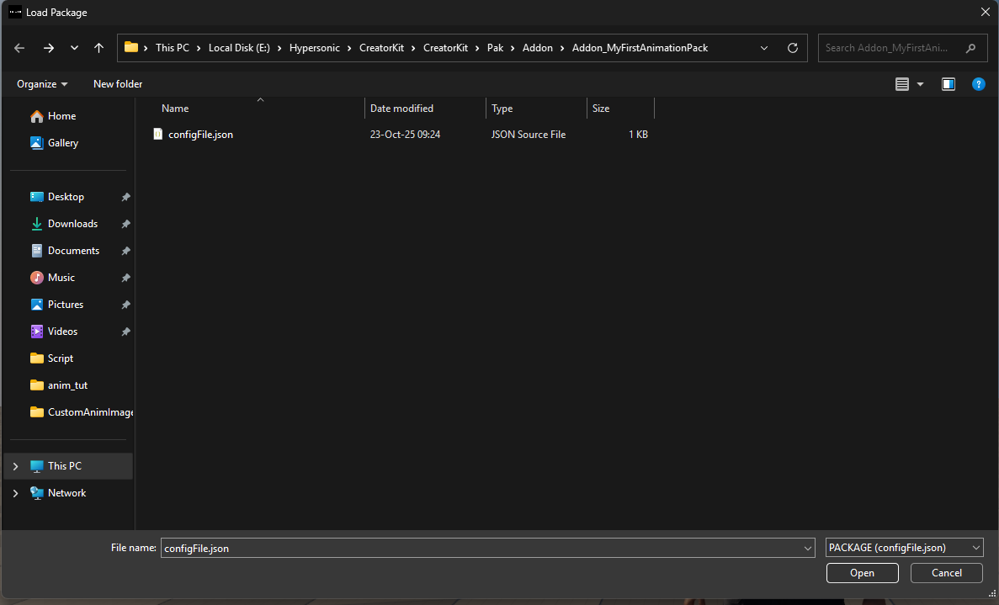
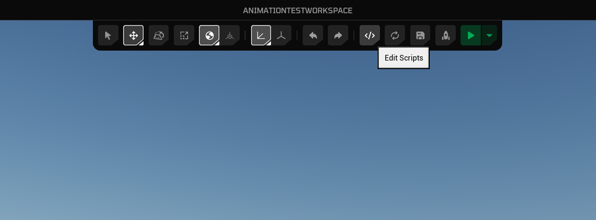
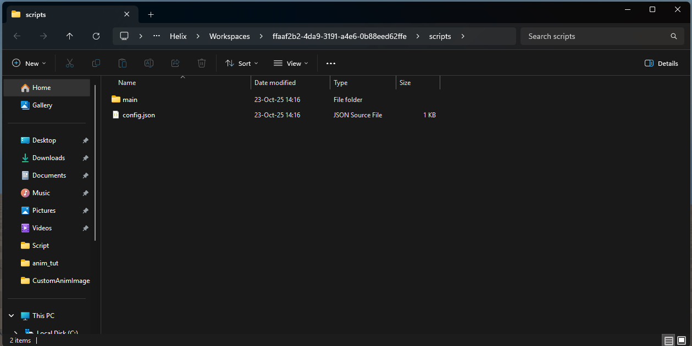
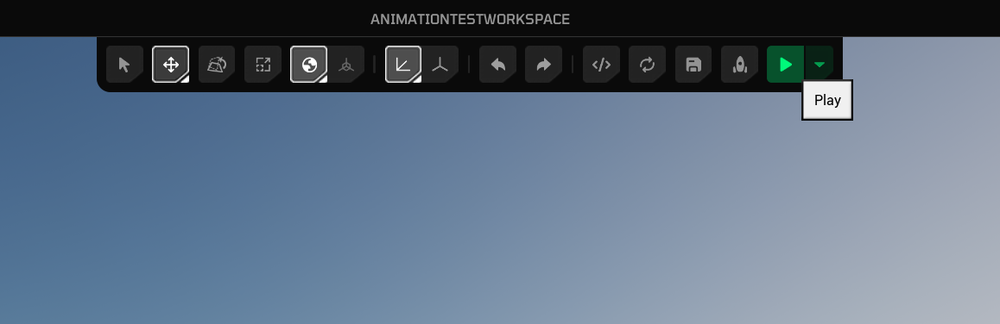

# Use Custom Assets

This guide walks you through how to use your imported custom package assets within your world, using Blueprints or Lua.

## 1. By Blueprint

[examples coming soon]

## 2. By Lua

Any kind of asset inside a [Workspace](https://development.helix-documentation.pages.dev/tutorials/workspaces/) imported package can be accessed with:

```lua
local CustomAsset = UE.UObject.Load('Game/YourPackageName/PathToYourAsset/YourAssetName.YourAssetName')
```

For example, to access a package named `Addon_MyFirstAnimationPack` with an animation sequence named `AS_Crying.uasset`, you can load the animation sequence as shown below in your lua scripts:

```lua
local CustomAnimationAsset = UE.UObject.Load('/Game/Addon_MyFirstAnimationPack/AS_Crying.AS_Crying')
```

After creating a reference variable to your asset, you can pass it into other functions in your Lua scripts.

### Example: Play Custom Animation Asset On Player Character With Lua

For this example use case, we will try to load a [packaged custom animation sequence asset](https://development.helix-documentation.pages.dev/tutorials/custom_animations/) and play it on player character with a Lua script.

1. After creating your workspace, open build mode and import the package you created in **Creator Kit HELIX Packaging Tool**. To do that, click **File** -> **Load Package** from top bar, navigate to your package folder cooked by Creator Kit, and select `configFile.json` in the folder.

    

    

2. After import is completed, you will get a panel on the left side of window with the package's name. It might appear empty if your package doesn't have any world placeable assets, which is not a problem.

    

3. Now we need to write our Lua script to access the assets inside this package. Click **Edit Scripts** button and open your workspace folder.

    

    

4. To play an animation with [Animation API](https://development.helix-documentation.pages.dev/api/apiImport/classes/animation/) after a player is spawned, add the server lua script below into  `WORKSPACE_ID/scripts/main/server/main.lua` path in your workspace. If the file doesn't exist, create it.

    ```lua
    -- Register a function to listen for player joined global event
    RegisterServerEvent('PlayerJoined', function(source)
        local MyCharacter = HPlayer:K2_GetPawn()
        local AnimParams = UE.FHelixPlayAnimParams()

        coroutine.resume(
            coroutine.create(function(delayTime)
                UE.UKismetSystemLibrary.Delay(_G.HWorld, delayTime)

                -- Our custom package is named "Addon_MyFirstAnimationPack", and animation sequence asset inside is named "AS_Crying"
                local result = Animation.Play(MyCharacter, '/Game/Addon_MyFirstAnimationPack/AS_Crying.AS_Crying', AnimParams, function() print('Animation Ended') end)
                print('Animation play result: ', result)
            end),
            1.0
        )
    end)
    ```

4. Click the **Reload** button and then the **Play** button respectively to re-execute your lua scripts in workspace and then get back into play mode.

    

    

5. Observe your character plays the custom animation after a second.

    
