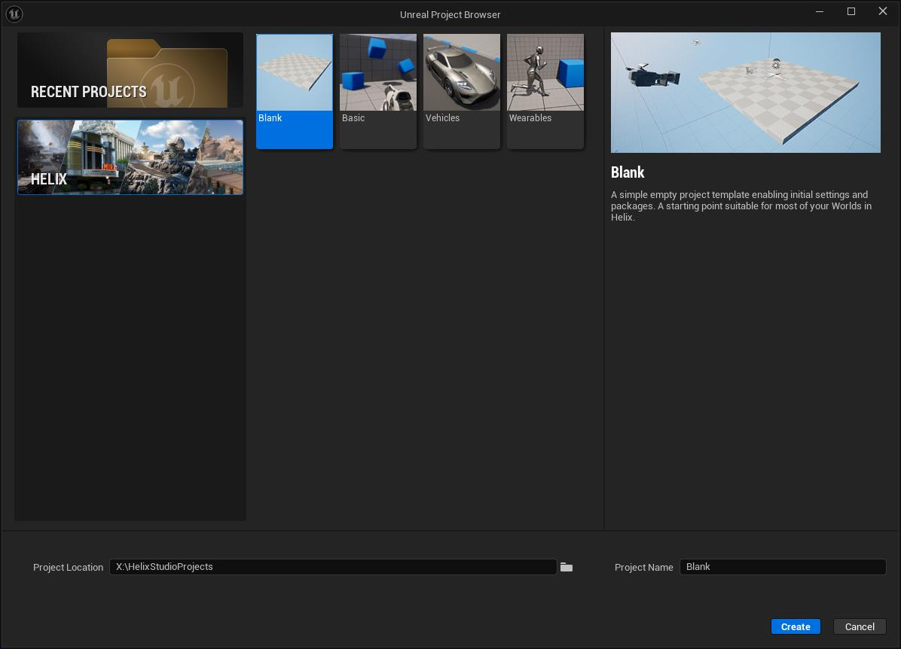

# HELIX Studio User Guide

## **Overview**

**HELIX Studio** is a customized version of Unreal Editor that allows you to create, test, and publish **HELIX Worlds** along with various types of **Packages** for HELIX, such as **Maps**, **Vehicles**, and **Wearables**.

/// info | Note
Most information regarding the preparation of individual assets (such as meshes, materials or levels) and interaction with the Engine using Blueprints in Unreal Editor is also applicable to **HELIX Studio**.
///

/// warning | Warning
**HELIX Studio** is in early development. There will be bugs and missing features, but as an early tester, there are opportunities to help shape the platform from the ground up.
///

****

## **First Steps**

You can run **HELIX Studio** through the **Steam**. To do that, you will need to obtain and redeem a Steam key as per steps below:

1. Go to https://helixgame.com/download.
2. Sign into your **HELIX** account.
3. Copy your Steam key and follow the on-screen instructions to redeem it on Steam and download **HELIX** and **HELIX Studio**. 

If you cannot see **HELIX Studio** on Steam, ensure you don't have any filters enabled in **Steam Library**, or try to search for "HELIX" or "Studio". 

Launch **HELIX Studio** and wait for initialization to complete. Then you will see the Project Browser window. Navigate to the **HELIX** section and select one of the project templates. For this tutorial, we will start with the **Blank** template:

 

If you are not logged in, you'll be presented with a login screen. You must authenticate with a **HELIX account** before proceeding with **HELIX Studio**:

 

Upon successful login, the World will be initialized, and a default level for that World will open.

All HELIX-related features can be accessed through the toolbar menu:

/// warning | Warning
The vast majority of Unreal's standard project settings should be considered immutable. Altering any of these may lead to compatibility issues with the **HELIX Game** client.
///

****

## **Worlds and Packages in HELIX Studio**

Every project in **HELIX Studio** represents a **HELIX World**, which may contain packages as dependencies. Packages are structured as content plugins.

/// info | Note
Your World does not need to be published. You can use it for local testing of your packages. 
///

When using a **Blank** template, you should see a single package of type **Map:**

 

You can create additional packages by selecting **PACKAGES** -> **NEW PACKAGE:**

/// note | Note
The package type is selected upon creation and cannot be changed later.
///

****

### **Map Packages**

**Map** packages are unique in that only one such package can exist within a World. A **Map** package must contain at least one level asset, which serves as the underlying level for the World.

If there are multiple assets, you can select which one to use in the package properties:

****

### **Other Packages**

**Addon** packages are the most generic type, as they do not assume any specific structure and are not treated in any particular way. You can add various standard assets, such as static and skeletal meshes, textures, materials, and different types of blueprints, and rely on them in your World.

/// info | Note
There are also packages with specific semantics, such as [**Wearable**](custom_cc_assets.md) and [**Vehicle**](custom_vehicles.md) packages. Separate tutorials will cover these.
///

****

### **Worlds**

A **World** does not contain any assets itself. It only references other packages.

/// warning | Warning
This means that no assets from the main project’s content are packaged or published. Use them strictly for local testing.
///

Besides basic metadata, the World can also contain scripts (Lua or JS) used to implement gameplay logic while relying on **HELIX API** and referenced packages:

/// info | Note
Please refer to the [**scripting**](Scripting/anim_list.md) tutorial for more information on the structure and semantics of the **Scripts** folder.
///

****

### **Dependencies**

A World, as well as each package, can have dependencies on other packages. This includes both third-party packages from the **Vault** and local packages in the same project.

It is implied that the World depends on all local packages present in the project. But you can also add additional dependencies from the **Vault**:

 

Similarly, packages can have dependencies from the **Vault**, but they can also depend on one another without forming a circular dependency:

/// warning | Warning
Asset visibility is not currently enforced, so you must be careful not to access assets from another package without explicit dependencies.
///

/// warning | Warning
There is a known issue where, after adding or removing package dependencies from the **Vault**, you may need to leave and re-open the World for the changes to take effect.
///

****

## **Testing in Editor**

We encourage creators to test their packages and Worlds using the **Play in Editor (PIE)** feature. You can test in all available net modes, including **Play as Client**, which spins up a local in-process dedicated server (**DS**):

 

Testing with a **DS**, along with emulating network latency, provides the closest experience to a real-world packaged game.

/// warning | Warning
Standalone Game mode and running multiple processes for testing in general are not currently supported.
///

****

## **Publishing**

You can access **Publishing** options from the **Properties Menu** of either the World or a package. 

 

You can publish to the **Vault** or create a PAK file locally for testing with the **HELIX Game** client:

 

By default, not only the current package or World, but also all its dependencies will be selected for publishing. You can intentionally skip some packages by deselecting them.

/// warning | Warning
Adding preview images or a user access list directly from **HELIX Studio** is not yet supported. This should be done through the **Creator Hub** after publishing from **HELIX Studio**.
///
