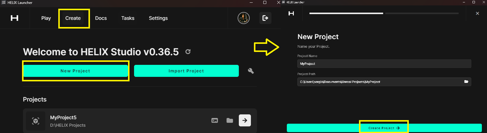
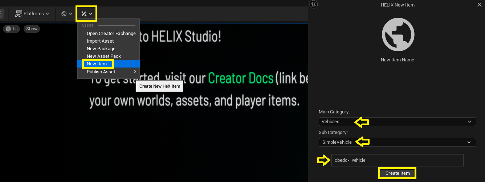
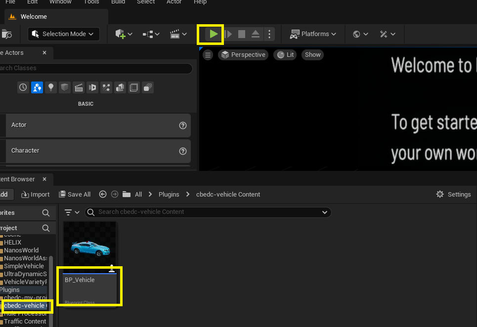
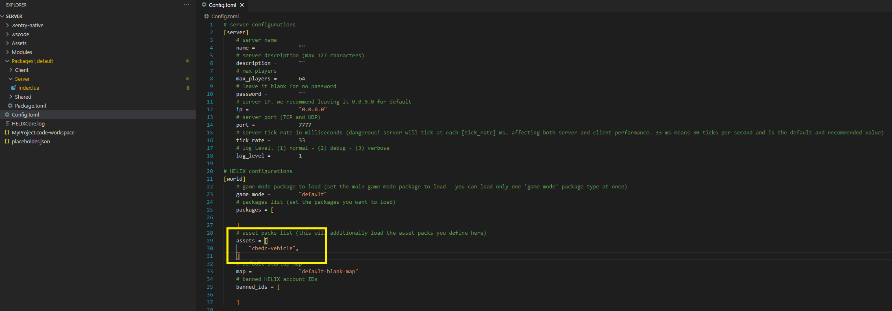
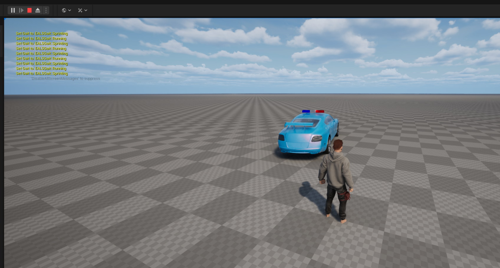

--8<-- "old.md"

Create vehicles using the HSimpleVehicle class.

## Vehicle Tutorial
### Creation and testing

Studio provides a ready made template to start testing simple vehicle right away in just a few steps.

* Create and open a new studio project from launcher.




* Inside the new project select "New Item" then Select category “Vehicle” subcategory “Simple Vehicle”, set a name for the item and click "Create Item".



* A new plugin will be created with a single blueprint item called “BP_Vehicle”, click the play button on studio and stop the game again, so the new plugin files are generated.




* Now, open VS Code from the menu in studio, and in the Server root folder there is the config.toml file, click it and add the created plugin into the assets section.





* Now, still in VS Code, find the index.lua file inside `Packages > Server > Index.lua` and add the following code at the end of the file:

```Lua title='Packages/Server/Index.lua'
SIMPLEVEHICLE = HSimpleVehicle(Vector(400, 0, 30), Rotator(0, 0, 0),"YourPlugin::BP_Vehicle", CollisionType.Normal,true)
```

* Replace the “YourPlugin” section for the correct name of the vehicle plugin folder. Now click play and test the vehicle!


