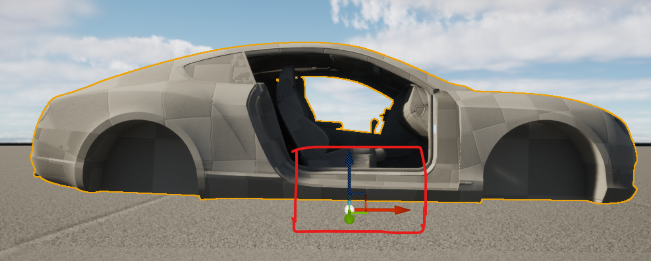

Making a Simple Vehicle based off an empty mesh

## Creating a custom simple vehicle using a single mesh

The simplest way to create a custom simple vehicle, is to use a single mesh, it will not have advanced functionality (like doors or trunk), but all the physics and driving will be the same. 

All vehicle meshes have certain requirements though, and some knowledge of 3d modeling will be required to adjust any mesh found on the internet. A more detailed tutorial on how to convert any vehicle to this requirements will be created later, for now, just know that the mesh needs to have the pivot point at a specific location.

Full list of requirements of other body parts: [Vehicle Conversion Requirements](https://www.notion.so/Vehicle-Conversion-Requirements-00782d976a434e6885a25598336a2397?pvs=21) 

Mesh requirements:

- The Pivot of this mesh should be at bottom center of Vehicle body Mesh
- The vehicle mesh shouldn't include wheels

/// tip 
> For learning reasons, we recommend you follow this tutorial using this provided mesh AND the Simple Vehicle template (as opposed of the empty vehicle). After you get familiar with our systems you will be ready to import your own meshes and do a more advanced setup. For now, please use the mesh we provided and follow along. This mesh is missing a door on purpose, to allow us to follow the tutorial and see what's going on inside. 
/// 

First create a simple vehicle using the template provided by Studio:

Create a new folder called “Mesh” into the vehicle plugin folder, then drag your fbx file from your windows folder into Unreal Engine vehicle plugin folder. If this option doesn't work, use `File > Import into level` Then select your plugin folder to import the mesh. In the FBX Import Options Window, click on “Import All”

Open the full blueprint ‘BP_Vehicle‘ again.  
/// note
   make sure on the main window, you have the tab “Viewport” selected, so you can see your vehicle meshes and configuration. 
/// 

On the components select core mesh and in the the details panel, on the Static Mesh section, open the dropdown and search for the imported mesh

This will change the main mesh of the vehicle. This and the wheels are the only required mesh for the vehicle to work. 

There are multiple adjustments yet left to be made, but its a good practice to test the vehicle while working on it, so click `save` and click the `compile` button. Then click play again and test the vehicle!

Now, doors from the previous vehicle still exist, and the character plays a door opening animation, even though our single mesh vehicle won't be able to do this.

HSimpleVehicle is setup in a way that if a component doesn't have mesh in place, it won’t perform its function. For example: If a door component doesn't have a mesh, it will teleport player inside the vehicle directly. If there is no siren, it will not allow you to press “J” to turn on the siren, etc.

/// tip
An empty vehicle template also exist on studio, for now some meshes of the default vehicle must be removed so we can learn their function better.
/// 

## Removing the doors and siren meshes 

- Open the `BP_Vehicle` blueprint again.
- Select “Door_FR” on the components section.
- On the details panel, look for the “Static Mesh” property.
- Expand the dropdown and select “Clear”.
- Repeat the same for “Door_FL”, “Siren”, “Hood”, “Trunk” and “Spoiler”

Now there's a single mesh vehicle with only the parts needed. The siren can be left in place if you prefer.

`Compile`, `save` and test again! Since there are no doors now, the character should teleport inside the vehicle but there are some stuff not aligned correctly.

## Adjusting doors

Even tough there are no door meshes, the doors still do some important functionality in the vehicle. They control where the player interacts for example, and where the final sitting position is located.

- If the `BP_Vehicle` blueprint is closed, open it again.
- On the components window, look for and select the BPC_Door_FL. This is the components that controls the drivers position.
- On the details panel, look for the settings section, and adjust values for the `Seat position` property.  This value is relative to the position of the component itself. A small red sphere will be visible on the viewport to assist adjusting values.
- Repeat this process for the other door.

 

/// tip 
> Better previewing of the seat position will be added later. For now, it will involve some trial an error. Feel free to click play at any point and test changes. If the red sphere representing the seat position can't be seen on screen, the position might be way too off, or even inside the vehicle mesh.
/// 

Test the vehicle, now the character should be sitting on the right position!

However character's hands are grabbing a very low positioned steering wheel. In order to adjust this do the following:

- Select the “Steering wheel” component.
- On the viewport, use the gizmos to adjust the steering wheel position.
- Additionally, the steering wheel can be replaced by any mesh that follow the requirements. [**Steering wheel**](https://www.notion.so/Steering-wheel-0ec8e56df97e4b44b0a1aeb3b2252b8e?pvs=21)

 

Now the seat positions and steering wheel are adjusted!

## Adjusting Wheels

Wheel position and sizes must be adjusted. Keep in mind to keep consistent position and size along the wheels to ensure the vehicle works as expected.

- If the `BP_Vehicle` blueprint is closed, open it again.
- On the components tab, hold shift and select all the 4 “Suspension” components.
- On the details panel, adjust the Transform > Scale values to fit the size of the vehicle.
- In this example, set all the “Scale” values to 1.2. This should fit the wheels properly.

 

- Selecting both front wheels (FL, FR), the position can be adjusted using the transform gizmos on the viewport to fit the vehicle better.
- Repeat for the back wheels (RL, RR).

Additionally, the wheel meshes can be replaced, as long as it follows our requirements [**Wheels**](https://www.notion.so/Wheels-41d285cc1c034052b9243d1af2b98b5b?pvs=21).

/// tip
> There are some key points to be aware of when setting up the wheels: 
- Each Suspension component cannot have a child attachment, as this is a dynamic component, the child attachment won’t be rendered in game.
- If the tire mesh in game has the wrong position, you should change the “Wheeldirection” inside the settings options.
- The tire radius can be adjusted to fit well with the ground by manipulating the “Base Wheel Radius”
/// 

Click on the `Compile` and `Save` buttons and then test the vehicle! The wheels should be aligned to look better now.

## Adjusting remaining positions
There are a couple more things that can be adjusted.

- There are two headlights that can be adjusted at the front of the vehicle.
- The vehicle proximity sphere, indicates at what distance around the vehicle it can be interacted.
- And every sound and animation can be replaced. More on sounds and animations later.

And that's it! The Single Mesh Simple Vehicle is done! Feel free to publish your package and world to test in HELIX client!

## Creating a complete vehicle

Now that you know how to setup a very basic vehicle. Let’s create a more advanced one with more parts.

The basic principles are still the same, it’s pretty obvious now for example, what you need to do to replace a door mesh. Just add the mesh into the door component and adjust positions!

There are some other important concepts that need to be explained though. 

The first important part is, in order for the doors and vehicle to function correctly, there are some requirements needed for the meshes to work correctly. A more advanced blender tutorial will be created later, for now you can refer to [Vehicle Conversion Requirements](https://www.notion.so/Vehicle-Conversion-Requirements-00782d976a434e6885a25598336a2397?pvs=21) if you have the technical knowledge to create a vehicle mesh.

## Advanced concepts

### Adding more doors

The default vehicle only has 2 doors, but any number of doors can be added to simple vehicle. Follow this steps to add them:

- On the components panel, select the “core mesh” and click the add button and search “Door”, select the one called “Simple Vehicle Door” and name it accordingly, in this case “Door_Back_Left”.

- In this newly created door component, go to the details panel and add the door mesh. Then on the viewport position this door using the gizmos to move it around.

> In this case, Vehicle_42_Left_Door mesh was used as creating meshes is out of scope. This mesh was used only as a reference.

- Then click on the “core mesh” again and click the button add, this time for “simple vehicle interaction” add the BPC Simple Vehicle Interaction and name it accordingly. In this case: “BPC_Door_Back_Left”.

- Position the interaction sphere in the viewport, and the character seat position, similarly to the configurations that where done before.
- Then click on “BPC_Door_back_Left” and on the details panel make sure of the following.
    - The type of attachment should be door, in order to work correctly.
    - Attachment direction, should be left in this case, this will determine in what direction the door opens.
    - The interaction component index must be set correctly, in this case, since we already have two doors (0 and 1) this door will be index 2. This is necessary for correct synchronization of the vehicle.

/// tip 
> If there are duplicated indexes or the indexes are incorrectly assigned, the doors won’t work correctly.
/// 

- Other values like seat offset and animations can be tweaked.

There are a lot of values that can be changed with doors, we recommend to test your vehicle constantly and make adjustments as they become necessary.

### Adding your own wheels

Wheels meshes have one requirement, the “rubber” part needs to be separated. Then on the material slot for the rubber, the following name should be added: M_Wheel_RubberGrip

Only one wheel mesh is needed.

### Adding additional parts
In order to keep vehicles customizable for the future, we have setup an attachment system. If you want to add any additional parts to the vehicle, you should use it and tag the parts correctly. Another benefit of using the attachment system, is that parts can break when the vehicle crashes. This is entirely optional and can be setup when creating a new part.

Adding a new part is pretty simple, lets say we want to add an [**Exhaust**](https://www.notion.so/Exhaust-07363be2b4af49649f5f3483ee7bf1ab?pvs=21) 

- Open the blueprint editor.
- Select “CoreMesh” and click the “Add” button.
- Search “attachment” and select the “Custom Attachment”.
- Name the new component as “Exhaust”
- Select the Exhaust and go to the detail panel and on the “Static Mesh” property, select your exhaust mesh.
- Position your exhaust using the viewport and gizmos.
- On the details panel, make sure to select the “Attachment type”, in this case “Exhaust”.
- Also on details panel, you can select “Can Detach when Broken” if you want your attachment to break and fall. This would depend on the attachment. If for example you are adding an engine, it wont make sense to allow it to detach.

### Changing Sounds

All sounds of the simple vehicle are interchangeable. From engine sounds, to doors and sirens. As we move forward with simple vehicle, more customizable sounds might be added (like different types of terrains or separated impacts).

For now, all the interchangeable sounds can be found when clicking The “BP_Vehicle” on the components tab and navigating on the details tab to the “Sounds Data” section.

### Changing animations

All animations can be changed as well! From the interaction animations to the entering and leaving animations. 

However we are in the process of upgrading the character, so we don't recommend changing them right now. 

If you still want to do it, you can find some animations here: 

- Hood and trunk have their own animation, is currently a placeholder animation, feel free to change it!
- Each door has his own animation montages as well. For enter, exit and sitting positions. You can find them under BPC_Door_xx, details > Montage.