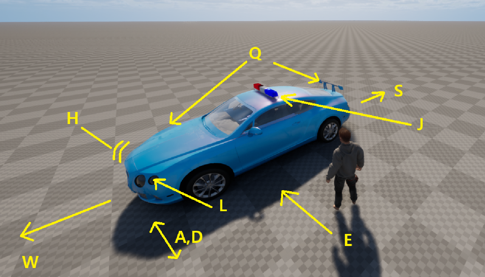
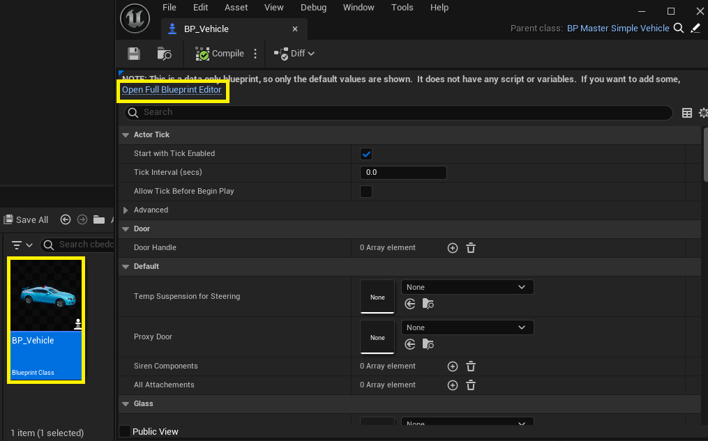
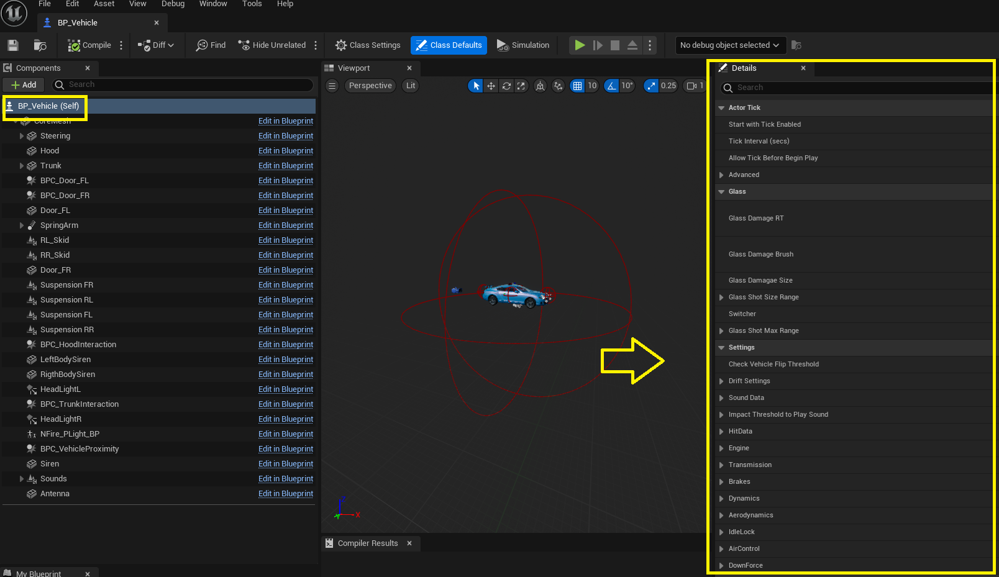
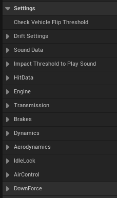
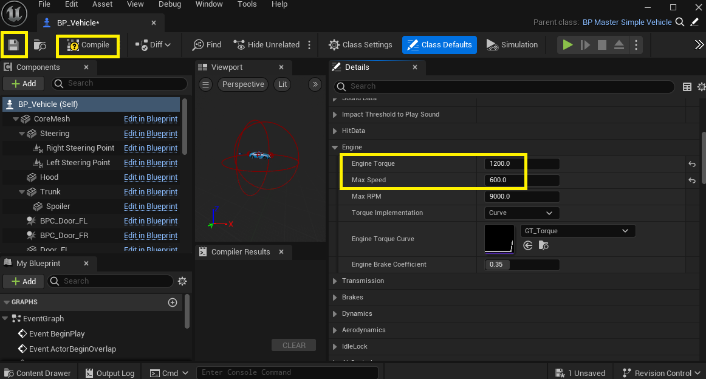

--8<-- "old.md"

This page covers the controls to drive the vehicle and settings to customize the HSimpleVehicle experience.

## Vehicle Controls

You can test the vehicle functions with the following controls:

> Q - Interact with hood and trunk  
> E - To enter the vehicle  
> W - To Accelerate  
> A,D - Wheels direction  
> S, Space - Handbrake  
> H - Horn  
> J - Siren  
> L - Lights

## Changing vehicle settings

All the vehicle physics can be changed from the vehicle blueprint. To do this, double click the “BP_Vehicle” to open the blueprint editor. Once open, click on the “Open Full Blueprint Editor” link at the top.

On the components section on the left, select “BP_Vehicle (self)” and the details window will show a set of configuration that can be changed. In the “Details” tab search for the “settings” section and expand it, this are the main configurations for the vehicle physics as well as for sounds configuration.

Settings include: Drift Settings, Sounds Data, Impact threshold, HitData, Engine, Transmission, Brakes, Dynamics, Aereodynamics, IdleLock, AirControl and Downforce. All of this settings affect the vehicle handling and performance, it is recommended to test one configuration at a time and test it.

## Adjustment example: Top speed and acceleration

Go to the “Engine” section and expand it, set the “Engine Torque” value from 600 to 1200 and the max speed from 300 to 600. Then on the top left click the “Compile” button and then the “Save” buttons. 

Now the blueprint editor can be closed and then click play again. Test the vehicle, it will be a lot more faster!

Other settings related to physics can be found on the wheels, they are called “transmission”. Click on them and check what values can you modify to adjust the driving experience!

/// tip
> Tweaking vehicle physics can be tricky and may involve a lot of trial and error. Later on we will include presets for you to have a starting point.
/// 