--8<-- "old.md"

Create items to use them with the HELIX character

/// tip
In order to follow this guide, please read and follow on [How to install HELIX Studio](/assets-modding/studio/setting-up-studio.md)
/// 

---

## Create a new project with HELIX studio.

To detailed information about how to create a project using HELIX Studio, please go to [Studio New Project](/assets-modding/studio/create-project.md)

## Creating a item

Click on the Studio tool bar and click on “Asset”(1) and then click on "create new Item"(2) to open the “HELIX New Item” dialog box.

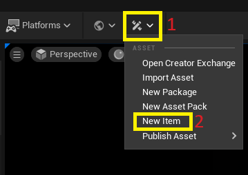

Currently there is only one category, but different subcategories can be selected, after defining one subcategory, insert a name for the item. The name box accepts only lower-case letters and dashes.

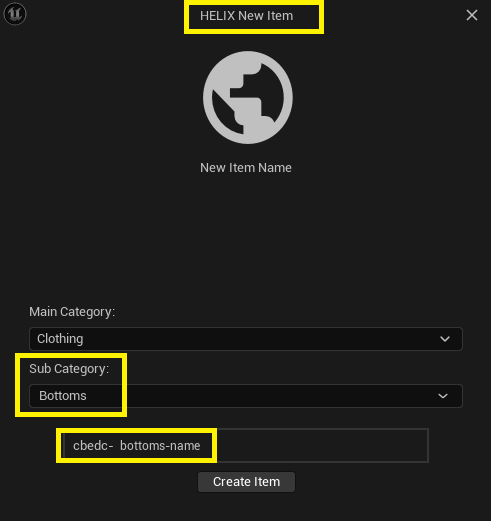

Then click on the "Create Item" button.

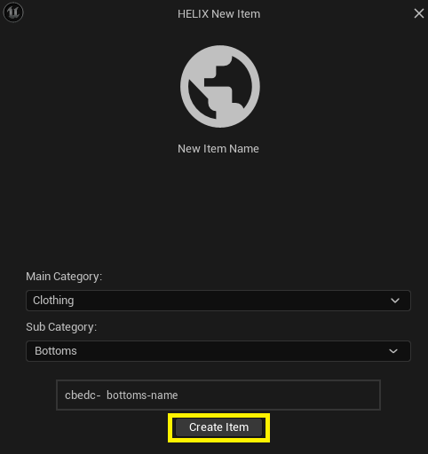

## Prepare Mesh to upload.

After finishing creating the base item in the previous step, a new folder with the item will appear in the content drawer under: All -> Plugins -> *item Name folder* with the default mesh inside.

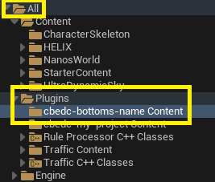

These meshes and materials can be modified to create a new item.

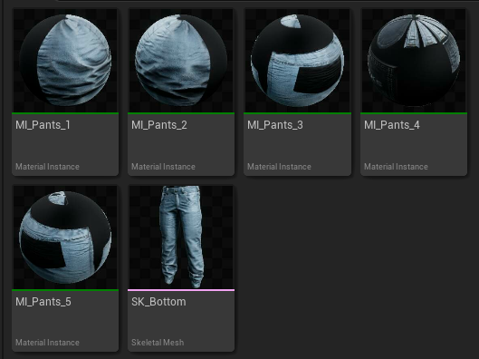

## Adding the mask

In order to avoid having issues with the items displaying over the character, a mask is required, to do this create a texture file filled with the color black.

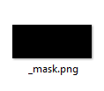

And then from the Content Browser, click on "Import" and browse where the texture file is located, select the file and click on the Open button.

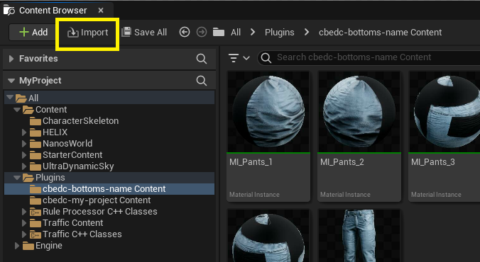

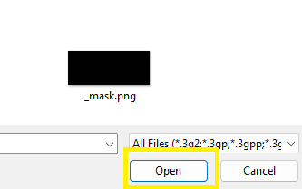

> :warning: **IMPORTANT:** Change the texture name to match the Skeletal Mesh name and add "_mask" at the end of the **file texture**.
Then in the content drawer there are going to be two files, the mesh with "itemName" and the texture named "itemName_mask" 

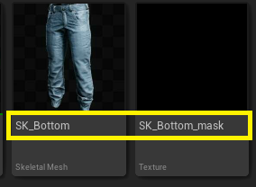

## Publishing the item

Last step in creating an item is to publish it to be used with the character, to do this click on the asset button(1) from the studio toolbar, scroll down to the "Publish Asset"(2) option which will show the items in the project(3) 

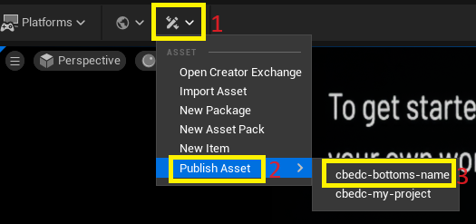

Then select the item to be uploaded to HELIX Hub. Please wait for studio to create the package and then the upload will begin, after the upload finishes the asset will be shown in HELIX Hub.

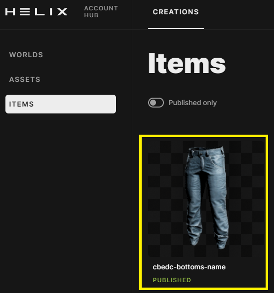

## Item in HUB, update details

After uploading an item to the HUB the item will contain default information, it’s recommended to change these defaults, so go to [HELIX Hub](https://hub.helixgame.com/) and login then click on the creations tab(1) and there click on the ITEMS(2) section to see a list of the created items(3)

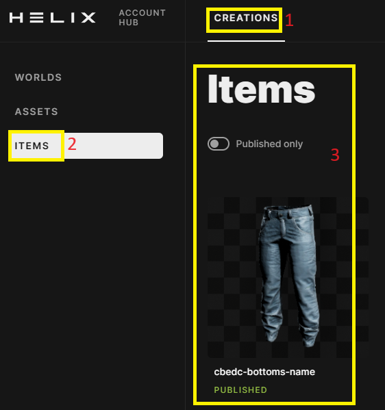

Click on one item to access the item’s data and then the details section will show general information.

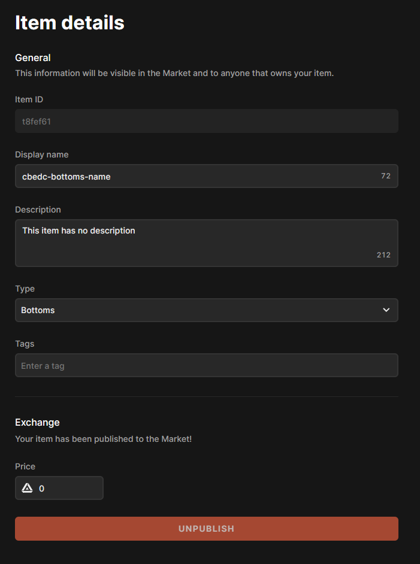

*ITEM ID* - Read only, this is the item unique ID.  
*DISPLAY NAME* - this name is how the item will be used in HELIX.  
*DESCRIPTION* - A short description for the item.  
*TYPE* - The asset's type, this should be left as it is.  
*TAGS* - Enter a tag name and press the tab key to create a tag, this tags are used to locate items in the EXCHANGE search bar.  
*PRICE* - Enter the item price to be exchanged for lix later on (in development)  

Then click on showcase section to upload images and icons for the item.

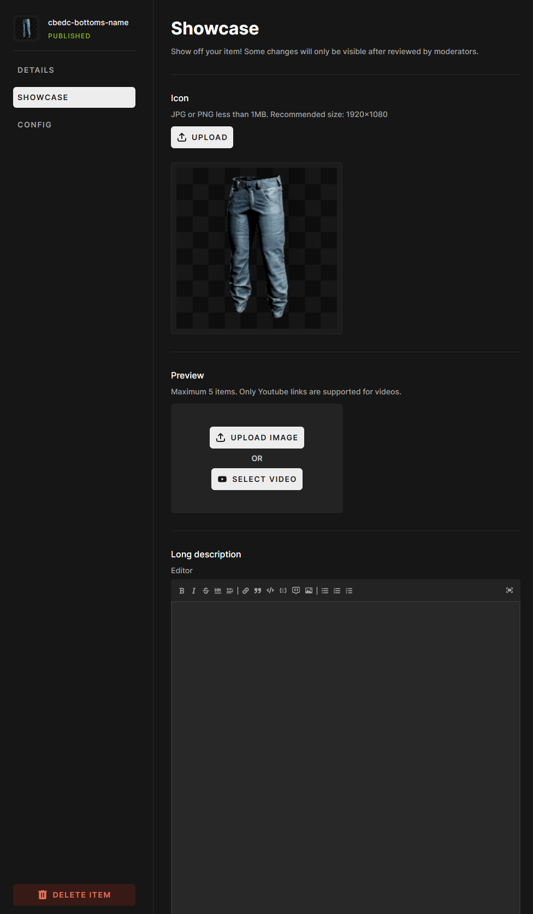

*ICON* - A new icon for the item can be changed here. [JPG or PNG less than 1MB. Recommended size: 1920x1080]  
*PREVIEW* - Images and videos can be uploaded/linked to show the item [Maximum 5 items. Only Youtube links are supported for videos.]  
*LONG DESCRIPTION* - A longer description can be added to describe the item in full detail.  
*CONFIG* - this section is still in development.  
At the bottom of the item data there is a button to delete the item permanently, use this with caution as this deletes the item permanently.  

When editing the item information is completed, click in "SAVE & CLOSE" to save the information.

<!--## Use the item in HELIX

Now the item will be shown in the exchange and the avatar can be equipped with it.

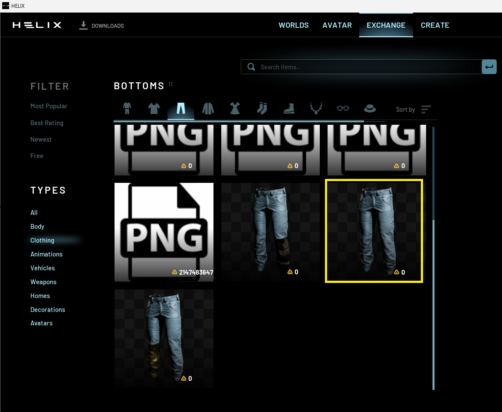
-->
