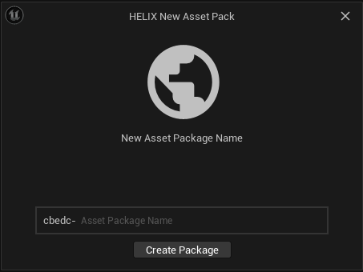

--8<-- "old.md"

Custom animations 

Our current character systems work by default with the UE5 Metahuman character skeleton. Any animation made for standard UE5 Manny or UE5 Metahuman skeleton should work out of the bag on our main character.

However, most of the animations found on the Unreal Marketplace are made for UE4 skeletons. Following this tutorial, you will learn how to retarget the animations with a few clicks to work correctly on Helix.

> 📋 Requirements:  
[HELIX Studio Setup](/assets-modding/studio/setting-up-studio.md)    

## Setting up project and importing from Marketplace

### Create a new project with HELIX studio.

To detailed information about how to create a project using HELIX Studio, please go to [Studio New Project](/assets-modding/studio/create-project.md)

After the new project is created, import any animations packs from the Unreal Marketplace

.png)

After importing, inside your new project, create a new Asset Pack 

.png)



### **Preparing UE5 Animations**

If an animation was made using the UE5 manequin or the UE5 MetaHuman Skeleton, setup is pretty simple. 

Just right click your animation > Replace Skeleton. Then write “SKEL_Metahuman” on the searchbar and select the SKEL_Metahuman skeleton.


.png)

If a warning showing incompatability is shown or the animation looks distorted. Most likely you are dealing with a UE4 animation, proceed to the retargeting instructions ahead.

If everything went ok, you can now drag your animation to the newly created asset pack content folder and proceed to testing it in the next section.

> 💡 Please note: If the animation looks distorted or you get an error on this step, most likely your animation was not made for UE5 standard skeletons.   
> Proceed to manual retarget section 
 
 

## Testing Animations

After all the animations you want have been retargeted, click the run button once so files are generated. Then press “Esc” and click the stop button.

.png)

Then open the project on Visual Studio Code.

.png)

On the assets section, locate the animation you want to test.

.png)

Paste the following code on your Server / Client index lua files file.

Your Package > **Client** > Index.lua

```lua
Input.Register("G", "G")

Input.Bind("G", InputEvent.Pressed, function()
    -- calls a remote Event in all Server Packages
    Events.CallRemote("TestAnimation", "hello HELIX!")
end)
```
Your Package > Server > Index.lua
```lua
-- Function to spawn a Character to a player
function SpawnCharacter(player)
    Console.Log("Spawn player")
    local new_character = HCharacter(Vector(0, 0, 0), Rotator(0, 0, 0), player)
    player:Possess(new_character)
end

-- Subscribes to an Event which is triggered when Players join the server (i.e. Spawn)
Player.Subscribe("Spawn", SpawnCharacter)

-- Iterates for all already connected players and give them a Character as well
-- This will make sure you also get a Character when you reload the package
Package.Subscribe("Load", function()
    for k, player in pairs(Player.GetAll()) do
        SpawnCharacter(player)
    end
end)

-- When Player leaves the server, destroy it's Character
Player.Subscribe("Destroy", function(player)
    local character = player:GetControlledCharacter()
    if (character) then
        character:Destroy()
    end
end)

-- register for a client Event (remote = client)
Events.SubscribeRemote("TestAnimation", function(player, my_text)
    Console.Log(player:GetName() .. " sent an event from client! " .. my_text)
    local char = player:GetControlledCharacter()
    char:PlayAnimation(“[your-asset-pack]::[your-animation]”)
end)
```
On the Server file, line 35. Replace “[your-asset-pack]::[your-animation]” by your asset pack name and your animation file name.

Save and click play. Now pressing the keyboard key “G” should trigger your animation on the HCharacter!

## **Creating animations from scratch**

If you are an aniamator an want to create your own animations. You should start from the Meta Human skeleton.

On studio, type into the search bar “SKM_Manny”

.png)

.png)

Right click it and select Asset Actions > Export

.png)

This will allow you to save a .FBX file that can be imported into any 3D software for animation.

Animation is a complex topic, that its ouside the scope of this guide.

After your animation is done, save your file as FBX and proced to the next step to import it. If you used the SKM_Manny skeleton, then SKel_Metahuman will be the skeleton you need to choose when importing.

## **Manual Retargetting**

In some cases, asset from the Unreal Marketplace or other imported animations might not be compatible with either the UE5 skeletons.

In cases like this, manual retargetting will need to be done.

In this example, an animation pack includes his own custom skeleton. The creator is including an IK RIG that we will use to retarget.

.png)

>💡Note:  
>  Creating an IK rig is a complex process that its outside the scope of this guide. [This youtube video tutorial](https://youtu.be/xvHOamXuZDI?si=tRtLKr_a4mDc5emG&t=215) has enough information to create a ik rig, after you have it you can follow to the next steps.

Create a new Ik Retargeter asset and select the SOURCE ik rig (meaning ti rig based on the skeleton of the animations you want to retarget). In this case “Dummy_male_IkRig” as show on the previous image.

.png)

.png)

Name your retargeter apropiately, in this case “Dummy_To_Metahuman_IKR”.

Open your newly created retargeter, and make sure “IK_Mannequin_Retarget” and “SK_Male” are selected on the TARGET section

.png)

To make sure the animation is retargeting correcly, you can go into the Asset Browser on the bottom and right, and double click any of the available animations to preview it.

.png)

>💡 Note: More complex retargetting can be achieve to make sure hands positions are correct.   
> But its outside the scope of this guide.   
>  [You can follow this third party youtube tutorial](https://youtu.be/xvHOamXuZDI?si=dko-06axJnD13a8y&t=900) on how to retarget animations with ik goals.

Now you can proceed to the retargeting steps here to retarget your animations using your newly created retargeter.

## Importing animations from FBX file

Importing animations from fbx should be straight fordward. Just drag your fbx into the plugin folder and select either the Skel_Metahuman / SK_Mannequin (for UE5 rigs) or SK_Mannequin_Skeleton (for UE4 rigs) depending on what rig was used to create the animation.

Please note, if the animation was imported using the UE4 skeleton, retargetting steps need to be followed.
## **Publish your animation package**

Publishing your newly created Assetpack, is as simple as clicking Publish Asset and selecting your Asset Pack!

.png)