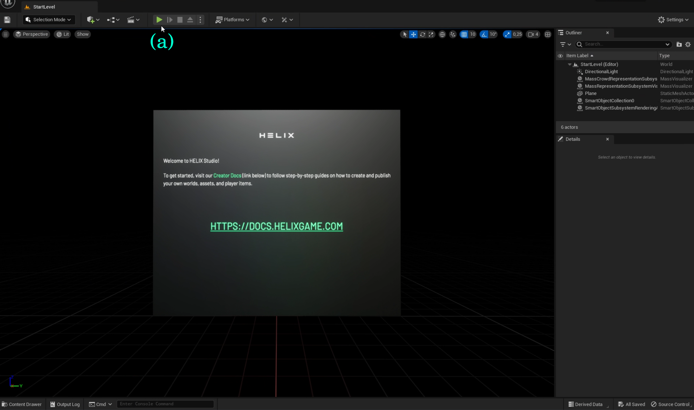
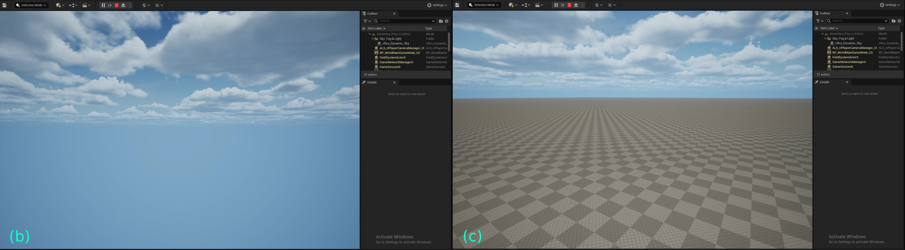
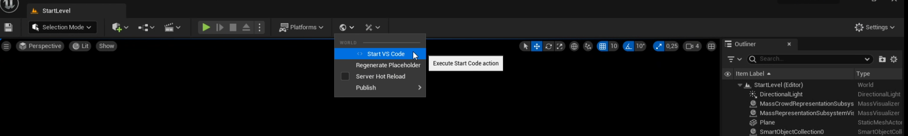
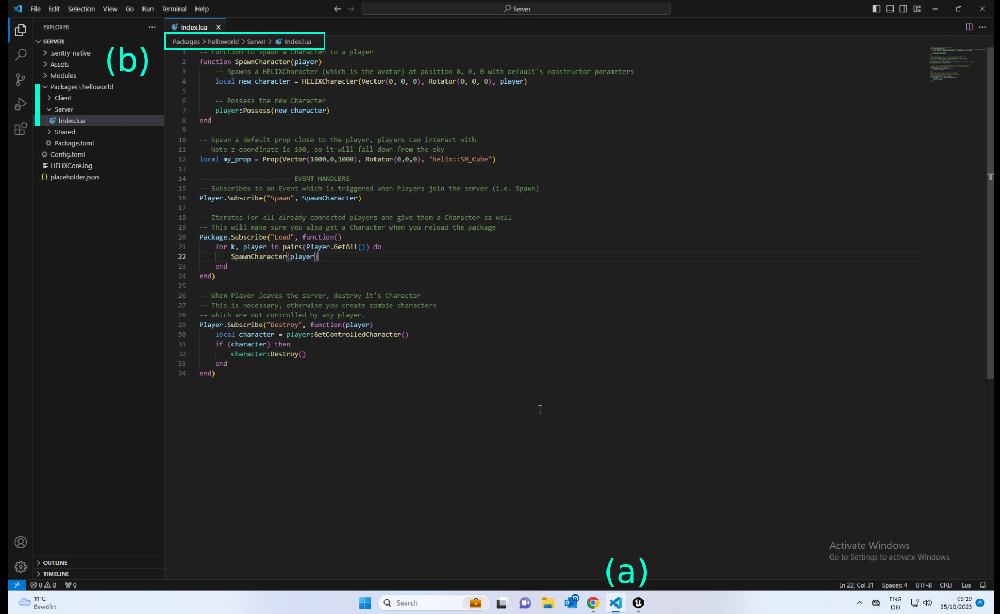
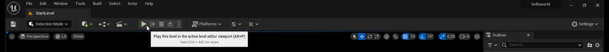
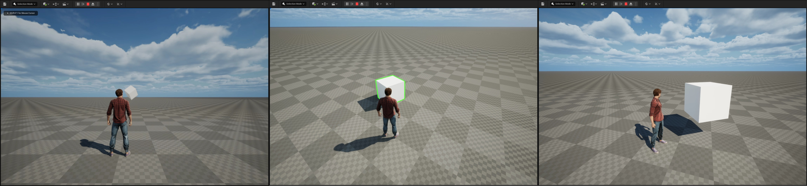
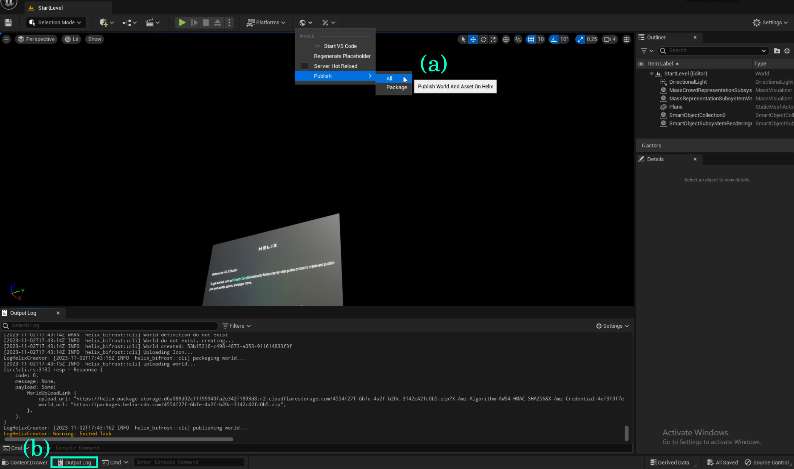
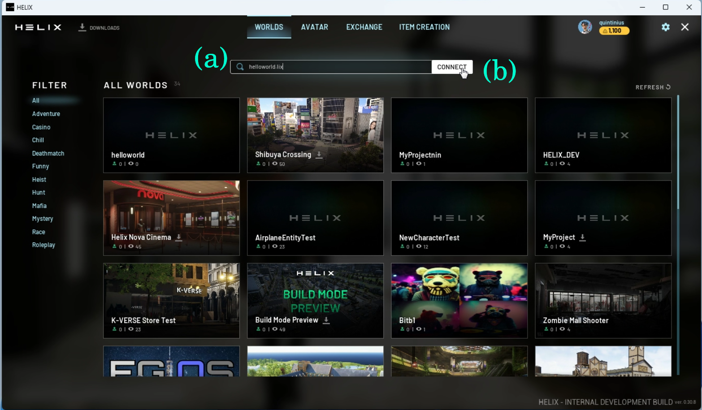

--8<-- "old.md"

Creating a World can be very simple after understanding the basics from this page.

/// info
Requirements:  
[HELIX Studio Setup](/docs/assets-modding/studio/setting-up-studio.md)  
/// 
 
___

A video regarding [creating a world for the first time can be found here](/getting-started/video-tutorials/02-creating-your-first-world.md)

___
## Creating a Basic World in HELIX Studio
In this section we will create a basic world in HELIX Studio, which we will upload and publish.    
> :warning: Choose the [project-name] carefully. This will become the public World ID.  
 &emsp;&nbsp; Players will be able to find your world using [project-name].lix   
 &emsp;&nbsp; A webpage is created at `helixgame.com/worlds/[project-name].lix` 

> :memo: You need to replace [project-name] through your chosen World ID in all steps below! We create a world with World ID helloworld in this tutorial.

## Create the project

To detailed information about how to create a project using HELIX Studio, please go to [Studio New Project](/assets-modding/studio/create-project.md)

> :warning: In the project's name use lowercase letters and dashes only, please avoid using symbols, numbers or uppercase letters.


## First steps in Project

You will see a welcome Message and the StartLevel main tab. Check The Introduction for more details on the Tools and Structure of HELIX Studio.  

For a very first test, hit the green `Play-Button (a)` 



Next, allow Firewall if prompted.  
You will see blue sky with `clouds (b)`. This is what server without any code looks like. You can already navigate with the camera with the typical game-controls (`W` ,`A` ,`S` ,`D` and mouse for looking around)  
Look into the sky and move forward with the W key a bit. If you look down again, you should now see a chessboard `floor (c)`  
The world exists, now let’s fill it with life. Hit the red Stop button or `ESC` key.



## Add Game Logic
Open VS Code by clicking on the World Icon and then “Start VS Code”



This opens VS Code outside Unreal Engine! You can navigate between Unreal Engine and VS Code in the Windows `Task-Bar (a)`  
Open and edit the file located at `Packages/helloworld/Server/Index.lua (b)`



In Packages/helloworld/Server/Index.lua file paste the source-code shown below:
```lua title="Packages/helloworld/Server/Index.lua"
-- Function to spawn a Character to a player
function SpawnCharacter(player)
    -- Spawns a HELIXCharacter (which is the avatar) at position 0, 0, 0 with default's constructor parameters
    local new_character = HELIXCharacter(Vector(0, 0, 0), Rotator(0, 0, 0), player)

    -- Possess the new Character
    player:Possess(new_character)
end

-- Spawn a default prop close to the player, players can interact with
-- Note z-coordinate is 1000, so it will fall from the sky
local my_prop = Prop(Vector(1000,0,1000), Rotator(0,0,0), "helix::SM_Cube")

----------------------- EVENT HANDLERS
-- Subscribes to an Event which is triggered when Players join the server (i.e. Spawn)
Player.Subscribe("Spawn", SpawnCharacter)

-- Iterates for all already connected players and give them a Character as well
-- This will make sure you also get a Character when you reload the package
Package.Subscribe("Load", function()
    for k, player in pairs(Player.GetAll()) do
        SpawnCharacter(player)
    end
end)

-- When Player leaves the server, destroy it's Character
-- This is necessary, otherwise you create zombie characters 
-- which are not controlled by any player.
Player.Subscribe("Destroy", function(player)
    local character = player:GetControlledCharacter()
    if (character) then
        character:Destroy()
    end
end)
```
Save the Index.lua file and go back to Unreal Engine and hit the green Play button!



>The Server is controlled and tested through Unreal Engine. It's important to save Code-Files in VS Code, otherwise the server will not apply your changes.  

You will now see your Avatar and a white cube falling from the sky in front of the avatar. Run around and explore, the cube can be grabbed. If you move the Avatar close to it, you can pick it up with the `E` key and carry around.




## Publish your world
To publish the world just go to the `World-Icon → Publish → All` (a)  
You see confirmation on the bottom right side and also in the Output log. (b) 



In case you encounter issues, please also share these logs (b) when filing bug reports.  
Your world should now be public and playable. In the example, the world can be found via `helixgame.com/worlds/helloworld.lix` and you can connect to the server via HELIX Client.



Congratulations, you’ve just created your very first HELIX world!  


## Finalize World Settings and Publish
Before you and other players are able to Join your World, some final settings and polishing is required in [HELIX Creator Hub](https://hub.helixgame.com/)  
Once you log in, you will see your World in draft stage. Click on it to edit. This gives you a lot of options, here’s a quick overview:  
___
- **Details:** Basic and public information and details about your world, it is the social side as you can link discord servers, create tags and any key information you want your users to see.
___
- **Showcase:** You will be able to upload images and also link videos online that everyone will see on the HELIX page and also [helixgame.com/worlds](http://helixgame.com/worlds). Of course, this content will be moderated before people can see what you have uploaded, so you have to keep what you are uploading to the age guidance for HELIX.
___
- **Access:** Admin options on how you let people join your game, such as; your game’s address link, password protection, visibility and max players.
___
- **In-World Purchases:** In-World Purchases are entitlements which players can buy more than once, making them perfect for in-experience currency, consumables, or similar products.
___
- **Sales:** This shows analytics and a list of total transactions your World has gained from the Payment Class.
___
- **Hosting:** This page allows you to control how you host your game, with Region Selection (e.g. instead of having the server be based in USA East Coast, you can do EU Central) and also shows you the costs of hosting your World with LIX, once hosting you can see details and control the server on the hub page.
___
- **Config:** Backend options such as Asset IDs, Package upload depot, Game modes, Maps and additional config to your world.
___


> 💡 Now we have a bit of context and our world set up, we can now follow a step by step guide on how to set your World up!


## What’s next?
You now have a World created and running. Players can connect to it through its unique .lix URL and interact with the Cube and each other. Admittedly, the environment and Cube is a bit boring though, so let’s continue with the next step.