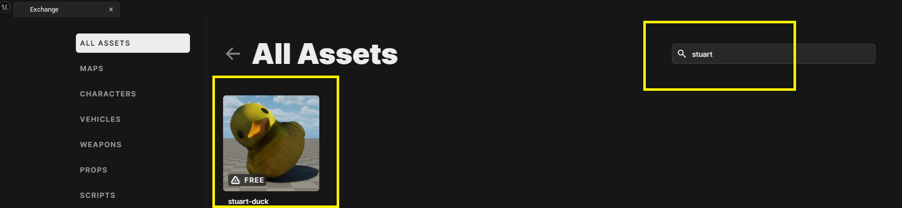

--8<-- "old.md"

## Adding an Asset from HELIX Creator Exchange

In this example we will add a Rubber Duck from the [stuart-duck Package](https://helixgame.com/vault/add-on/ab03ecf4-0c65-4d62-8a16-beb6f9cfdfd7) and spawn it as a Prop in our World we created earlier.

In HELIX Studio, go to the Asset-Icon and Open Creator Exchange.

 

Search the `stuart-duck` asset or any other you like and click on it, then press the yellow Download Button in the next window


 

 

## Asset-Pack contents

Once the download is successful, you can verify its content in the Content Drawer

 

## Add Asset as Prop

Static Meshes are often used as Props. We will add the Static Mesh asset identified by `duck` as a Prop to our World project we created earlier.  
Open VS Code by Clicking in "Manage HELIX World" button and then clicking on "Start VS Code"

 

In VS Code, navigate to `Packages/<your-project>/Server/Index.lua`

 

And add the following code:

```lua
local my_duck = Prop(Vector(1000,400,100), Rotator(0,0,0), "cbedc-duck::duck")
```

> ⚒️ All assets are identified via [asset-pack]::[asset-id].  
The Double-Colon :: is a namespace operator.   
`cbedc-duck::duck` clarifies that duck is a static mesh located in the cbedc-duck asset pack.

This adds Stuart The Duck with the static mesh `duck` 400 cm to the right of my_prop, which is the white `SM_Cube` Prop we created earlier.

Save the file, navigate back to Unreal Engine and test it with the Play button. You will now see the Rubber Duck next to the white cube falling from the sky.

 

> my_prop is dropping from a height of 1000 at the location x=1000, y=0
my_duck is added at location x=1000, y=400

Complete code for convenience:
```lua
--- Function to spawn a Character to a player
function SpawnCharacter(player)
    -- Spawns a HELIXCharacter (which is the avatar) at position 0, 0, 0 with default's constructor parameters
    local new_character = HELIXCharacter(Vector(0, 0, 0), Rotator(0, 0, 0), player)

    -- Possess the new Character
    player:Possess(new_character)
end

-- Spawn a default prop close to the player, players can interact with
-- Note z-coordinate is 1000, so it will fall from the sky
local my_prop = Prop(Vector(1000,0,1000), Rotator(0,0,0), "helix::SM_Cube")
local my_duck = Prop(Vector(1000,400,100), Rotator(0,0,0), "cbedc-duck::duck")
----------------------- EVENT HANDLERS
-- Subscribes to an Event which is triggered when Players join the server (i.e. Spawn)
Player.Subscribe("Spawn", SpawnCharacter)
-- Iterates for all already connected players and give them a Character as well
-- This will make sure you also get a Character when you reload the package
Package.Subscribe("Load", function()
    for k, player in pairs(Player.GetAll()) do
        SpawnCharacter(player)
    end
end)
-- When Player leaves the server, destroy it's Character
-- This is necessary, otherwise you create zombie characters 
-- which are not controlled by any player.
Player.Subscribe("Destroy", function(player)
    local character = player:GetControlledCharacter()
    if (character) then
        character:Destroy()
    end
end)
```

## Troubleshooting

### The red ERROR


If you see the infamous red ERROR instead of your asset, this means that a Prop was spawned, but the Static Mesh provided as the third parameter (`cbedc-duck::duck`) could not be found.

Please verify the following:

1. Typos in either the Asset-Pack name or the Asset-ID. 
    1. Note everything is case-sensitive, so `CBEDC-DUCK::DUCK` and `cbedc-duck::duck` are not the same.
2. The Asset-Pack was not properly downloaded. Refer section Asset-Pack contents to verify the process.
3. [In longer-living projects] The asset-pack creator changed the Asset-IDs. In this case, you need to update your code accordingly!

