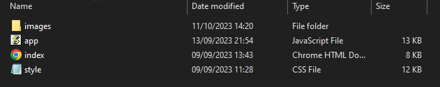

--8<-- "old.md"


> 💡 This page details how to optimally add UIs onto your game with key points, techniques and live examples.

> 💡 TODO: Divide into sections: Custom UI, UI Core (when “ui-core” package is available)

A UI as mentioned in the Introduction is a *2D visual and interactive interface webpage for the user that can show content or be interacted with, where with JavaScript you can affect your game in real time.*

First of all, a WebUI is a webpage, so you must use **HTML, CSS** and **JS** to properly utilize your WebUI. To structure one, it is like any other HTML webpage with a HTML file, a CSS file and a JS file. You can expect your average UI file structure to look like this:

>JQuery is also compatible with our WebUIs, so we highly recommend using them as well. 

___
WebUIs are an Insertable Class that has inherited the Entity Base Class that you can insert into your game Clientside only. To Create one you can simply write:
```lua
local my_ui = WebUI("UI Name", "your_path.html",WebUIVisibility.Visible)
```
(Client/Index.lua)
```lua
my_ui:BringToFront() -- Brings the UI to the top so you can see and interact with it
my_ui:SetVisibility(WidgetVisibility) -- Use WidgetVisibility to change the UI state
my_ui:GetName() -- Returns the name you set it to during construction
my_ui:GetVisibility() -- Returns the WidgetVisibility you have set it to
```
There are many methods you can apply onto your WebUI, the most common ones are these!
___
You can also execute JavaScript code in WebUIs and communicate between the WebUI and your Client Scripts. Once you combine these you can easily have a dynamic UI that can change easily and affect the game in real time. Below is an example:

<iframe width="100%" height="315" src="../../../img/docs/World-creation/add-ui/02_2023-09-27_12-40-01.mp4" frameborder="1" allowfullscreen></iframe>


(Note that at the moment, you cannot receive Keyboard inputs from Javascript code, to bypass this you can use HELIX’s Static Input Class) 

```lua
local my_ui = WebUI("Awesome UI", "file://UI/index.html")

-- Calls an event to the JavaScript
my_ui:CallEvent("SendToJS", "Hello Test!")

-- Subscribes to receive JS events
my_ui:Subscribe("RecieveJS", function(message)
    print(message)
    -- Will output 'Hey there!' from the JS function below this example
end)
```
Client/Index.lua


```
// Register for "SendToJS" from the LUA Client
Events.Subscribe("SendToJS", function(message) {
    console.log("Triggered! " + message);
    // Will output 'Triggered! Hello Test!'

    Events.Call("RecieveJS", message);
		// Triggers "RecieveJS" to the LUA Client
})
```
script.js  
Now you understand the basics, look at this case study for a Music Player - try and replicate it or make your own UI!
