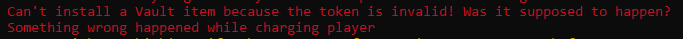
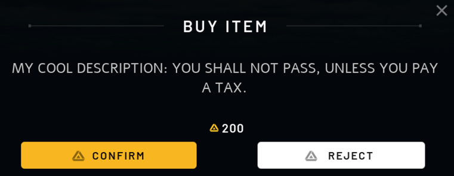
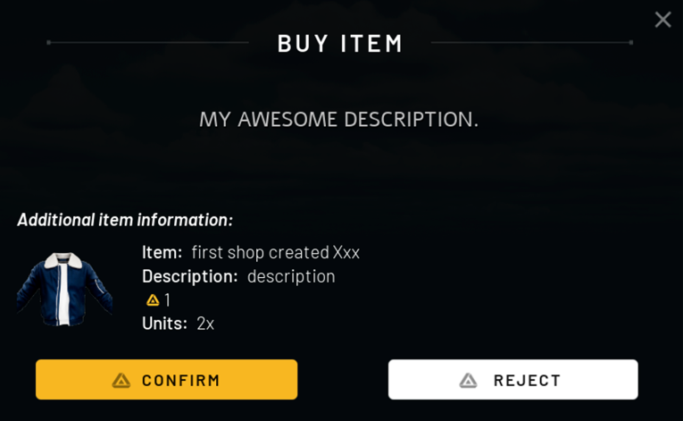
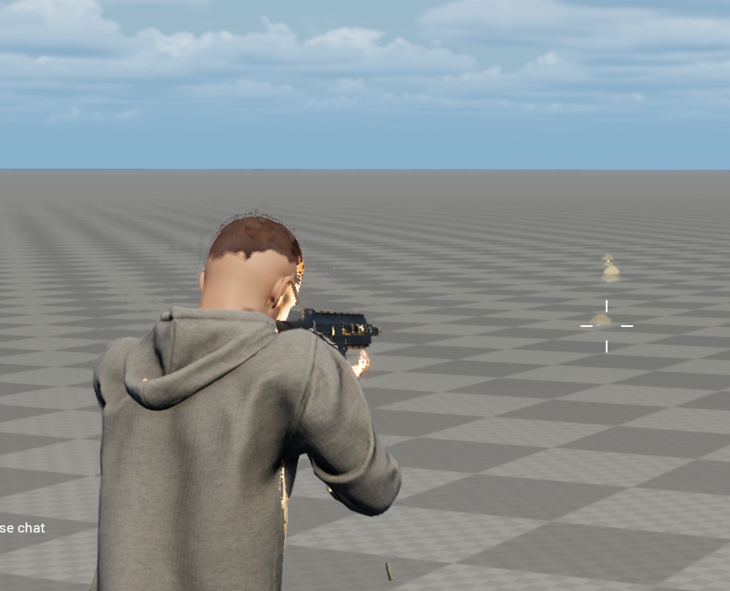

--8<-- "old.md"

# In-World Purchases Video

There is video you can follow in the [video tutorials here](/getting-started/video-tutorials/05-our-currency.md)


> 💡 In-World Purchases uses HELIX’s native Static Payment Class. Make sure to have a quick read over this page before you try coding with this.

In World purchases allow you to earn LIX in various ways- so you can spend it on hosting, cosmetics, assets and plenty more!  

You can expect that this class is mostly used for in-world Microtransactions, below are some examples of the Static Payment Class: 

- In-game Currency (e.g. Poker Chips)
- Boosts (e.g. x2 speed)
- Items (e.g. rare limited edition item)
- Additional chance at a Daily Wheel Spin
- Entry to a secret room
___

Don’t forget that you must have this world uploaded to the HELIX Creator Hub if you want to have a valid token to be allowed to monetize with LIX. Otherwise you will have an error message that can look like this:



To prevent this, follow the [Create your first world](/assets-modding/world-creation/create-first-world.mdx) walk-through.
___
## Methods to Charge the Player

> 💡 When you call the method of choice, a UI will open to the player and wont go until the player confirms or reject. There is no way for the client to be forcefully charged!

### Charge Player

Directly requests to charge the specified amount of LIX on a player. This is the simplest as you do not need an actual item and you can just use code to perform the microtransaction. Depending on if you can afford it, the callback function will give a parameter that will let you check if the purchase was a success.

```lua
Payment.ChargePlayer(player, amount, to_id, charge_title, charge_description, callback)
```


___
### Sell Item
Request to purchase an actual item with a valid Item ID
```lua
Payment.SellItemToPlayer(player, item_id, amount, charge_title, charge_description, callback)
```



___


### Code Snippet From HELIX Docs
```lua
function ChargeTax(player)
    -- Charges a Player, this will show a PopUp on the Player's screen
    Payment.ChargePlayer(
        player, -- Player to charge
        3500, -- LIX Amount
        "a269ab5f-b68c-48dc-a17c-930696f1766f", -- Player ID to send amount
        "BUY ITEM", -- Title
        "YOU SHALL NOT PASS, UNLESS YOU PAY A TAX.", -- Description
        function(success, intent_id) -- Callback if charge succeeded or not
            if success then
                Console.Log("Intent ID " .. intent_id .. " was created")
            else
                Console.Error("Something wrong happened while charging player")
            end
        end
    )
end

function SellItemToPlayer(player)
    -- Sell a item to a player, this will show a Popup on Player's screen
    Payment.SellItem(
        player, -- Player to charge
        "033968d6-b5d8-4f29-a86c-61a911cf364f", -- Selling item
        1, -- Quantity
        "BUY MY ITEM", -- Charge Title
        "MY AWESOME DESCRIPTION.", -- Charge Description
        function(success, intent_id)
            if success then
                Console.Log("Intent ID " .. intent_id .. " was created")
            else
                Console.Error("Something wrong happened while selling item to player")
            end
    end)
end

-- This will be called when the Player accepts or refuses the Charge
Payment.Subscribe("ChargePlayerComplete", function(success, id, amount, status)
    Console.Log("ChargePlayerCompleted %s %d %s", id, amount, status)
end)

-- This will be called when the Player accepts or refuses the item sale
Payment.Subscribe("SellItemToPlayerComplete", function(success, id, item_id, status)
    Console.Log("ChargePlayerCompleted %s %s %s", id, item_id, status)
end)

-- Charges someone random
ChargeTax(Player.GetByIndex(1))

-- Sell item
SellItemToPlayer(Player.GetByIndex(1))
```
Server/Index.lua
___
### Code Walkthrough

> 💡 This walkthrough will provide a step-by-step tutorial on how to make a shop that converts LIX into a Weapon for the player with the helix-weapons Package.

We can make it so you can request to purchase a Weapon on the client and then the ChargePlayer method will check if the player can afford it, and then charge the player so you can continue your thread of code. 


---
First of all I will make a simple function that will purchase a weapon and then give the player a rifle.

```lua
function PurchaseWeapon(player,weapon)
		local WeaponData = WeaponSHOP[weapon]

    -- Charges a Player, this will show a PopUp on the Player's screen
    Payment.ChargePlayer(
        player, -- Player to charge
        5000, -- LIX Amount
        "a269ab5f-b68c-48dc-a17c-930696f1766f", -- Player ID to send amount
        "Buy Rifle", -- Title
        "Purchase your own Gun!.", -- Description
        function(success, intent_id) -- Callback if charge succeeded or not
            if success then
                Console.Log("Intent ID " .. intent_id .. " was created")
				
								player:GetControlledCharacter():PickUp( ACM() )

            else

                Console.Error("Something wrong happened while charging player")
            
						end
        end)

end


WeaponSHOP = {
	Rifle = {price = 5000, title = "AK47", class = ACM},
	Sniper = {price = 5000, title = "Sniper Rifle", class = CS446}
}

function CreateWeapon(player, weapon)
    local char = player:GetControlledCharacter()
    local wep = WeaponSHOP[weapon]["class"]() --Runs the class constructor of the weapon

    char:PickUp(wep)
end


function PurchaseWeapon(player,weapon)
		local WeaponData = WeaponSHOP[weapon]

    -- Charges a Player, this will show a PopUp on the Player's screen
    Payment.ChargePlayer(
        player, -- Player to charge
        WeaponData.price, -- LIX Amount
        "a269ab5f-b68c-48dc-a17c-930696f1766f", -- Player ID to send amount
        "Buy "..WeaponData.title, -- Title
        "Purchase your own Gun!.", -- Description
        function(success, intent_id) -- Callback if charge succeeded or not
            if success then
                Console.Log("Intent ID " .. intent_id .. " was created")
				
								CreateWeapon(player,weapon) --calls the CreateWeapon function

            else

                Console.Error("Something wrong happened while charging player")
            
						end
        end)

end
Events.SubscribeRemote("PurchaseWeaponRequest",PurchaseWeapon)
--You can use something such as this event or call the function 

-- Asks to purchase a Rifle when player joins 
Player.Subscribe("Possess",function(player)
		PurchaseWeapon(Player.GetByIndex(1),"Rifle")
end)

```
Index.lua

Now we have the code working, let’s test it out! Join your world and you will see the request!



