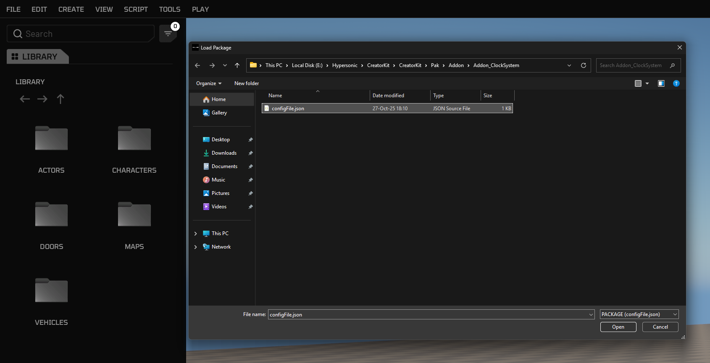
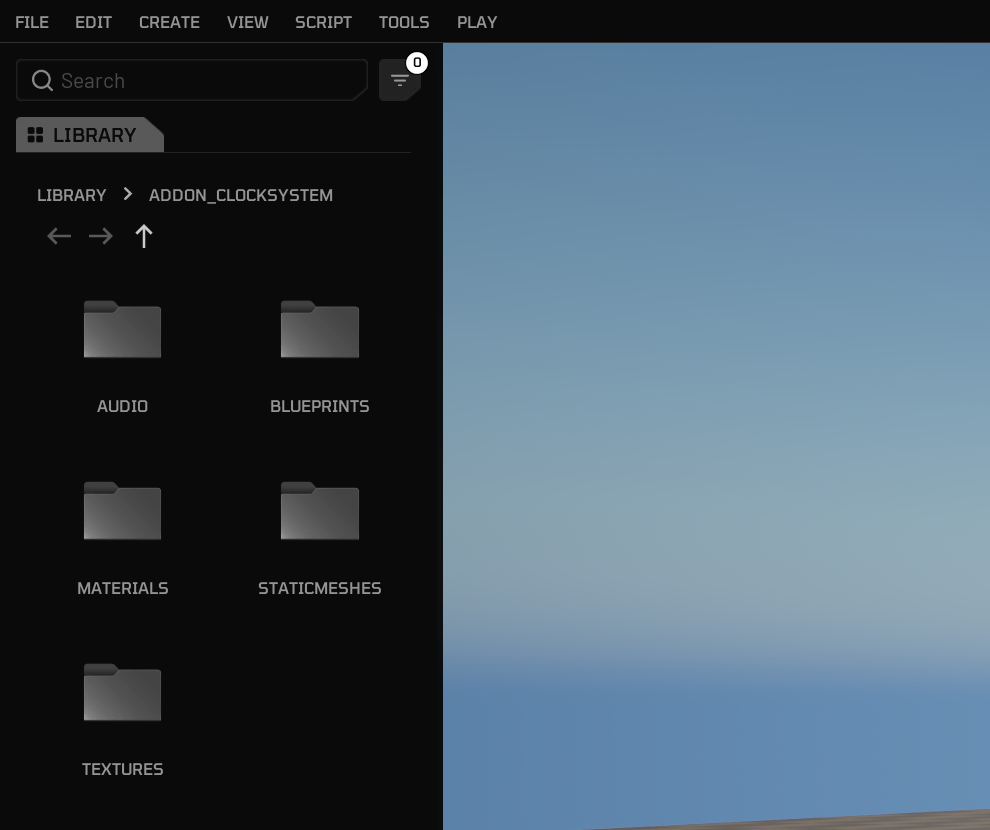
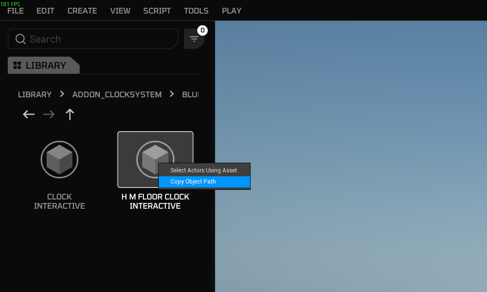
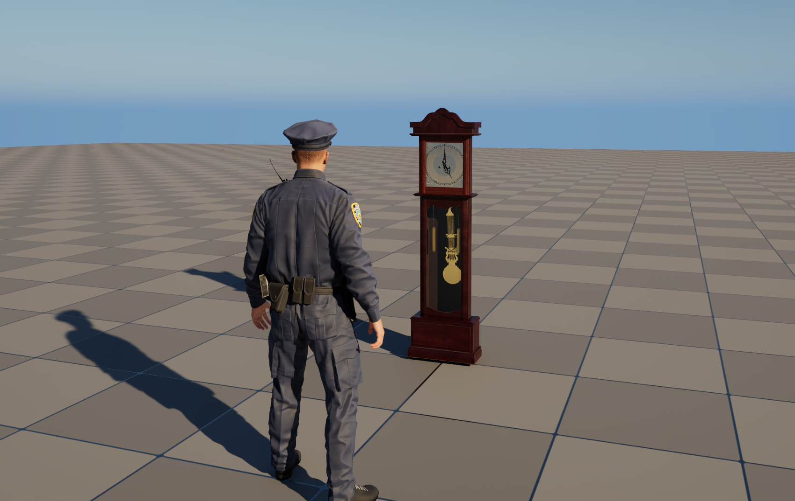
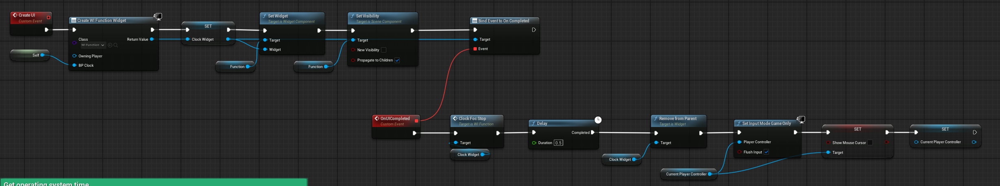
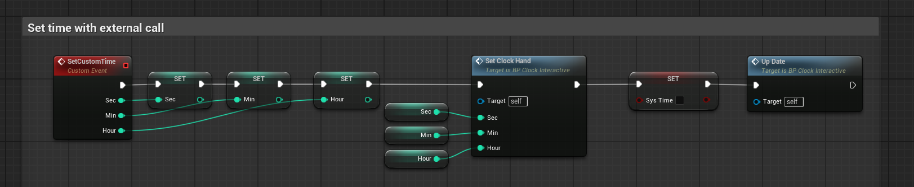

# Use Custom Blueprints

## 1. By Lua

For this example use case, we will try to load a [packaged custom blueprint asset](https://development.helix-documentation.pages.dev/tutorials/custom_blueprints/) and spawn it on world with a Lua script. Then, we will define a custom event in the actor blueprint and call it from Lua script.

1. After creating your workspace, open build mode and import the package you created in **Creator Kit HELIX Packaging Tool**. To do that, click **File** -> **Load Package** from top bar, navigate to your package folder cooked by Creator Kit, and select `configFile.json` in the folder.

    

    

2. After import is completed, you will get a panel on the left side of window with the package's name. It should show your packages content as shown below:

    

3. Find and right click to the blueprint you would like to spawn in world. Select **Copy Object Path** from the dropdown menu. You can use this full path in Lua scripts to load the object into memory.

    

4. Now we need to write our Lua script to spawn our blueprint actor. Click **Edit Scripts** button and open your workspace folder.

    

    

5. To spawn our blueprint actor locally in the client, add the client lua script below into `WORKSPACE_ID/scripts/main/client/main.lua` path in your workspace. If the file doesn't exist, create it.

    ```lua
    -- Load clock actor class from package. The path is copied from build mode interface as explained in the 3rd step.
    local ClockActorClass = UE.UObject.Load('/Game/Addon_ClockSystem/Blueprints/BP_HM_floor_clock_Interactive.BP_HM_floor_clock_Interactive_C')

    -- Spawn transform
    local SpawnTransform = Transform()
    SpawnTransform.Translation = Vector(500, 0, 150)
    SpawnTransform.Rotation = Rotator(0, 90, 0):ToQuat()
    SpawnTransform.Scale3D = Vector(1.5, 1.5, 1.5)

    -- Constructor
    local ClockActor = HWorld:SpawnActor(
        ClockActorClass,
        SpawnTransform,
        UE.ESpawnActorCollisionHandlingMethod.AlwaysSpawn
    )
    ```

    

6. We have a basic logic in the blueprint to spawn an UMG widget on screen as shown below. After walking towards the clock, the widget automatically spawns on the screen to tweak the time.

    

    

7. Now let's call an event we've previously defined in the blueprint. Our `SetCustomTime` event changes the time shown on the clock.

    

8. After restarting the game to clean the level from previous changes, we add the function call below at end of our `main.lua` script to execute our custom event on spawned blueprint actor. The same syntax can be used for calling any function in spawned actors.

    ```lua
    -- Manually set time on spawned clock with our blueprint defined event
    ClockActor:SetCustomTime(0,30,5) -- second, minute, hour
    ```

## 2. By Blueprint

[examples coming soon]
